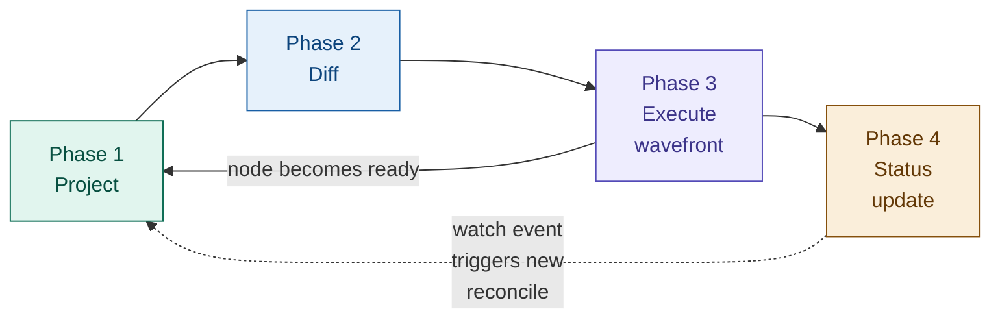

# KREP-023: Level-Aware Graph Synchronization for the Instance Controller

**Authors:** Jakob Moller
**Status:** Draft

## Problem statement

KRO lets users define a **ResourceGraphDefinition (RGD)** — a template that
describes a set of Kubernetes resources and how they depend on each other.
When a user creates an **instance** of that RGD, KRO's **instance controller**
creates and manages all the resources on their behalf.

Today the instance controller processes resources **one at a time**, in
topological order. For each node it resolves CEL variables, applies via SSA,
and checks `readyWhen` before moving to the next node. Per-node state is
tracked in a flat `map[string]*ResourceState`.

This works but has known limitations:

- **No parallelism.** Independent branches run one at a time. A graph with
  two independent subtrees of depth 5 takes 10 steps instead of 5.
- **No propagation control.** Every reconcile applies all changes at once.
  There's no way to gate rollouts, enforce maintenance windows, or do
  incremental rollouts across `forEach` collections.
- **No ordered deletion.** The current ApplySet tracks resources as a flat
  set. When pruning, a Service might be deleted before its Deployment, or a
  Namespace before the resources inside it.
- **No revision tracking.** When the RGD changes and a new
  [GraphRevision](https://kro.run/api/crds/graphrevision) is issued, the
  controller has no way to tell which resources need updating and which are
  already current.

Consider a simple web app RGD with three resources:

```
ConfigMap ──► Deployment ──► Service
```

**Today (sequential):**
```
Step 1: Apply ConfigMap     wait for ready
Step 2: Apply Deployment    wait for ready (pods start)
Step 3: Apply Service       wait for ready
Total: 3 sequential steps

Delete: Service, Deployment, ConfigMap  (no ordering guarantee!)
```

For a wider graph with independent branches, the cost is even higher:

```
ConfigMap ──► Deployment-A ──► Service-A
Secret    ──► Deployment-B ──► Service-B

Today: 6 sequential steps, even though A and B are completely independent.
```

## Proposal

Replace the sequential model with a **level-aware wavefront synchronizer**.
The core idea:

1. Group resources into **dependency levels** using topological sorting.
   Level 0 has no dependencies, level 1 depends on level 0, and so on.
2. Apply all resources within a level **in parallel**. Wait for the level
   to finish. Then move to the next level.
3. When deleting, go in **reverse order** — remove level 2 before level 1
   before level 0. This prevents dangling references.
4. Track which **GraphRevision** each resource was last applied at, so the
   controller knows exactly what to update when the RGD changes.

The same example with this proposal:

```
Level 0: Apply ConfigMap                 wait for ready
Level 1: Apply Deployment               wait for ready (pods start)
Level 2: Apply Service                  wait for ready
Total: 3 steps (same for a linear chain, but parallel for wider graphs)

Delete: Level 2 (Service) → Level 1 (Deployment) → Level 0 (ConfigMap)
        Always in reverse order. Dependents removed first.
```

For a wider graph:

```
  Level 0: ConfigMap + Secret          (parallel)
  Level 1: Deployment-A + Deployment-B (parallel)
  Level 2: Service-A + Service-B       (parallel)
```

Key decisions:

| Decision | Choice | Why |
|----------|--------|-----|
| Parallelism model | Within-level parallelism, strict ordering between levels | Simple to reason about. No need to track per-node dependency readiness at runtime. |
| Error handling | Failed node blocks only its dependents, not the whole graph | Independent branches should keep working. |
| Deletion order | Reverse topological (highest level first) | Prevents dangling references (Service deleted before Deployment). |
| Revision tracking | Per-node `kro.run/revision` label | Allows partial migration. Controller knows exactly where it left off after a crash. |
| New revision during migration | Skip to latest (default) | Each GraphRevision is a complete snapshot. No need to apply intermediate revisions. |
| Inventory storage | Annotation on instance (can migrate to other backends) | Fits in standard Kubernetes objects. No external storage needed. |

#### Overview

The synchronizer operates in four phases per reconcile cycle:



Each phase may short-circuit or loop based on watch events. The arrow
from the wavefront back to projection shows what happens when a node
reaches `Ready` and that changes an `includeWhen` predicate — the
controller re-evaluates the DAG.

#### Design details

##### Phase 1: Project

Projection takes the structural DAG from the current
[GraphRevision](https://kro.run/api/crds/graphrevision) and the instance's
input values, and produces a **runtime DAG**: which resources to create, at
which dependency levels, with fully-rendered templates. Dynamic elements --
`includeWhen`, `forEach`, CEL expressions - are all resolved here.

```go
type ProjectedDAG struct {
    // Levels is the output of Kahn's algorithm: nodes grouped by dependency
    // depth. Level 0 has no dependencies; level N depends only on levels 0..N-1.
    Levels [][]NodeID

    // Nodes maps each node ID to its projected state.
    Nodes map[NodeID]*ProjectedNode

    // Revision is the target GraphRevision.spec.revision for this reconcile.
    Revision int64
}

type NodeID struct {
    // ResourceID is the logical ID from the RGD (e.g., "deployment").
    ResourceID string

    // ForEachBindings holds the forEach variable bindings for expanded nodes.
    // nil for non-forEach nodes. Sorted so the same bindings always produce
    // the same ID.
    ForEachBindings map[string]string
}

type ProjectedNode struct {
    Included       bool                          // Result of evaluating all includeWhen predicates
    Template       *unstructured.Unstructured    // Fully-rendered Kubernetes resource manifest
    IsExternal     bool                          // externalRef node (read-only)
    Level          int                           // Topological level from Kahn's algorithm
    Dependencies   []NodeID                      // Nodes this node depends on
    ReadyWhen      []string                      // CEL predicates for readiness
    PropagateWhen  []string                      // CEL predicates for mutation gating (KREP-006)
    ResourcePolicy ResourcePolicies              // Adopt/Orphan policies (KREP-014)
}
```

Every resource has two identities: one in the graph, one in the cluster.

| Layer | Identifier | Scope | Example |
|-------|-----------|-------|---------|
| **Graph node** (logical) | `NodeID` = `ResourceID` + `ForEachBindings` | Unique within the projected DAG of one instance | `NodeID{ResourceID: "deployment"}` or `NodeID{ResourceID: "deployment", ForEachBindings: {"region": "eu-west-1"}}` |
| **Kubernetes resource** (physical) | GKNN (Group, Kind, Namespace, Name) | Unique within the cluster | `apps/Deployment/default/my-app-eu-west-1` |

The graph node ID is stable across revisions. The GKNN is not necessarily
stable — a new revision could change the resource name, which the diff sees
as delete-old + create-new. Each managed resource carries
`kro.run/resource-id` and `kro.run/foreach-bindings` labels to map a live
resource back to its logical NodeID.

Projection rules:

- `externalRef` nodes are resolved first (level -1, conceptually). They
  populate the CEL evaluation context but produce no create/update/delete
  actions.
- `includeWhen` predicates are evaluated against the current CEL context.
  Nodes with `Included == false` are excluded from the projected DAG entirely.
- `forEach` expressions are evaluated to produce the expansion set. Each
  combination of bindings produces a distinct `NodeID`.
- After projection, Kahn's algorithm ([KREP-003]) groups included nodes into
  levels.

The projected DAG can change while reconciling. When a node becomes Ready,
its status fields become available, which may flip another node's
`includeWhen` from false to true. The controller handles this by re-running
projection up to 5 times per reconcile. Cycle detection on
`includeWhen`/`readyWhen` edges prevents infinite loops.

##### Phase 2: Diff

The diff phase compares the projected DAG against the materialized cluster
state to produce a per-node action plan:

```go
type NodeAction int

const (
    // Forward actions (applied in level order 0, 1, 2, ...)
    ActionCreate    NodeAction = iota // In projected DAG, not in cluster
    ActionUpdate                      // In both, template differs from applied
    ActionAdopt                       // Exists, needs ApplySet labels (KREP-014)
    ActionNone                        // In both, matches, readyWhen not satisfied
    ActionReady                       // In both, matches, readyWhen satisfied

    // Reverse actions (applied in reverse level order ..., 2, 1, 0)
    ActionDelete                      // In cluster, not in projected DAG
    ActionOrphan                      // KREP-014: remove labels, keep resource

    // Gating states
    ActionBlocked                     // Dependencies not ready
    ActionGated                       // Dependencies ready, propagateWhen false (KREP-006)
)
```

Node classification logic:

```
  Resource not in cluster?              --> ActionCreate
  kro.run/revision < target revision?   --> ActionUpdate (force)
  Template differs from live?           --> ActionUpdate
  readyWhen satisfied?                  --> ActionReady
  Otherwise                             --> ActionNone

  In inventory but not in projection?   --> ActionDelete
  includeWhen became false?             --> ActionDelete (if resource exists)
  KREP-014 adopt policy?               --> ActionAdopt
  KREP-014 orphan policy?              --> ActionOrphan
```

An `includeWhen` exclusion caused by stale CEL context (e.g., a dependency
is in Error and its status is missing) must **not** trigger a delete (see
[Consistency invariants](#consistency-invariants-and-recovery) invariant 4).

##### Phase 3: Execute wavefront

The wavefront processes levels in order. Within each level, nodes run in
parallel. A level must finish before the next one starts. If a node fails,
only its dependents are blocked — independent branches continue.

**Forward wavefront (create/update)**

Levels are processed in ascending order (0, 1, 2, ...). Within each level,
all non-gated nodes are applied concurrently up to `maxConcurrency`:

```
DAG:  ConfigMap ──► Deployment ──► Service
      Secret    ──┘              ─► Ingress

Levels after Kahn's algorithm:
  Level 0: [ConfigMap, Secret]       (no dependencies)
  Level 1: [Deployment]              (depends on ConfigMap, Secret)
  Level 2: [Service, Ingress]        (depend on Deployment)

Forward wavefront execution:

  ┌─────────────────────────────────────────────────────────────────┐
  │ Level 0                                                         │
  │                                                                 │
  │   ConfigMap ─── SSA apply ──► exists ──► readyWhen? ──► Ready   │
  │                                          (parallel)             │
  │   Secret ────── SSA apply ──► exists ──► readyWhen? ──► Ready   │
  │                                                                 │
  │   All Ready? ── yes ──► runtime.Synchronize() ──► advance       │
  └─────────────────────────────────────────────────────────────────┘
                                    │
                                    ▼
  ┌─────────────────────────────────────────────────────────────────┐
  │ Level 1                                                         │
  │                                                                 │
  │   Deployment ── skip apply (unchanged) ─► readyWhen? ── Ready   │
  │                                                                 │
  │   All Ready? ── yes ──► runtime.Synchronize() ──► advance       │
  └─────────────────────────────────────────────────────────────────┘
                                    │
                                    ▼
  ┌─────────────────────────────────────────────────────────────────┐
  │ Level 2                                                         │
  │                                                                 │
  │   Service ──── SSA apply ──► exists ──► readyWhen? ──► Ready    │
  │                                         (parallel)              │
  │   Ingress ──── SSA apply ──► exists ──► readyWhen? ──► Ready    │
  │                                                                 │
  │   All Ready? ── yes ──► instance ACTIVE                         │
  └─────────────────────────────────────────────────────────────────┘
```

Key behaviors:

- **Level completion.** A level is done when every node in it reaches a
  terminal state: Ready, Error, or Gated. If a node's `readyWhen` is not
  yet true, the reconcile returns and waits for a watch event.
- **runtime.Synchronize() between levels.** After a level completes, the
  CEL evaluation context is refreshed with the latest status fields from
  the just-completed resources.
- **Concurrency bound.** A semaphore limits parallel SSA applies to
  `maxConcurrency` (default: 10).

**Reverse wavefront (delete/prune)**

When resources need to be removed (instance deletion or nodes removed by a
new GraphRevision), levels are processed in descending order (2, 1, 0):

```
Reverse wavefront execution (instance deletion):

  Level 2: DELETE Service      (parallel)
           DELETE Ingress
           Wait for confirmed deletion via watch.

  Level 1: DELETE Deployment
           Wait for confirmed deletion via watch.

  Level 0: DELETE ConfigMap    (parallel)
           DELETE Secret
           Wait for confirmed deletion via watch.

  Remove finalizer. Instance deleted.
```

**Propagation gating within a level ([KREP-006])**

When `propagateWhen` is configured, some nodes within a level may be gated
even though their dependencies are ready. The wavefront applies non-gated
nodes and skips gated ones — it does not block waiting:

```
Level 1: [deploy-us, deploy-eu, deploy-ap]
         propagateWhen: canary.status.healthy == true

  deploy-us ── propagateWhen? ── true  ──► SSA apply ──► WaitReady
  deploy-eu ── propagateWhen? ── false ──► GATED (skip)
  deploy-ap ── propagateWhen? ── false ──► GATED (skip)

  Level result: 1 applied, 2 gated.
  Reconcile completes with status: GATED.
  Next watch event (canary becomes healthy) triggers new reconcile.
```

Deletion does not respect `propagateWhen`. When a user deletes an instance,
all resources are cleaned up promptly regardless of gates.

**Mixed forward and reverse in the same reconcile**

When a new GraphRevision adds some nodes and removes others, both wavefronts
run in the same reconcile cycle. The forward wavefront runs first, then the
reverse wavefront prunes stale resources:

```
Revision 2: [ConfigMap] -> [Deployment, OldSidecar] -> [Service]
Revision 3: [ConfigMap] -> [Deployment, NewSidecar] -> [Service]

Same reconcile:
  Forward (levels 0, 1, 2):
    Level 0: Update ConfigMap
    Level 1: Update Deployment, Create NewSidecar
    Level 2: Update Service

  Reverse (levels 1):
    Level 1: Delete OldSidecar

Result: OldSidecar removed only after NewSidecar is Ready.
```

**Error isolation**

When a node fails, only its dependents are blocked — independent branches
at the same or deeper levels continue unaffected:

```
DAG:  ConfigMap ──► Deployment-A ──► Service-A
      Secret    ──► Deployment-B ──► Service-B

Deployment-A fails (SSA conflict). Deployment-B is Ready.

  Level 1 terminal states: [Error, Ready] - level complete, advance.

  Level 2 dependency check:
    Service-A depends on Deployment-A (Error) --> Blocked (skip)
    Service-B depends on Deployment-B (Ready) --> SSA apply --> Ready

  Result:
    Deployment-A: Error     Service-A: Blocked
    Deployment-B: Ready     Service-B: Ready
```

Status rollup:

```
Ready = False
  ResourcesReady = False
    Message: "6/8 nodes Ready. 1 Error: [deployment-a].
             1 Blocked: [service-a] (depends on deployment-a).
             deployment-a: SSA conflict (field manager 'helm'
             owns .spec.replicas)."
```

**Node state machine**

```
                      includeWhen = false
           [*] ──────────────────────────────────► Excluded ◄──┐
            │                                        │  ▲       │
            │ includeWhen = true,                    │  │       │ includeWhen
            │ deps not ready                         │  │       │ becomes false
            │ OR any dep in Error                    │  │       │
            ▼                          includeWhen   │  │       │
Ready ──► Blocked ◄──── becomes true ─────────────────┘  │       │
│  dep      │                                             │       │
│  regress  ├── deps ready, propagateWhen = false ──► Gated      │
│           │                                          │         │
│           │   deps ready, propagateWhen = true       │ propagate
│           │   (or not set)                           │ becomes
│           ▼                                          │ true
│       Applying ◄─────────────────────────────────────┘
│           │  ▲
│  template │  │ retry on
│  changed  │  │ next reconcile
│           │  │
│    SSA    ▼  │
│    fail  Error
│           │
│           │ SSA success,
│           │ readyWhen = false
│           ▼
└──────► WaitReady ─── readyWhen = true ──► Ready ───► Deleting ───► Deleted
                                            │                        ▲
                                            │  node removed or       │
                                            │  instance deleted      │
                                            └────────────────────────┘

Excluded (previously applied) ───► Deleting ───► Deleted
         resource exists,
         includeWhen = false
```

State mapping to [KREP-022] managedResources:

| Synchronizer state | [KREP-022] `managedResources.state` | Current `instance_state.go` |
|---|---|---|
| `Ready` | `READY` | `NodeStateSynced` |
| `Applying` | `IN_PROGRESS` | `NodeStateInProgress` |
| `WaitReady` | `WAITING_FOR_READINESS` | `NodeStateWaitingForReadiness` |
| `Blocked` | `BLOCKED` | *(new - dependency in Error or Gated)* |
| `Gated` | `GATED` | *(new - [KREP-006])* |
| `Excluded` (no resource) | not in `managedResources` | `NodeStateSkipped` (renamed) |
| `Excluded` (resource exists) | `DELETING` | `NodeStateDeleting` |
| `Deleting` | `DELETING` | `NodeStateDeleting` |
| `Deleted` | not in `managedResources` | `NodeStateDeleted` |
| `Error` | `ERROR` | `NodeStateError` |
| `ActionAdopt` | `IN_PROGRESS` | *(new - [KREP-014])* |

##### Phase 4: Status update

Condition hierarchy (extends KREP-001 and [KREP-006]):

```
Ready
+-- InstanceManaged       - Finalizers and labels set
+-- GraphResolved         - Runtime graph created, resources resolved
+-- ResourcesReady        - All projected resources pass readyWhen
+-- ResourcesPropagated   - All resources at latest GraphRevision (KREP-006)
```

Instance state mapping:

| State | Meaning |
|-------|---------|
| `ACTIVE` | All projected resources ready and propagated |
| `IN_PROGRESS` | Forward wavefront executing |
| `GATED` | Wavefront blocked by `propagateWhen` ([KREP-006]) |
| `FAILED` | One or more resources failed after retries |
| `DELETING` | Reverse wavefront executing |
| `ERROR` | Projection failed |

##### Level-aware inventory management

The ApplySet specification ([KEP-3659]) tracks set membership via a parent
object with labels and annotations — a flat set with no ordering. This
proposal adds a **Level Inventory** annotation on top of ApplySet that groups
resources by dependency level:

```yaml
metadata:
  labels:
    applyset.kubernetes.io/id: "kro-<hash>"
    applyset.kubernetes.io/tooling: "kro/<version>"
  annotations:
    applyset.kubernetes.io/contains-group-kinds: "Deployment.apps,Service.,ConfigMap."
    applyset.kubernetes.io/additional-namespaces: "ns-a,ns-b"
    # KRO extension: level-ordered inventory
    kro.run/inventory: |
      {"revision":3,"levels":[
        ["ConfigMap..default.app-config","Secret..default.app-secret"],
        ["Deployment.apps.default.app","Service..default.app-svc"],
        ["Ingress.networking.k8s.io.default.app-ingress"]
      ]}
```

Member labels on each managed resource:

```yaml
labels:
  applyset.kubernetes.io/part-of: "kro-<hash>"
  kro.run/instance: "<instance-name>"
  kro.run/resource-id: "deployment"
  kro.run/level: "1"
  kro.run/revision: "3"
annotations:
  kro.run/foreach-bindings: '{"region":"eu-west-1"}'  # forEach nodes only
```

The inventory `revision` field is a "fully converged" marker — it is only
updated after the entire forward wavefront completes and all nodes reach the
target revision. Per-node `kro.run/revision` labels are the source of truth
during a partial migration.

Annotation size analysis:

| Scenario | Total entries | Size | % of 256KB |
|----------|-------------|------|------------|
| Simple web app (5 nodes, 3 levels) | 5 | ~430B | 0.2% |
| Microservice mesh (20 nodes, 5 levels) | 20 | ~1.5KB | 0.6% |
| Multi-region (3 forEach x 10 regions) | 30 | ~2.3KB | 0.9% |
| Large platform (10 + 5 forEach x 50) | 260 | ~18KB | 7% |
| Extreme (5 + 10 forEach x 200) | 2005 | ~140KB | 55% |
| Pathological (20 forEach x 500) | 10000 | ~700KB | **EXCEEDS** |

If the annotation budget becomes a concern, the same data can be stored in a
dedicated ConfigMap or the instance's `.status.inventory` field without
changing the synchronizer logic — only the read/write layer needs to swap out.

##### Revision migration: n-1 to n

A new GraphRevision is created by the RGD controller whenever
`ResourceGraphDefinition.spec` changes. The GraphRevision is immutable and
contains a full snapshot of the RGD spec.

At the start of each reconcile, Phase 1 resolves the latest active
GraphRevision as the *target* revision. Each managed resource's *current*
revision is read from its `kro.run/revision` label during Phase 2. Nodes with
a stale label are classified as `ActionUpdate` and the forward wavefront
applies them level-by-level.

Topology changes between revisions:

| Change | Handling |
|--------|----------|
| **Node added** | `ActionCreate` at its computed level. |
| **Node removed** | `ActionDelete` in reverse order, after forward wavefront completes. |
| **Node moves level** | `kro.run/level` label updated during SSA. Processed at new level. |
| **Edge added** | Node waits for the new dependency. Cycles are caught at compile time. |
| **Edge removed** | Node may move to a lower level. Processed there. |

If a new GraphRevision becomes active mid-reconcile, the current reconcile
finishes against the in-progress revision. The controller picks up the new
one on the next cycle. The default behavior is **skip-to-latest** — each
GraphRevision is a complete snapshot, so there is nothing in revision N that
must be applied before N+1. An opt-in `revisionPolicy: Serialized` is
available for users who need per-revision health validation.

##### Consistency invariants and recovery

| # | Invariant | Recovery |
|---|-----------|----------|
| 1 | **Labels are the source of truth.** `kro.run/revision` and `kro.run/level` on each managed resource are authoritative. | On crash, rebuild from labels. If inventory lost entirely, scan for `applyset.kubernetes.io/part-of` labels. |
| 2 | **Inventory revision ≤ minimum per-node revision.** The inventory `revision` is only bumped after all nodes reach the target. | Stale nodes are re-applied. SSA is idempotent. |
| 3 | **Phase 1 recomputes levels from the GraphRevision, not the inventory.** | Stale inventory level data is ignored; inventory is rewritten at the end. |
| 4 | **Don't delete resources based on stale CEL context.** If a node's `includeWhen` depends on an Error node's status, the result is frozen at its last known value. | Skip `includeWhen` re-evaluation for nodes whose dependencies include an Error node. |
| 5 | **Create before delete within the same level.** During revision transitions, the forward wavefront creates new nodes before the reverse wavefront deletes old ones at the same level. | If the create fails, the delete is skipped — the old resource is kept. |

##### Observability

**Conditions** (Phase 4) surface failure information in `kubectl get` output:

```
Ready = False
  ResourcesReady = False
    Message: "2/8 nodes in ERROR state: [deployment, service].
             deployment: SSA conflict on apps/v1 Deployment default/app
             (field manager 'helm' owns .spec.replicas)."
```

**Kubernetes Events:**

| Event type | Reason | When |
|------------|--------|------|
| Normal | `LevelComplete` | A level finishes. Message includes level number, node count, duration. |
| Normal | `ReconcileComplete` | Full reconcile cycle completes. |
| Normal | `RevisionTransition` | Instance begins reconciling against a new GraphRevision. |
| Warning | `NodeError` | A node's SSA apply fails. Message includes resource ID, error, retry count. |
| Warning | `NodeGatedTimeout` | Node in GATED state longer than `propagationTimeout`. |
| Warning | `ReprojectionCapReached` | Phase 1 hit fixed-point iteration cap. |
| Warning | `InventoryOverflow` | Inventory exceeded annotation budget. |
| Warning | `ImmutableFieldConflict` | Diff detected change to a known immutable field. |

**New metrics** (all use the `kro_instance_` prefix):

| Metric | Type | Labels | Purpose |
|--------|------|--------|---------|
| `level_duration_seconds` | Histogram | `gvr`, `level`, `direction` | Per-level execution time. |
| `level_concurrency` | Histogram | `gvr`, `level` | Actual parallelism achieved per level. |
| `node_action_total` | Counter | `gvr`, `action` | Action distribution (create, update, delete, adopt, orphan, gate). |
| `node_duration_seconds` | Histogram | `gvr`, `resource_id`, `action` | Per-node SSA apply duration. |
| `nodes_gated` | Gauge | `gvr`, `instance` | Nodes currently in GATED state. |
| `nodes_error` | Gauge | `gvr`, `instance` | Nodes currently in ERROR state. |
| `reprojection_iterations` | Histogram | `gvr` | Fixed-point iterations in Phase 1. |
| `inventory_size_bytes` | Gauge | `gvr`, `instance`, `storage` | Annotation budget consumption. |
| `inventory_entries` | Gauge | `gvr`, `instance` | Total entries in inventory. |
| `revision_current` | Gauge | `gvr`, `instance` | GraphRevision being reconciled. |
| `revision_transition_duration_seconds` | Histogram | `gvr` | End-to-end migration time. |
| `nodes_at_revision` | Gauge | `gvr`, `instance`, `revision` | Resources per revision. |

The existing `instance_reconcile_duration_seconds` metric gains a `phase`
label (`project`, `diff`, `execute`, `status`) to enable per-phase breakdown.

##### Implementation plan

Mapping current → proposed:

| Current | Proposed | Change type |
|---------|----------|-------------|
| `Controller.Reconcile` (sequential walk) | 4-phase pipeline | Refactor |
| `InstanceState {State, ResourceStates}` | `+ Level, Revision` | Extend |
| `runtime.Synchronize()` (per-node) | Per-level, using SSA response objects | Optimize |
| `graph.Graph + flat TopologicalSort` | `TopologicalSortLevels` (Kahn's) | Refactor |
| ApplySet labels (flat membership) | ApplySet labels + `kro.run/inventory` | Extend |

New components:

| Component | Purpose |
|-----------|---------|
| `Wavefront` | Level-aware parallel executor with [KREP-006] + [KREP-014] gates |
| `LevelInventory` | Serializer for `kro.run/inventory` with pluggable storage backend |
| `ProjectedDAG` | Explicit runtime DAG with `includeWhen`/`forEach` evaluated |
| `ReconcilePlan` | Typed diff output grouping actions by level |

Migration phases:

| Phase | Scope |
|-------|-------|
| 1 | Add `TopologicalSortLevels()` ([KREP-003]). Sequential execution. Add `kro.run/level` labels. |
| 2 | Add `LevelInventory` writer. Write `kro.run/inventory`. Add `kro.run/revision` labels. |
| 3 | Replace sequential walk with wavefront. Add `managedResources` ([KREP-022]). |
| 4 | Add `propagateWhen` ([KREP-006]) and `onCreate`/`onDelete` ([KREP-014]). |

## Other solutions considered

**Per-node dependency graph walker instead of levels**

Instead of grouping nodes into levels and processing level-by-level, the
wavefront could track each node's dependencies individually. A node would
start as soon as all its specific dependencies are Ready, regardless of level.

Not chosen: level-based execution is simpler to reason about, debug, and
observe. "Level 1 is done, level 2 is starting" is easier to follow than
"node X started because nodes A and B finished but node Y is still waiting on
C." The parallelism benefit is the same for most real-world graphs.

**One ApplySet per level instead of a single inventory annotation**

Instead of extending a single ApplySet with a `kro.run/inventory` annotation,
we could create a separate ApplySet for each level.

Not chosen: the ApplySet spec requires each resource to belong to exactly one
ApplySet. A resource that changes level between revisions would need to be
removed from one ApplySet and added to another — an error-prone two-step
operation. A single inventory with level metadata is simpler.

**Instance-level revision tracking instead of per-node**

Instead of labeling each managed resource with `kro.run/revision`, we could
track the revision at the instance level: "this instance is at revision 3."

Not chosen: during a partial migration, an instance-level revision can't
represent the mixed state. The controller wouldn't know which nodes to retry
on the next reconcile. Per-node labels give exact progress visibility and
enable resumption from any failure point.

**Block the entire graph on any node error**

Instead of error isolation, the wavefront could halt entirely when any node
fails.

Not chosen: independent branches have no reason to stop. Blocking Service-B
because Deployment-A failed delays useful work for no benefit.

**Drop ApplySet entirely in favor of a custom inventory**

Instead of extending ApplySet with level metadata, we could build a fully
custom inventory system.

Not chosen: ApplySet gives us membership tracking, garbage collection
semantics, and compatibility with `kubectl apply --prune` and other ecosystem
tools for free. The only thing it lacks is ordering, which we add with one
annotation. If the ApplySet spec evolves in conflicting ways, we can migrate
away later — the inventory is a simple JSON blob behind a thin read/write layer.

**Serialized revision migration as the default**

Instead of skip-to-latest, the controller could complete each revision fully
before starting the next.

Not chosen as the default: Kubernetes controllers conventionally reconcile
toward the latest desired state. Each GraphRevision is a complete snapshot —
there's nothing in revision N that must be applied before N+1. Skip-to-latest
is simpler (no extra state to persist) and avoids wasting work on intermediate
revisions. Serialized mode is available as an opt-in.

## Scoping

#### What is in scope for this proposal?

- Four-phase reconcile loop (Project, Diff, Execute wavefront, Status update)
- Level-aware forward and reverse wavefronts
- Per-node `kro.run/revision` and `kro.run/level` labels
- `kro.run/inventory` annotation extending ApplySet
- Error isolation (failed node blocks only dependents)
- Integration points for [KREP-006] propagation gating, [KREP-014] resource
  lifecycles, and [KREP-022] managedResources
- Metrics, events, and structured logging for the new subsystems
- Four-phase migration plan for incremental rollout

#### What is not in scope?

- `propagateWhen` gate semantics — defined in [KREP-006].
- Adopt/Orphan lifecycle policies — defined in [KREP-014].
- `managedResources` status field shape — defined in [KREP-022].
- Topological sort algorithm — defined in [KREP-003].
- Pluggable inventory storage backends (ConfigMap, status field). The
  annotation approach is chosen for the initial implementation; migration is
  possible without changing synchronizer logic.
- `revisionPolicy: Serialized` implementation. The option is reserved but
  deferred; skip-to-latest ships first.
- `revisionPolicy: FallbackToPrevious`. Deferred.

## Testing strategy

#### Requirements

- envtest for integration tests (already in use)
- Fake API server or envtest for inventory annotation race simulation
- Large forEach expansion test fixtures (50+ and 200+ entries)

#### Test plan

**Unit tests:**
- Kahn's algorithm level computation
- Diff algorithm (create, update, delete, adopt, orphan)
- Inventory serialization and storage backend migration
- Propagation gate evaluation ([KREP-006])
- forEach set reconciliation and identity collision detection
- Annotation size estimation

**Integration tests:**
- Multi-level wavefront execution
- Partial failure and recovery
- Revision migration: full n-1 to n transition with level-by-level label bumping
- Revision migration: topology change (node added, node removed, node moves level)
- Revision migration: partial failure at level K, recovery on next reconcile
- Revision migration: new revision issued mid-reconcile (ignored until next cycle)
- Revision migration: failed revision blocks instances, fixed RGD unblocks
- forEach expansion/contraction with ordered pruning
- `includeWhen` re-projection
- `propagateWhen` gating ([KREP-006])
- `onCreate`/`onDelete` flows ([KREP-014])
- `managedResources` population ([KREP-022])
- Controller restart with partial inventory

**Edge cases:**
- Single-level graphs (all independent)
- Linear chains (no parallelism)
- 50+ resources across 10+ levels
- forEach producing 0 elements
- All nodes gated
- Revision reordering levels
- Revision n-1 partially applied, revision n+1 issued (skip n)
- Revision changes immutable field on a node
- Inventory exceeding 50% budget
- Resource lifecycle policy transitions mid-reconcile ([KREP-014])

## Discussion and notes

**Open questions:**

1. **Serialized vs skip-to-latest revision policy** — Should `revisionPolicy:
   Serialized` be available from the start, or deferred? Serialized requires
   persisting the in-progress target revision across controller restarts.
2. **Debounce on external watches** — Configurable 1-2s window to avoid
   unnecessary re-projections when rapid external changes trigger Phase 1.
3. **Inventory storage backend** — Start with annotations; migrate to ConfigMap
   or status field if annotation budget becomes a problem.
4. **Revision fallback policy** — A failed latest revision blocks all instances
   with no automatic fallback. Should opt-in `revisionPolicy: FallbackToPrevious`
   be supported? Deferred for now.

**Edge cases and risks:**

1. **Inventory annotation race with spec updates** (HIGH) — Inventory PATCH on
   main resource conflicts with user spec edits. Mitigation: use SSA with
   dedicated field manager `kro-inventory`, or store inventory in a separate
   ConfigMap.
2. **Stale informer cache during re-projection** (MEDIUM) — `runtime.Synchronize()`
   reads from cache that hasn't received the watch event yet. Mitigation: use
   SSA response objects directly to update the runtime context.
3. **Finalizer-blocked reverse prune** (MEDIUM) — DELETE sets
   `deletionTimestamp` but resource lingers until an external finalizer
   completes. Mitigation: multi-reconcile deletion: issue DELETE, mark
   DELETING, return; confirm deletion via watch on next reconcile.
4. **forEach identity collision** (MEDIUM) — Two forEach bindings produce the
   same Kubernetes resource name. Mitigation: validate expanded names for
   uniqueness during projection phase before SSA applies.
5. **Revision transition with immutable field changes** (LOW severity / HIGH
   blast) — RGD changes an immutable field (e.g., Deployment selector) and SSA
   fails permanently. Mitigation: diff structural DAGs at revision creation and
   flag known immutable field changes as warnings.
6. **Re-projection deleting resources due to stale Error node status** (MEDIUM)
   — An Error node's status is stale in the CEL context; another node's
   `includeWhen` references it, evaluates to false, and triggers an unintended
   delete. Mitigation: freeze `includeWhen` evaluation for nodes with Error
   dependencies (invariant 4).
7. **propagateWhen never becoming true** (LOW severity / MEDIUM impact) —
   External resource stuck, producing permanent GATED state. Mitigation:
   optional `propagationTimeout` with a condition message showing elapsed time.

**Related proposals:**

| Reference | Title | Relationship |
|-----------|-------|--------------|
| [KREP-003] | Level-based topological sorting | Foundation: provides Kahn's algorithm and level grouping |
| [KREP-006] | Propagation control | Extension: `propagateWhen` gates integrated into wavefront |
| [KREP-014] | Resource lifecycles | Extension: Adopt/Orphan policies affect diff and prune phases |
| [KREP-022] | `managedResources` in instance status | Consumer: wavefront produces data for managedResources |
| [KEP-3659] | ApplySet: kubectl apply --prune | Specification: inventory design extends ApplySet |

<!-- Reference-style links -->
[KREP-003]: https://github.com/bschaatsbergen/kro/blob/1260308a4475ea622f774e3d3ff0f4ee13bca0b5/docs/design/proposals/krep-003-level-based-topological-sorting.md
[KREP-006]: https://github.com/ellistarn/kro/blob/ba49042d4054b58ca44796fe36f247ca4e92d681/docs/design/proposals/propagation-control.md
[KREP-014]: https://github.com/kubernetes-sigs/kro/pull/1091
[KREP-022]: https://github.com/kubernetes-sigs/kro/pull/1161
[KEP-3659]: https://github.com/kubernetes/enhancements/blob/master/keps/sig-cli/3659-kubectl-apply-prune/README.md
