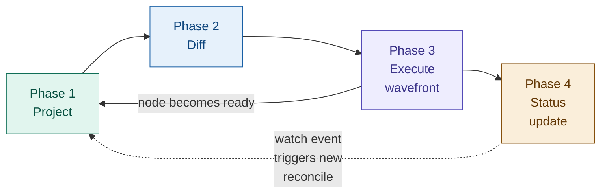
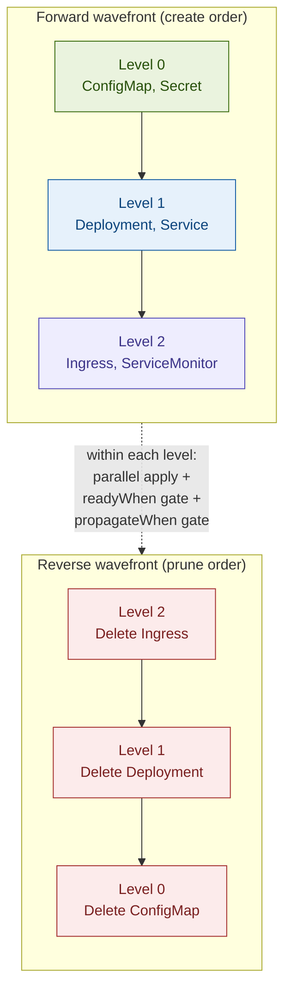
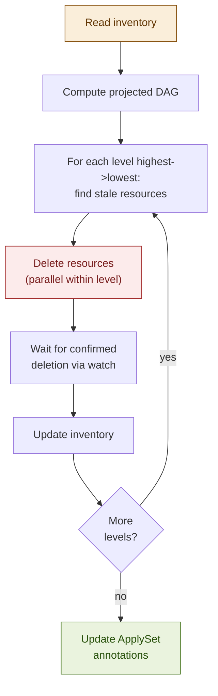
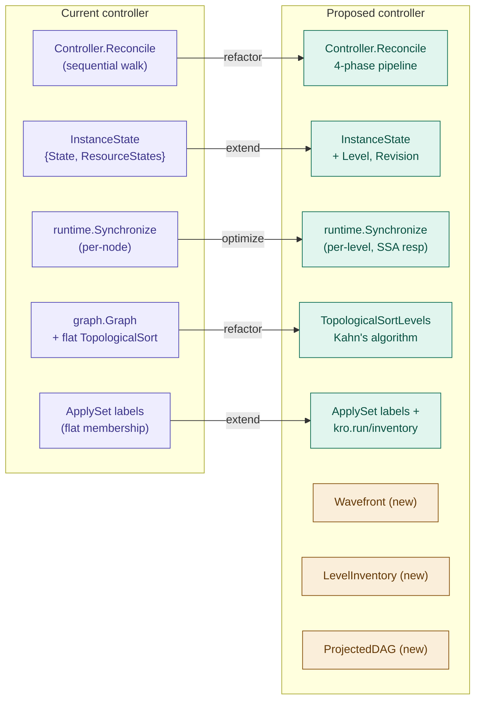
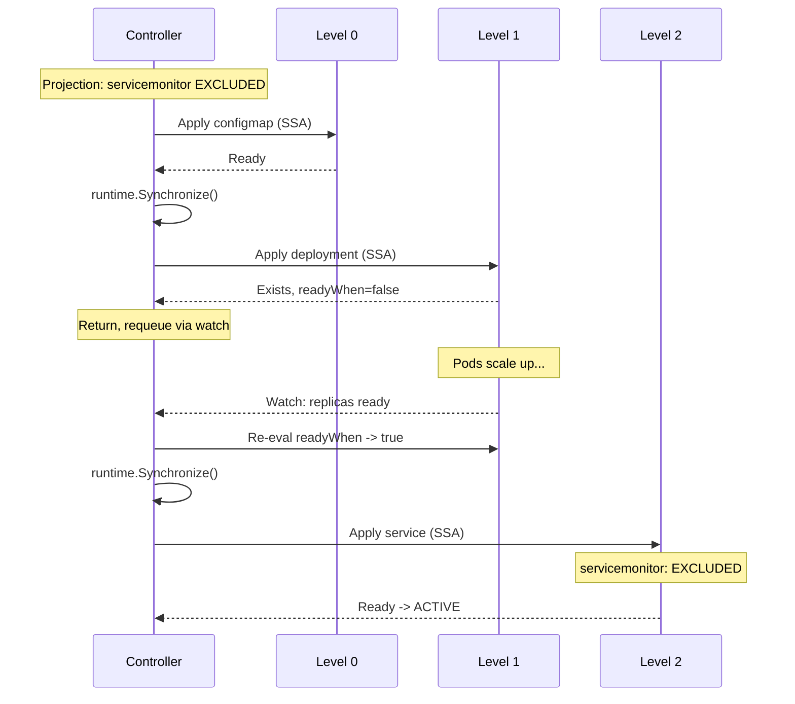
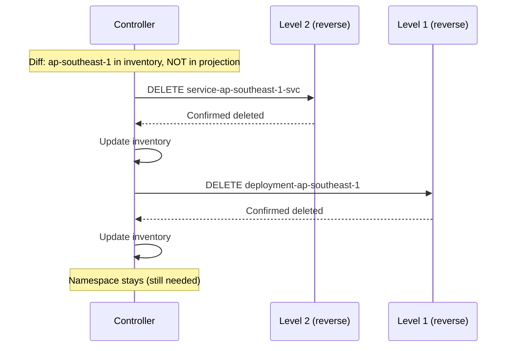
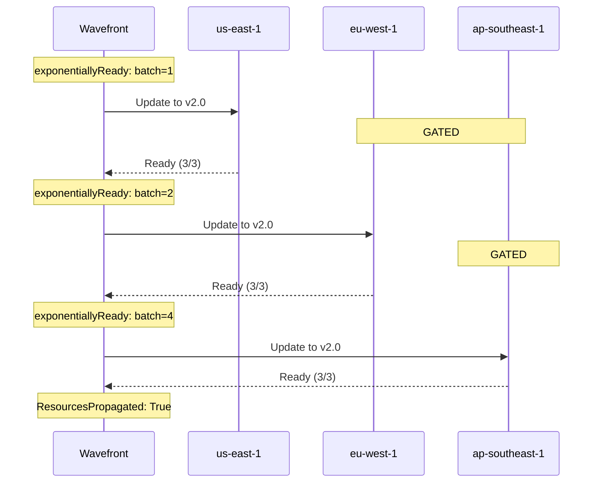

# KREP: Level-Aware Graph Synchronization for the Instance Controller

**Authors:** Jakob Moller
**Status:** Draft

## Related Proposals and References

| Reference | Title | Relationship |
|-----------|-------|--------------|
| [KREP-003] | Level-based topological sorting | Foundation: provides Kahn's algorithm and level grouping |
| [KREP-006] | Propagation control | Extension: `propagateWhen` gates integrated into wavefront |
| [KREP-014] | Resource lifecycles | Extension: Adopt/Orphan policies affect diff and prune phases |
| [KREP-022] | `managedResources` in instance status | Consumer: wavefront produces data for managedResources |
| [KEP-3659] | ApplySet: kubectl apply --prune | Specification: inventory design extends ApplySet |
| [GraphRevision CRD](https://kro.run/api/crds/graphrevision) | GraphRevision API | Data source: structural DAG snapshot |
| [SimpleSchema](https://kro.run/api/specifications/simple-schema) | SimpleSchema specification | Data source: RGD schema definition |
| [pkg/controller/instance](https://pkg.go.dev/github.com/kro-run/kro/pkg/controller/instance) | Instance controller (current) | Refactor target: existing code to be evolved |

---

## Summary

This proposal defines the synchronization engine at the heart of KRO's instance
controller. It replaces the current sequential reconciliation model with a
**level-aware wavefront synchronizer** that unifies three complementary
concerns:

1. **Parallel execution within dependency levels** (from [KREP-003])
2. **Propagation gating** via `propagateWhen` (from [KREP-006])
3. **Ordered inventory management** that extends the ApplySet specification
   ([KEP-3659]) with level-aware create/prune semantics

The core insight is that ApplySet gives us membership tracking but not ordering,
while level-based topological sorting gives us ordering but ApplySet can't
represent it. This proposal introduces a **Level Inventory** scheme that bridges
both: a per-level inventory attached to the instance's ApplySet parent, enabling
ordered creation in forward topological order and ordered pruning in reverse
topological order -- something a single flat ApplySet cannot express.

---

## Motivation

### Current state

The instance controller (`pkg/controller/instance`) today processes resources
sequentially in topological order. The `Controller.Reconcile` method walks the
DAG node-by-node: resolve CEL variables via `runtime.Synchronize()`, apply via
SSA, check `readyWhen`, advance. The `InstanceState` type tracks per-node state
as a flat `map[string]*ResourceState`. Node states (defined in
`api/v1alpha1/instance_state.go`, refactored in
[PR #970](https://github.com/kubernetes-sigs/kro/pull/970)) include `Synced`,
`InProgress`, `Error`, `WaitingForReadiness`, `Skipped`, `Deleting`, and
`Deleted`.

This works but has known limitations:

- **No parallelism.** Independent branches serialize unnecessarily. A graph with
  two independent subtrees of depth 5 takes 10 sequential steps instead of 5.
- **No propagation control.** Every reconciliation applies all pending changes
  immediately. There is no mechanism to gate mutation rate, enforce maintenance
  windows, or do incremental rollouts across `forEach` collections.
- **Flat inventory.** The current ApplySet tracks all managed resources as a
  single flat set. Pruning iterates this set without ordering guarantees,
  which means a Service might be deleted before the Deployment it fronts, or a
  Namespace before the resources inside it.
- **No revision-aware reconciliation.** When the RGD changes and a new
  [GraphRevision](https://kro.run/api/crds/graphrevision) is issued, the
  controller has no structured way to determine which resources need updating
  versus which are already at the latest revision.

### Design goals

1. **Correct ordered creation and deletion.** Resources are created in forward
   topological order and pruned in reverse topological order, even across
   reconcile interruptions.
2. **Safe parallelism.** Independent resources within the same dependency level
   execute concurrently, bounded by configurable concurrency limits.
3. **Propagation control integration.** The [KREP-006] `propagateWhen` mechanism
   gates when a node's mutation can *start*, complementing `readyWhen` which
   gates when a node's mutation is *complete*.
4. **Revision-aware convergence.** The synchronizer tracks which
   [GraphRevision](https://kro.run/api/crds/graphrevision) each resource was
   last reconciled against, enabling efficient diffing and ordered rollout of
   RGD changes.
5. **Compatibility with ApplySet.** The inventory scheme is a superset of the
   ApplySet specification ([KEP-3659]). Standard ApplySet tooling can still
   discover and enumerate managed resources; KRO extends the metadata to encode
   level ordering.

---

## Design

### Architecture overview

The synchronizer operates in four phases per reconcile cycle:



Each phase may short-circuit or loop based on watch events. The re-projection
arrow from the wavefront back to projection represents the case where a node
reaching `Ready` state causes an `includeWhen` predicate to change, requiring
a partial DAG re-evaluation.

### Phase 1: Project

Projection computes the **runtime DAG** from the structural DAG
([GraphRevision](https://kro.run/api/crds/graphrevision)) and the current
instance state. This is where the dynamic elements resolve:

```go
type ProjectedDAG struct {
    // Levels is the output of Kahn's algorithm: nodes grouped by dependency
    // depth. Level 0 has no dependencies; level N depends only on levels 0..N-1.
    Levels [][]NodeID

    // Nodes maps each node ID to its projected state.
    Nodes map[NodeID]*ProjectedNode

    // Revision is the GraphRevision this projection is based on.
    Revision int64
}

type NodeID struct {
    // ResourceID is the logical ID from the RGD (e.g., "deployment").
    ResourceID string

    // ForEachBindings encodes the forEach variable bindings for expanded nodes.
    // nil for non-forEach nodes. Deterministically serialized for stable identity.
    ForEachBindings map[string]string
}

type ProjectedNode struct {
    Included       bool                          // Result of evaluating all includeWhen predicates
    Template       *unstructured.Unstructured    // Fully-rendered Kubernetes resource manifest
    IsExternal     bool                          // externalRef node (read-only)
    Level          int                           // Topological level from Kahn's algorithm
    Dependencies   []NodeID                      // Nodes this node depends on
    ReadyWhen      []string                      // CEL predicates for readiness
    PropagateWhen  []string                      // CEL predicates for mutation gating (KREP-006)
    ResourcePolicy ResourcePolicies              // Adopt/Orphan policies (KREP-014)
}
```

**Projection rules:**

- `externalRef` nodes are resolved first (level -1, conceptually). They
  populate the CEL evaluation context but produce no create/update/delete
  actions. Since they are watched, changes trigger re-projection automatically.
- `includeWhen` predicates are evaluated against the current CEL context. Nodes
  with `Included == false` are excluded from the projected DAG entirely.
- `forEach` expressions are evaluated to produce the expansion set. Each
  combination of bindings produces a distinct `NodeID`.
- After projection, Kahn's algorithm ([KREP-003]) groups included nodes into
  levels.

**Re-projection:** Because `includeWhen` predicates can reference other
resources' status fields, the projected DAG can change during a reconciliation
pass. This is modeled as a fixed-point computation capped at a configurable
depth (default: 5 iterations). The existing cycle detection on
`includeWhen`/`readyWhen` edges prevents true infinite loops; the cap is a
safety net for complex conditional chains.

### Phase 2: Diff

The diff phase compares the projected DAG against the materialized cluster state
to produce a per-node action plan:

```go
type NodeAction int

const (
    // Forward actions (applied in level order 0, 1, 2, ...)
    ActionCreate    NodeAction = iota // In projected DAG, not in cluster
    ActionUpdate                      // In both, template differs from applied
    ActionAdopt                       // Exists, needs ApplySet labels (KREP-014)
    ActionNone                        // In both, matches, readyWhen not satisfied
    ActionReady                       // In both, matches, readyWhen satisfied

    // Reverse actions (applied in reverse level order ..., 2, 1, 0)
    ActionDelete                      // In cluster, not in projected DAG
    ActionOrphan                      // KREP-014: remove labels, keep resource

    // Gating states
    ActionBlocked                     // Dependencies not ready
    ActionGated                       // Dependencies ready, propagateWhen false (KREP-006)
)
```

### Phase 3: Execute wavefront

The wavefront processes levels in order, with parallelism within each level,
respecting both `readyWhen` and `propagateWhen` gates:



**Level execution with propagation gating ([KREP-006]):**

```go
func (w *Wavefront) executeLevel(ctx context.Context, level int, actions []PlannedAction) error {
    var wg sync.WaitGroup
    sem := make(chan struct{}, w.maxWorkers)
    errs := &syncErrorMap{}

    for _, action := range actions {
        if !w.canPropagate(action) { // KREP-006 gate check
            continue // Node is gated -- skip, do not block the level.
        }
        wg.Add(1)
        go func(a PlannedAction) {
            defer wg.Done()
            sem <- struct{}{}
            defer func() { <-sem }()
            if err := w.applyAction(ctx, a); err != nil {
                errs.Set(a.NodeID, err)
            }
        }(action)
    }
    wg.Wait()
    if errs.Len() > 0 {
        return errs.Combined()
    }
    return w.awaitLevelReady(ctx, level, actions)
}
```

**Node state machine:**

```mermaid
stateDiagram-v2
    [*] --> Pending
    Pending --> Excluded : includeWhen = false
    Pending --> Blocked : includeWhen = true,\ndeps not ready
    Excluded --> Blocked : includeWhen becomes true
    Blocked --> Gated : deps ready,\npropagateWhen = false
    Blocked --> Applying : deps ready,\npropagateWhen = true\n(or not set)
    Gated --> Applying : propagateWhen\nbecomes true
    Applying --> Error : SSA apply failed
    Applying --> WaitReady : SSA success,\nreadyWhen = false
    WaitReady --> Ready : readyWhen = true
    Error --> Applying : retry on\nnext reconcile

    note right of Gated : KREP-006\npropagateWhen\ngates mutation start
    note right of WaitReady : readyWhen\ngates mutation end
    note right of Excluded : KREP-022\nstate: EXCLUDED
```

**State mapping to [KREP-022] managedResources:**

| Synchronizer state | [KREP-022] `managedResources.state` | Current `instance_state.go` |
|---|---|---|
| `Ready` | `READY` | `NodeStateSynced` |
| `Applying` | `IN_PROGRESS` | `NodeStateInProgress` |
| `WaitReady` | `WAITING_FOR_READINESS` | `NodeStateWaitingForReadiness` |
| `Blocked` | `IN_PROGRESS` | `NodeStateInProgress` |
| `Gated` | `GATED` | *(new -- [KREP-006])* |
| `Excluded` | `EXCLUDED` | `NodeStateSkipped` (renamed) |
| `Error` | `ERROR` | `NodeStateError` |
| `ActionDelete` | `DELETING` | `NodeStateDeleting` |
| `ActionAdopt` | `IN_PROGRESS` | *(new -- [KREP-014])* |

**Why gated nodes don't block the wavefront:**

[KREP-006] models `propagateWhen` as a gate that *prevents* mutation, not one
that *delays* the reconcile loop. If the wavefront blocked waiting for
`propagateWhen` to become true (which might depend on external conditions like
maintenance windows), the controller goroutine would be tied up indefinitely.
Instead, the reconcile completes with a "gated" status, and the next watch
event or resync triggers a new evaluation.

**Deletion does not respect `propagateWhen`:** When a user deletes an instance,
all resources should be cleaned up promptly. Propagation control is a
deployment-time safety mechanism, not a deletion-time one.

### Phase 4: Status update

**Condition hierarchy (extends KREP-001 and [KREP-006]):**

```
Ready
+-- InstanceManaged       - Finalizers and labels set
+-- GraphResolved         - Runtime graph created, resources resolved
+-- ResourcesReady        - All projected resources pass readyWhen
+-- ResourcesPropagated   - All resources at latest GraphRevision (KREP-006)
```

**Instance state mapping:**

| State | Meaning |
|-------|---------|
| `ACTIVE` | All projected resources ready and propagated |
| `IN_PROGRESS` | Forward wavefront executing |
| `GATED` | Wavefront blocked by `propagateWhen` ([KREP-006]) |
| `FAILED` | One or more resources failed after retries |
| `DELETING` | Reverse wavefront executing |
| `ERROR` | Projection failed |

---

## Level-Aware Inventory Management

### The ApplySet limitation

The ApplySet specification ([KEP-3659]) uses a parent object with labels and
annotations to track set membership. This is a flat set with no ordering. When
pruning, a Service might be deleted before its Deployment. Each resource can
belong to at most one ApplySet -- you cannot create one per level.

### Level Inventory design

We extend the ApplySet parent's annotations with level metadata:

```yaml
metadata:
  labels:
    applyset.kubernetes.io/id: "kro-<hash>"
    applyset.kubernetes.io/tooling: "kro/<version>"
  annotations:
    applyset.kubernetes.io/contains-group-kinds: "Deployment.apps,Service.,ConfigMap."
    applyset.kubernetes.io/additional-namespaces: "ns-a,ns-b"
    # KRO extension: level-ordered inventory
    kro.run/inventory: |
      {"revision":3,"levels":[
        ["ConfigMap..default.app-config","Secret..default.app-secret"],
        ["Deployment.apps.default.app","Service..default.app-svc"],
        ["Ingress.networking.k8s.io.default.app-ingress"]
      ]}
```

**Member labels (on each managed resource):**

```yaml
labels:
  applyset.kubernetes.io/part-of: "kro-<hash>"
  kro.run/instance: "<instance-name>"
  kro.run/resource-id: "deployment"
  kro.run/level: "1"
  kro.run/revision: "3"
annotations:
  kro.run/foreach-bindings: '{"region":"eu-west-1"}'  # forEach nodes only
```

### Ordered prune



---

## Annotation Size Analysis

### Size formula

```
inventory_bytes ~ 30 + sum(entries_per_level * (avg_gknn_length + 3) + 4)
```

A typical GKNN entry like `"Deployment.apps.my-namespace.my-app-eu-west-1"` is
~50 characters.

### Concrete estimates

| Scenario | Total entries | Size | % of 256KB |
|----------|-------------|------|------------|
| Simple web app (5 nodes, 3 levels) | 5 | ~430B | 0.2% |
| Microservice mesh (20 nodes, 5 levels) | 20 | ~1.5KB | 0.6% |
| Multi-region (3 forEach x 10 regions) | 30 | ~2.3KB | 0.9% |
| Large platform (10 + 5 forEach x 50) | 260 | ~18KB | 7% |
| Extreme (5 + 10 forEach x 200) | 2005 | ~140KB | 55% |
| Pathological (20 forEach x 500) | 10000 | ~700KB | **EXCEEDS** |

### Mitigation

The recommended hard limit is **50% of budget (~128KB)**:

1. **Primary**: ConfigMap overflow. Annotation stores
   `{"overflow":"<configmap-name>"}`. ConfigMap data holds full inventory (1MB).
2. **Secondary**: Use GKN instead of GKNN when all resources share the instance
   namespace (~15-25 bytes saved per entry).
3. **Last resort**: gzip + base64 (typically 3-5x compression).

---

## Edge Cases and Risks

| # | Risk | Severity | Root cause | Mitigation |
|---|------|----------|------------|------------|
| 1 | **Watch storm during forEach expansion** | HIGH | N creates -> N watch events -> burst of API server load | Bound worker pool via `maxConcurrency` semaphore. Post-level yield (200ms) for levels creating >20 resources. |
| 2 | **Inventory annotation race with spec updates** | HIGH (new surface) | Inventory PATCH on main resource conflicts with user spec edits. Today's controller only writes `/status`. | Use SSA with dedicated field manager `kro-inventory`. Or store inventory in separate ConfigMap. |
| 3 | **Stale informer cache during re-projection** | MEDIUM | `runtime.Synchronize()` reads from cache that hasn't received the watch event yet | Use SSA response objects directly to update runtime context, bypassing informer cache. |
| 4 | **Finalizer-blocked reverse prune** | MEDIUM | DELETE sets `deletionTimestamp` but resource lingers until external finalizer completes | Multi-reconcile deletion: issue DELETE, mark DELETING, return. Next reconcile confirms deletion via watch. |
| 5 | **forEach identity collision** | MEDIUM | Two forEach bindings produce same Kubernetes resource name | Validate expanded names for uniqueness during projection phase before SSA applies. |
| 6 | **Revision transition with immutable field changes** | LOW / HIGH blast | RGD changes immutable field (e.g., Deployment selector) -> SSA fails permanently | Diff structural DAGs at revision creation. Flag known immutable field changes as warnings. |
| 7 | **Controller crash mid-inventory-write** | LOW | Stale inventory listing deleted resources | Atomic PATCH. On recovery, rebuild from ApplySet `part-of` labels via cluster scan. |
| 8 | **propagateWhen never becoming true** | LOW / MED impact | External resource stuck -> permanent GATED state ([KREP-006]) | Optional `propagationTimeout`. Condition message: "propagateWhen false for 4h on node X". |

---

## Correlation with KREP-022: managedResources

[KREP-022] introduces `managedResources` in instance status. This proposal's
synchronizer produces all the data it needs.

**Key design decisions from [PR #1161](https://github.com/kubernetes-sigs/kro/pull/1161) review:**

- **`graphRevision` must be per-node**, not per-instance
  ([review comment](https://github.com/kubernetes-sigs/kro/pull/1161#discussion_r2949023361)).
  During revision transitions, different nodes are at different revisions.
- **External nodes excluded** from managedResources
  ([review comment](https://github.com/kubernetes-sigs/kro/pull/1161#discussion_r2949061140)).
- **Add `level` field** to each entry (new -- this proposal recommends it).
- **State naming**: map internal `NodeStateSynced` -> `READY` in status
  ([review comment](https://github.com/kubernetes-sigs/kro/pull/1161#discussion_r2949028082)).

---

## Correlation with KREP-014: Resource Lifecycles

[KREP-014] introduces resource policies for adoption and orphaning. The
[PR #1091](https://github.com/kubernetes-sigs/kro/pull/1091) review discussion
converges toward separating creation and deletion policies:

```go
type ResourcePolicies struct {
    OnCreate string // "Create" (default) | "Adopt" | "Error"
    OnDelete string // "Delete" (default) | "Orphan" | "Error"
}
```

This fits the synchronizer naturally: forward wavefront reads `OnCreate`,
reverse wavefront reads `OnDelete`. They never interfere, avoiding the compound
`AdoptAndOrphan` policy flagged in [review](https://github.com/kubernetes-sigs/kro/pull/1091#discussion_r2921044507).

---

## Convergence with pkg/controller/instance

### Mapping current -> proposed



### What stays

- `Controller.Reconcile(ctx, req) error` -- same entry point.
- `graph.Graph` -- compiled RGD with CEL programs
  ([PR #1014](https://github.com/kubernetes-sigs/kro/pull/1014)). Proposal adds
  levels but doesn't change the type.
- `runtime.Synchronize()` -- called per-level instead of per-node. Should use
  SSA response objects to avoid stale cache risk.
- All ApplySet labels -- strictly additive.
- Node state constants from `api/v1alpha1/instance_state.go` -- kept, with new
  states: `GATED` ([KREP-006]), `EXCLUDED`/`INCLUDED` ([KREP-022]).

### What changes

- `ResourceState` gains `Level int`, `Revision int64`, `Action NodeAction`.
  Backward compatible (zero values = current behavior).
- `ReconcileConfig` gains `MaxConcurrency int` (default: 10).
- Status update gains `managedResources` builder ([KREP-022]) and inventory
  annotation writer.

### New components

| Component | Purpose |
|-----------|---------|
| `Wavefront` | Level-aware parallel executor with [KREP-006] + [KREP-014] gates |
| `LevelInventory` | Serializer for `kro.run/inventory` with ConfigMap overflow |
| `ProjectedDAG` | Explicit runtime DAG with `includeWhen`/`forEach` evaluated |
| `ReconcilePlan` | Typed diff output grouping actions by level |

### Migration path

| Phase | Scope | Target |
|-------|-------|--------|
| 1 | Add `TopologicalSortLevels()` ([KREP-003]). Sequential execution. Add `kro.run/level` labels. | v0.10 |
| 2 | Add `LevelInventory` writer. Write `kro.run/inventory`. Add `kro.run/revision` labels. | v0.10 |
| 3 | Replace sequential walk with wavefront. Add `managedResources` ([KREP-022]). | v0.11 |
| 4 | Add `propagateWhen` ([KREP-006]) and `onCreate`/`onDelete` ([KREP-014]). | v0.12+ |

---

## Concrete Examples

### Example 1: Web application with conditional monitoring

RGD with `includeWhen`-conditional `ServiceMonitor`. Levels:
`[configmap]` -> `[deployment]` -> `[service, servicemonitor]`.

**Reconcile sequence with `monitoring: false`:**



**User enables `monitoring: true`:**
servicemonitor transitions `EXCLUDED -> INCLUDED -> IN_PROGRESS -> READY`.

### Example 2: Multi-region forEach with ordered pruning

**User removes region `ap-southeast-1`:**



Service deleted **before** Deployment -- traffic stops before pods removed.

### Example 3: Database with Adopt/Orphan ([KREP-014])

- Level 0: database -- `onCreate: Adopt` -> verify exists, add labels
- Level 1: app-config -- normal create using `database.status`
- Level 2: deployment -- normal create
- On delete: Level 2->1 deleted, Level 0 database **orphaned** (labels removed,
  resource survives)

### Example 4: Propagation-controlled rollout ([KREP-006])



---

## Open Questions

1. **Concurrent propagations** -- [KREP-006] raises whether multiple revision
   rollouts can overlap. This proposal assumes single-propagation. Defer.
2. **Debounce on external watches** -- configurable 1-2s window.
3. **forEach rollout** -- subsumed by [KREP-006] `propagateWhen` primitives.
4. **Inventory storage backend** -- annotation-first with ConfigMap overflow vs
   always-ConfigMap.

---

## Testing Strategy

### Unit tests

- Kahn's algorithm level computation
- Diff algorithm (create, update, delete, adopt, orphan)
- Inventory serialization and ConfigMap overflow
- Propagation gate evaluation ([KREP-006])
- forEach set reconciliation and identity collision detection
- Annotation size estimation

### Integration tests

- Multi-level wavefront execution
- Partial failure and recovery
- Revision transitions
- forEach expansion/contraction with ordered pruning
- `includeWhen` re-projection
- `propagateWhen` gating ([KREP-006])
- `onCreate`/`onDelete` flows ([KREP-014])
- `managedResources` population ([KREP-022])
- Controller restart with partial inventory

### Edge cases

- Single-level graphs (all independent)
- Linear chains (no parallelism)
- 50+ resources across 10+ levels
- forEach producing 0 elements
- All nodes gated
- Revision reordering levels
- Inventory exceeding 50% budget
- Resource lifecycle policy transitions mid-reconcile ([KREP-014])

<!-- Reference-style links -->
[KREP-003]: https://github.com/bschaatsbergen/kro/blob/1260308a4475ea622f774e3d3ff0f4ee13bca0b5/docs/design/proposals/krep-003-level-based-topological-sorting.md
[KREP-006]: https://github.com/ellistarn/kro/blob/ba49042d4054b58ca44796fe36f247ca4e92d681/docs/design/proposals/propagation-control.md
[KREP-014]: https://github.com/kubernetes-sigs/kro/pull/1091
[KREP-022]: https://github.com/kubernetes-sigs/kro/pull/1161
[KEP-3659]: https://github.com/kubernetes/enhancements/blob/master/keps/sig-cli/3659-kubectl-apply-prune/README.md
