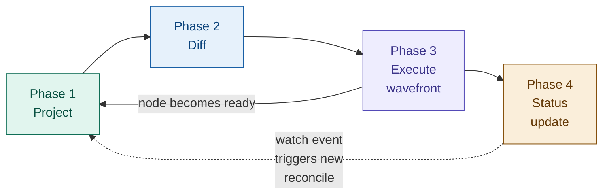
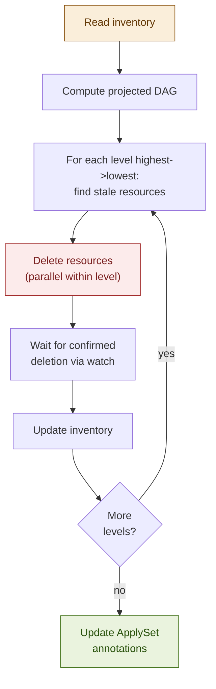
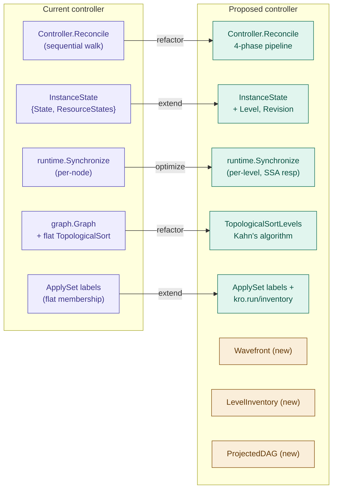
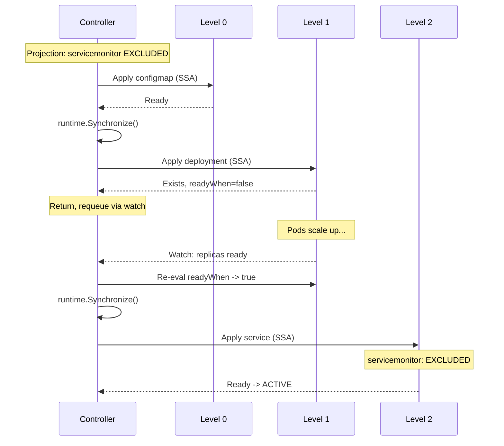
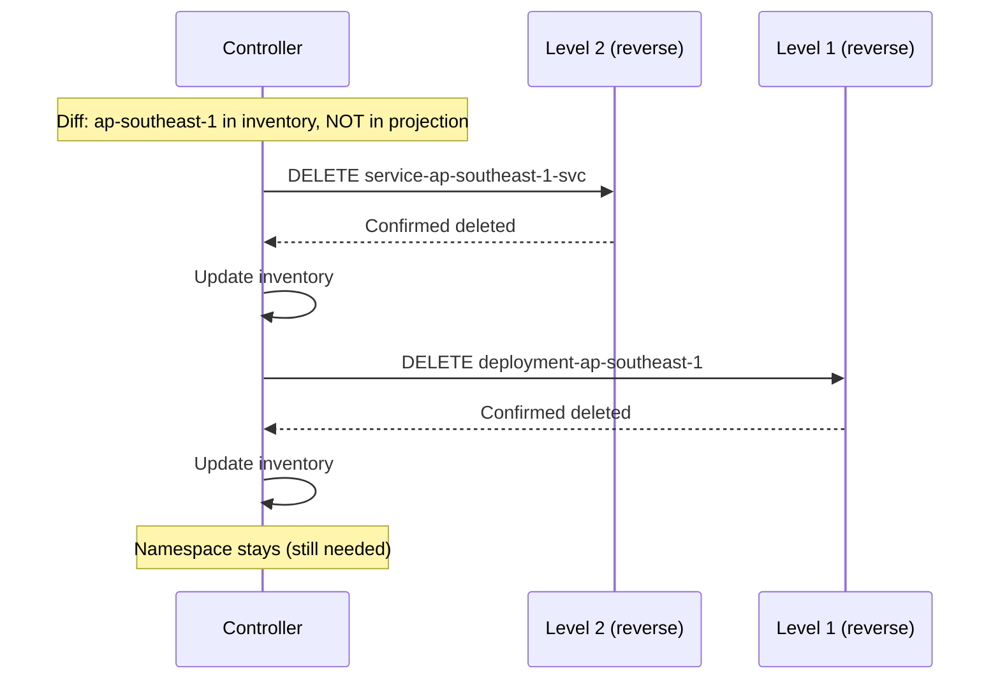
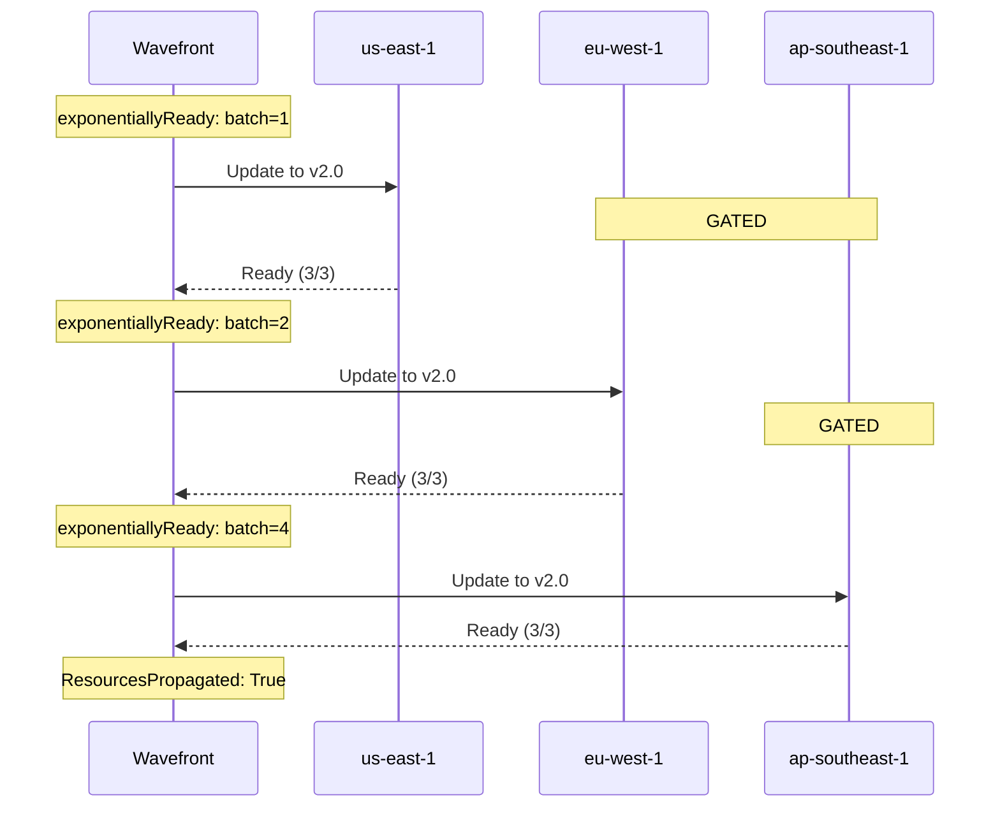

# KREP: Level-Aware Graph Synchronization for the Instance Controller

**Authors:** Jakob Moller
**Status:** Draft

## Related Proposals and References

| Reference | Title | Relationship |
|-----------|-------|--------------|
| [KREP-003] | Level-based topological sorting | Foundation: provides Kahn's algorithm and level grouping |
| [KREP-006] | Propagation control | Extension: `propagateWhen` gates integrated into wavefront |
| [KREP-014] | Resource lifecycles | Extension: Adopt/Orphan policies affect diff and prune phases |
| [KREP-022] | `managedResources` in instance status | Consumer: wavefront produces data for managedResources |
| [KEP-3659] | ApplySet: kubectl apply --prune | Specification: inventory design extends ApplySet |
| [GraphRevision CRD](https://kro.run/api/crds/graphrevision) | GraphRevision API | Data source: structural DAG snapshot |
| [SimpleSchema](https://kro.run/api/specifications/simple-schema) | SimpleSchema specification | Data source: RGD schema definition |
| [pkg/controller/instance](https://pkg.go.dev/github.com/kro-run/kro/pkg/controller/instance) | Instance controller (current) | Refactor target: existing code to be evolved |

---

## Summary

This proposal defines the synchronization engine at the heart of KRO's instance
controller. It replaces the current sequential reconciliation model with a
**level-aware wavefront synchronizer** that unifies three complementary
concerns:

1. **Parallel execution within dependency levels** (from [KREP-003])
2. **Propagation gating** via `propagateWhen` (from [KREP-006])
3. **Ordered inventory management** that extends the ApplySet specification
   ([KEP-3659]) with level-aware create/prune semantics

The core insight is that ApplySet gives us membership tracking but not ordering,
while level-based topological sorting gives us ordering but ApplySet can't
represent it. This proposal introduces a **Level Inventory** scheme that bridges
both: a per-level inventory attached to the instance's ApplySet parent, enabling
ordered creation in forward topological order and ordered pruning in reverse
topological order -- something a single flat ApplySet cannot express.

---

## Motivation

### Current state

The instance controller (`pkg/controller/instance`) today processes resources
sequentially in topological order. The `Controller.Reconcile` method walks the
DAG node-by-node: resolve CEL variables via `runtime.Synchronize()`, apply via
SSA, check `readyWhen`, advance. The `InstanceState` type tracks per-node state
as a flat `map[string]*ResourceState`. Node states (defined in
`api/v1alpha1/instance_state.go`, refactored in
[PR #970](https://github.com/kubernetes-sigs/kro/pull/970)) include `Synced`,
`InProgress`, `Error`, `WaitingForReadiness`, `Skipped`, `Deleting`, and
`Deleted`.

This works but has known limitations:

- **No parallelism.** Independent branches serialize unnecessarily. A graph with
  two independent subtrees of depth 5 takes 10 sequential steps instead of 5.
- **No propagation control.** Every reconciliation applies all pending changes
  immediately. There is no mechanism to gate mutation rate, enforce maintenance
  windows, or do incremental rollouts across `forEach` collections.
- **Flat inventory.** The current ApplySet tracks all managed resources as a
  single flat set. Pruning iterates this set without ordering guarantees,
  which means a Service might be deleted before the Deployment it fronts, or a
  Namespace before the resources inside it.
- **No revision-aware reconciliation.** When the RGD changes and a new
  [GraphRevision](https://kro.run/api/crds/graphrevision) is issued, the
  controller has no structured way to determine which resources need updating
  versus which are already at the latest revision.

### Design goals

1. **Correct ordered creation and deletion.** Resources are created in forward
   topological order and pruned in reverse topological order, even across
   reconcile interruptions.
2. **Safe parallelism.** Independent resources within the same dependency level
   execute concurrently, bounded by configurable concurrency limits.
3. **Propagation control integration.** The [KREP-006] `propagateWhen` mechanism
   gates when a node's mutation can *start*, complementing `readyWhen` which
   gates when a node's mutation is *complete*.
4. **Revision-aware convergence.** The synchronizer tracks which
   [GraphRevision](https://kro.run/api/crds/graphrevision) each resource was
   last reconciled against, enabling efficient diffing and ordered rollout of
   RGD changes.
5. **Compatibility with ApplySet.** The inventory scheme is a superset of the
   ApplySet specification ([KEP-3659]). Standard ApplySet tooling can still
   discover and enumerate managed resources; KRO extends the metadata to encode
   level ordering.

---

## Design

### Architecture overview

The synchronizer operates in four phases per reconcile cycle:



Each phase may short-circuit or loop based on watch events. The re-projection
arrow from the wavefront back to projection represents the case where a node
reaching `Ready` state causes an `includeWhen` predicate to change, requiring
a partial DAG re-evaluation.

### Phase 1: Project

Projection computes the **runtime DAG** from the structural DAG
([GraphRevision](https://kro.run/api/crds/graphrevision)) and the current
instance state. This is where the dynamic elements resolve:

```go
type ProjectedDAG struct {
    // Levels is the output of Kahn's algorithm: nodes grouped by dependency
    // depth. Level 0 has no dependencies; level N depends only on levels 0..N-1.
    Levels [][]NodeID

    // Nodes maps each node ID to its projected state.
    Nodes map[NodeID]*ProjectedNode

    // Revision is the target GraphRevision.spec.revision number for this
    // reconcile cycle. Resolved via GraphRevisionResolver.GetLatestRevision()
    // from the in-memory revision registry. The corresponding GraphRevision
    // object is immutable (XValidation: "self == oldSelf") and carries the
    // full RGD spec snapshot in spec.snapshot.spec.
    //
    // Per-node current revision is tracked individually via the
    // kro.run/revision label on each managed resource — NOT at the instance
    // level. This allows partial migration: after a failed wavefront, some
    // nodes are at the new revision and some are still at the old one.
    Revision int64
}

type NodeID struct {
    // ResourceID is the logical ID from the RGD (e.g., "deployment").
    ResourceID string

    // ForEachBindings encodes the forEach variable bindings for expanded nodes.
    // nil for non-forEach nodes. Deterministically serialized for stable identity.
    ForEachBindings map[string]string
}

type ProjectedNode struct {
    Included       bool                          // Result of evaluating all includeWhen predicates
    Template       *unstructured.Unstructured    // Fully-rendered Kubernetes resource manifest
    IsExternal     bool                          // externalRef node (read-only)
    Level          int                           // Topological level from Kahn's algorithm
    Dependencies   []NodeID                      // Nodes this node depends on
    ReadyWhen      []string                      // CEL predicates for readiness
    PropagateWhen  []string                      // CEL predicates for mutation gating (KREP-006)
    ResourcePolicy ResourcePolicies              // Adopt/Orphan policies (KREP-014)
}
```

**Projection rules:**

- `externalRef` nodes are resolved first (level -1, conceptually). They
  populate the CEL evaluation context but produce no create/update/delete
  actions. Since they are watched, changes trigger re-projection automatically.
- `includeWhen` predicates are evaluated against the current CEL context. Nodes
  with `Included == false` are excluded from the projected DAG entirely.
- `forEach` expressions are evaluated to produce the expansion set. Each
  combination of bindings produces a distinct `NodeID`.
- After projection, Kahn's algorithm ([KREP-003]) groups included nodes into
  levels.

**Re-projection:** Because `includeWhen` predicates can reference other
resources' status fields, the projected DAG can change during a reconciliation
pass. This is modeled as a fixed-point computation capped at a configurable
depth (default: 5 iterations). The existing cycle detection on
`includeWhen`/`readyWhen` edges prevents true infinite loops; the cap is a
safety net for complex conditional chains.

### Phase 2: Diff

The diff phase compares the projected DAG against the materialized cluster state
to produce a per-node action plan:

```go
type NodeAction int

const (
    // Forward actions (applied in level order 0, 1, 2, ...)
    ActionCreate    NodeAction = iota // In projected DAG, not in cluster
    ActionUpdate                      // In both, template differs from applied
    ActionAdopt                       // Exists, needs ApplySet labels (KREP-014)
    ActionNone                        // In both, matches, readyWhen not satisfied
    ActionReady                       // In both, matches, readyWhen satisfied

    // Reverse actions (applied in reverse level order ..., 2, 1, 0)
    ActionDelete                      // In cluster, not in projected DAG
    ActionOrphan                      // KREP-014: remove labels, keep resource

    // Gating states
    ActionBlocked                     // Dependencies not ready
    ActionGated                       // Dependencies ready, propagateWhen false (KREP-006)
)
```

**Revision-aware diffing:**

The diff phase reads each managed resource's `kro.run/revision` label to
determine whether it needs re-reconciliation against the target revision.
When a node's label is behind the target, the diff marks it `ActionUpdate`
even if the rendered template is byte-for-byte identical — because the new
GraphRevision may have changed CEL expressions, dependency edges, or
`readyWhen`/`propagateWhen` predicates that don't appear in the template:

```go
func (d *Differ) classifyNode(node *ProjectedNode, live *unstructured.Unstructured) NodeAction {
    if live == nil {
        return ActionCreate
    }

    liveRevision, _ := strconv.ParseInt(
        live.GetLabels()["kro.run/revision"], 10, 64,
    )

    if liveRevision < d.targetRevision {
        // Resource was last reconciled under an older revision.
        // Force update to bump the label and apply any behavioral
        // changes from the new GraphRevision.
        return ActionUpdate
    }

    if !equality.Semantic.DeepEqual(node.Template, live) {
        return ActionUpdate
    }

    if d.evaluateReadyWhen(node, live) {
        return ActionReady
    }
    return ActionNone
}
```

### Phase 3: Execute wavefront

The wavefront processes levels in strict order, with parallelism *within*
each level. A level only begins after all nodes in the previous level have
reached `Ready` (or been skipped/gated). This guarantees that a node's
dependencies are always satisfied before it is touched.

#### Forward wavefront (create/update)

Levels are processed in ascending order (0, 1, 2, ...). Within each level,
all non-gated nodes are applied concurrently up to `maxConcurrency`:

```
DAG:  ConfigMap ──► Deployment ──► Service
      Secret    ──┘              ─► Ingress

Levels after Kahn's algorithm:
  Level 0: [ConfigMap, Secret]       (no dependencies)
  Level 1: [Deployment]              (depends on ConfigMap, Secret)
  Level 2: [Service, Ingress]        (depend on Deployment)

Forward wavefront execution:

  ┌─────────────────────────────────────────────────────────────────┐
  │ Level 0                                                         │
  │                                                                 │
  │   ConfigMap ─── SSA apply ──► exists ──► readyWhen? ──► Ready   │
  │                                          (parallel)             │
  │   Secret ────── SSA apply ──► exists ──► readyWhen? ──► Ready   │
  │                                                                 │
  │   All Ready? ── yes ──► runtime.Synchronize() ──► advance       │
  └─────────────────────────────────────────────────────────────────┘
                                    │
                                    ▼
  ┌─────────────────────────────────────────────────────────────────┐
  │ Level 1                                                         │
  │                                                                 │
  │   Deployment ── SSA apply ──► exists ──► readyWhen? ── no       │
  │                                                                 │
  │   Requeue. Wait for watch event (e.g. replicas become ready).   │
  │   Next reconcile re-enters here:                                │
  │                                                                 │
  │   Deployment ── skip apply (unchanged) ─► readyWhen? ── Ready   │
  │                                                                 │
  │   All Ready? ── yes ──► runtime.Synchronize() ──► advance       │
  └─────────────────────────────────────────────────────────────────┘
                                    │
                                    ▼
  ┌─────────────────────────────────────────────────────────────────┐
  │ Level 2                                                         │
  │                                                                 │
  │   Service ──── SSA apply ──► exists ──► readyWhen? ──► Ready    │
  │                                         (parallel)              │
  │   Ingress ──── SSA apply ──► exists ──► readyWhen? ──► Ready    │
  │                                                                 │
  │   All Ready? ── yes ──► instance ACTIVE                         │
  └─────────────────────────────────────────────────────────────────┘
```

Key behaviors:

- **Parallelism within a level.** ConfigMap and Secret are applied
  concurrently. Service and Ingress are applied concurrently. But
  Deployment never starts before both ConfigMap and Secret are `Ready`.
- **readyWhen as a level gate.** The wavefront does not advance to level 1
  until *all* level 0 nodes pass their `readyWhen` predicates. If a node's
  readyWhen is not yet satisfied, the reconcile returns and waits for a
  watch event.
- **runtime.Synchronize() between levels.** After a level completes, the
  CEL evaluation context is refreshed with the latest status fields from
  the just-completed resources. This ensures that level 1 templates can
  reference level 0 status values (e.g., a Deployment referencing a
  ConfigMap's resourceVersion).
- **Concurrency bound.** A semaphore limits parallel SSA applies to
  `maxConcurrency` (default: 10) to avoid overwhelming the API server.

#### Reverse wavefront (delete/prune)

When resources need to be removed (instance deletion or nodes removed by a
new GraphRevision), levels are processed in descending order (2, 1, 0).
This ensures dependents are cleaned up before their dependencies:

```
Reverse wavefront execution (instance deletion):

  Level 2: DELETE Service      (parallel)
           DELETE Ingress
           Wait for confirmed deletion via watch.

  Level 1: DELETE Deployment
           Wait for confirmed deletion via watch.

  Level 0: DELETE ConfigMap    (parallel)
           DELETE Secret
           Wait for confirmed deletion via watch.

  Remove finalizer. Instance deleted.
```

This ordering prevents dangling references: the Service is deleted before
the Deployment it routes to, and the Deployment is deleted before the
ConfigMap it mounts.

#### Propagation gating within a level ([KREP-006])

When `propagateWhen` is configured, some nodes within a level may be
gated even though their dependencies are ready. The wavefront applies
non-gated nodes and skips gated ones — it does not block waiting:

```
Level 1: [deploy-us, deploy-eu, deploy-ap]
         propagateWhen: canary.status.healthy == true

  deploy-us ── propagateWhen? ── true  ──► SSA apply ──► WaitReady
  deploy-eu ── propagateWhen? ── false ──► GATED (skip)
  deploy-ap ── propagateWhen? ── false ──► GATED (skip)

  Level result: 1 applied, 2 gated.
  Reconcile completes with status: GATED.
  Next watch event (canary becomes healthy) triggers new reconcile.
  deploy-eu and deploy-ap re-evaluated.
```

#### Mixed forward and reverse in the same reconcile

When a new GraphRevision adds some nodes and removes others, both
wavefronts run in the same reconcile cycle. The forward wavefront runs
first (create/update), then the reverse wavefront prunes stale resources:

```
Revision 2: [ConfigMap] -> [Deployment, OldSidecar] -> [Service]
Revision 3: [ConfigMap] -> [Deployment, NewSidecar] -> [Service]

Same reconcile:
  Forward (levels 0, 1, 2):
    Level 0: Update ConfigMap
    Level 1: Update Deployment, Create NewSidecar
    Level 2: Update Service

  Reverse (levels 1):
    Level 1: Delete OldSidecar

Result: OldSidecar removed only after NewSidecar is Ready.
```

**Node state machine:**

```
                         includeWhen = false
              [*] ──────────────────────────────────► Excluded
               │                                        │
               │ includeWhen = true,                    │ includeWhen
               │ deps not ready                         │ becomes true
               ▼                                        │
            Blocked ◄───────────────────────────────────┘
               │
               ├─── deps ready, propagateWhen = false ──► Gated ─┐
               │                                                  │
               │    deps ready, propagateWhen = true              │ propagateWhen
               │    (or not set)                                  │ becomes true
               ▼                                                  │
           Applying ◄─────────────────────────────────────────────┘
               │  ▲
  SSA apply    │  │ retry on
  failed       │  │ next reconcile
               ▼  │
            Error ─┘
               │
               │ SSA success,
               │ readyWhen = false
               ▼
          WaitReady ─── readyWhen = true ──► Ready
               │                               │
               │                               │
    ┌──────────┘                  ┌────────────┘
    │ KREP-006: propagateWhen     │ KREP-006: readyWhen
    │ gates mutation start        │ gates mutation end
    └─────────────────────────────┘
```

**State mapping to [KREP-022] managedResources:**

| Synchronizer state | [KREP-022] `managedResources.state` | Current `instance_state.go` |
|---|---|---|
| `Ready` | `READY` | `NodeStateSynced` |
| `Applying` | `IN_PROGRESS` | `NodeStateInProgress` |
| `WaitReady` | `WAITING_FOR_READINESS` | `NodeStateWaitingForReadiness` |
| `Blocked` | `IN_PROGRESS` | `NodeStateInProgress` |
| `Gated` | `GATED` | *(new -- [KREP-006])* |
| `Excluded` | `EXCLUDED` | `NodeStateSkipped` (renamed) |
| `Error` | `ERROR` | `NodeStateError` |
| `ActionDelete` | `DELETING` | `NodeStateDeleting` |
| `ActionAdopt` | `IN_PROGRESS` | *(new -- [KREP-014])* |

**Why gated nodes don't block the wavefront:**

[KREP-006] models `propagateWhen` as a gate that *prevents* mutation, not one
that *delays* the reconcile loop. If the wavefront blocked waiting for
`propagateWhen` to become true (which might depend on external conditions like
maintenance windows), the controller goroutine would be tied up indefinitely.
Instead, the reconcile completes with a "gated" status, and the next watch
event or resync triggers a new evaluation.

**Deletion does not respect `propagateWhen`:** When a user deletes an instance,
all resources should be cleaned up promptly. Propagation control is a
deployment-time safety mechanism, not a deletion-time one.

### Phase 4: Status update

**Condition hierarchy (extends KREP-001 and [KREP-006]):**

```
Ready
+-- InstanceManaged       - Finalizers and labels set
+-- GraphResolved         - Runtime graph created, resources resolved
+-- ResourcesReady        - All projected resources pass readyWhen
+-- ResourcesPropagated   - All resources at latest GraphRevision (KREP-006)
```

**Instance state mapping:**

| State | Meaning |
|-------|---------|
| `ACTIVE` | All projected resources ready and propagated |
| `IN_PROGRESS` | Forward wavefront executing |
| `GATED` | Wavefront blocked by `propagateWhen` ([KREP-006]) |
| `FAILED` | One or more resources failed after retries |
| `DELETING` | Reverse wavefront executing |
| `ERROR` | Projection failed |

---

## Level-Aware Inventory Management

### The ApplySet limitation

The ApplySet specification ([KEP-3659]) uses a parent object with labels and
annotations to track set membership. This is a flat set with no ordering. When
pruning, a Service might be deleted before its Deployment. Each resource can
belong to at most one ApplySet -- you cannot create one per level.

### Level Inventory design

We extend the ApplySet parent's annotations with level metadata:

```yaml
metadata:
  labels:
    applyset.kubernetes.io/id: "kro-<hash>"
    applyset.kubernetes.io/tooling: "kro/<version>"
  annotations:
    applyset.kubernetes.io/contains-group-kinds: "Deployment.apps,Service.,ConfigMap."
    applyset.kubernetes.io/additional-namespaces: "ns-a,ns-b"
    # KRO extension: level-ordered inventory
    kro.run/inventory: |
      {"revision":3,"levels":[
        ["ConfigMap..default.app-config","Secret..default.app-secret"],
        ["Deployment.apps.default.app","Service..default.app-svc"],
        ["Ingress.networking.k8s.io.default.app-ingress"]
      ]}
```

The `revision` field in the inventory is a "fully converged" marker — it
is only updated after the entire forward wavefront completes and all
nodes reach the target revision. Per-node revision is the source of truth
(via `kro.run/revision` labels on managed resources). During a partial
failure, individual node labels show exactly which nodes migrated and
which did not; the inventory `revision` stays at the old value, ensuring
the next reconcile correctly re-targets all stale nodes.

**Member labels (on each managed resource):**

```yaml
labels:
  applyset.kubernetes.io/part-of: "kro-<hash>"
  kro.run/instance: "<instance-name>"
  kro.run/resource-id: "deployment"
  kro.run/level: "1"
  kro.run/revision: "3"
annotations:
  kro.run/foreach-bindings: '{"region":"eu-west-1"}'  # forEach nodes only
```

### Ordered prune



---

## Revision Migration: n-1 to n

This section describes the mechanics of transitioning an instance from
GraphRevision *n-1* to GraphRevision *n*.

### Trigger

A new GraphRevision is created by the RGD controller whenever
`ResourceGraphDefinition.spec` changes. The GraphRevision object is
immutable (`spec` carries an XValidation rule: `self == oldSelf`) and
contains a full snapshot of the RGD spec:

```yaml
apiVersion: internal.kro.run/v1alpha1
kind: GraphRevision
metadata:
  name: webapp-r00003
  labels:
    kro.run/graph-revision-hash: "sha256-abc123"
    internal.kro.run/resource-graph-definition-name: webapp
spec:
  revision: 3
  snapshot:
    name: webapp
    generation: 7
    spec: { ... }   # full copy of the RGD spec at generation 7
```

The in-memory revision registry (`pkg/graph/revisions/registry.go`)
tracks this object through states `Pending -> Active` (or `Failed`). The
instance controller's `GraphRevisionResolver.GetLatestRevision()` returns
the highest-numbered active entry.

### Detection

At the start of each reconcile, Phase 1 (Project) resolves the latest
active GraphRevision and records it as `ProjectedDAG.Revision` — the
*target* revision. Each managed resource's *current* revision is read
individually from its `kro.run/revision` label during Phase 2 (Diff).

There is no instance-level "previous revision" field. Per-node tracking
is the source of truth because during a partial migration, different
nodes are at different revisions. The `revision` field in the
`kro.run/inventory` annotation is a "fully converged" marker — only
updated after all nodes reach the target.

### Diffing during revision transition

Phase 2 compares each node individually:

- If the managed resource's `kro.run/revision` label equals the target →
  normal diff (compare template, check readyWhen).
- If the label is **behind** the target → `ActionUpdate` regardless of
  whether the rendered template changed. This ensures:
  1. The `kro.run/revision` label is bumped.
  2. Any SSA field manager changes take effect.
  3. The new revision's `readyWhen`/`propagateWhen` predicates are
     evaluated.
- If the resource does **not exist** → `ActionCreate` (new node in this
  revision).
- If the resource exists in the inventory but is **absent** from the
  projected DAG → `ActionDelete` (node removed in this revision).

### Execution order

Revision migration follows the same level-by-level forward wavefront.
This is critical: level 0 resources may carry new configuration values
that higher levels depend on.

```
Revision 2 (current):  [ConfigMap] -> [Deployment] -> [Service]
Revision 3 (target):   [ConfigMap] -> [Deployment] -> [Service, Ingress]
                                                        ^^^^^^^ new node

Forward wavefront:
  Level 0: Update ConfigMap (kro.run/revision: 2 -> 3)
           Wait readyWhen -> Ready
  Level 1: Update Deployment (kro.run/revision: 2 -> 3)
           Wait readyWhen -> Ready
  Level 2: Update Service (kro.run/revision: 2 -> 3)
           Create Ingress (kro.run/revision: 3)
           Wait readyWhen -> Ready

Inventory updated: {"revision": 3, ...}
```

If a node fails at level 1, the wavefront halts. Level 0 nodes carry
`kro.run/revision: 3`, level 1+ nodes retain `kro.run/revision: 2`.
The inventory `revision` stays at `2`. On the next reconcile, the diff
sees level 0 nodes already at revision 3 (skip or readyWhen-check only)
and resumes work at level 1.

### Topology changes between revisions

When the new GraphRevision changes the dependency structure:

| Change | Handling |
|--------|----------|
| **Node added** | Appears in projected DAG at its computed level. `ActionCreate`. Created in forward order. |
| **Node removed** | In inventory but absent from projected DAG. `ActionDelete`. Deleted in reverse order after all forward actions complete. |
| **Node moves to a different level** | `kro.run/level` label updated during SSA apply. Inventory rewritten with new level assignments. The forward wavefront processes the node at its new level. |
| **Dependency edge added** | Node waits for an additional dependency. If it creates a cycle, the GraphRevision's `GraphVerified` condition is `False` and the revision enters `Failed` state — never served to instances. |
| **Dependency edge removed** | Node may move to a lower level. Processed at its new level. |

**Example — node changes level:**

```
Revision 2:  L0:[ConfigMap, Secret]  L1:[Deployment]  L2:[Service]
Revision 3:  L0:[ConfigMap]          L1:[Secret, Deployment]  L2:[Service]
             (Secret now depends on ConfigMap)

Forward wavefront for revision 3:
  Level 0: Update ConfigMap (revision 2->3)
  Level 1: Update Secret (revision 2->3, kro.run/level: 0->1)
           Update Deployment (revision 2->3)
  Level 2: Update Service (revision 2->3)
```

### The kro.run/revision label

Each managed resource carries `kro.run/revision` set during SSA apply.
It serves three purposes:

1. **Diff optimization.** Skip re-applying resources already at the
   target revision when templates have not changed.
2. **Progress visibility.** `kubectl get <resource> -L kro.run/revision`
   shows at a glance which resources have migrated and which have not.
3. **Debugging.** After a partial failure, the label reveals the exact
   frontier of the migration across all managed resources.

The label is written atomically as part of the SSA apply — it is never
updated separately from the resource template.

### Edge cases

**Revision issued mid-reconcile:**

If a new GraphRevision becomes active while the wavefront is executing
revision *n*, the current reconcile completes against revision *n*. The
newer revision *n+1* is picked up on the next reconcile cycle. This is
safe because `resolveCompiledGraph()` is called once at the start of
each reconcile and the result is held for the duration. The inventory and
labels are updated to revision *n*, so the next reconcile correctly
diffs *n* against *n+1*.

**Failed revision:**

If the latest GraphRevision enters `Failed` state (compilation error),
`resolveCompiledGraph()` returns a terminal error and the reconcile
aborts. The instance retains its current per-node revision labels. There
is no fallback to the previous active revision — a failed revision means
the RGD spec is invalid, and silently falling back could mask the
problem. The `GraphVerified` condition on the GraphRevision surfaces the
error; the instance's `GraphResolved` condition transitions to `False`
with a message referencing the failed revision number. Operators must fix
the RGD, which triggers a new GraphRevision.

**Partial migration + topology reorder:**

If revision *n* completes levels 0 and 1 but fails at level 2, and the
operator issues revision *n+1* which reorders levels, the next reconcile
starts fresh against *n+1*. The diff reads each node's `kro.run/revision`
label individually: all are < *n+1*, so all are marked `ActionUpdate` and
processed in the new level order. Partially-applied level-2 resources
from revision *n* are either updated (if still in the projected DAG) or
pruned (if removed).

**Concurrent propagation (deferred):**

Under the current single-propagation model, if revision *n* is still
being rolled out when *n+1* arrives:

- Current reconcile finishes against *n* (or partially).
- Next reconcile targets *n+1* directly.
- Nodes updated to *n* are updated again to *n+1*.
- Nodes still at *n-1* jump directly to *n+1*.

This is correct but potentially wasteful for rapid successive revisions.
See [Open Questions](#open-questions) item 1.

---

## Annotation Size Analysis

### Size formula

```
inventory_bytes ~ 30 + sum(entries_per_level * (avg_gknn_length + 3) + 4)
```

A typical GKNN entry like `"Deployment.apps.my-namespace.my-app-eu-west-1"` is
~50 characters.

### Concrete estimates

| Scenario | Total entries | Size | % of 256KB |
|----------|-------------|------|------------|
| Simple web app (5 nodes, 3 levels) | 5 | ~430B | 0.2% |
| Microservice mesh (20 nodes, 5 levels) | 20 | ~1.5KB | 0.6% |
| Multi-region (3 forEach x 10 regions) | 30 | ~2.3KB | 0.9% |
| Large platform (10 + 5 forEach x 50) | 260 | ~18KB | 7% |
| Extreme (5 + 10 forEach x 200) | 2005 | ~140KB | 55% |
| Pathological (20 forEach x 500) | 10000 | ~700KB | **EXCEEDS** |

### Mitigation

If the annotation budget becomes a concern, the inventory can be stored
elsewhere instead:

1. **ConfigMap**: A dedicated ConfigMap per instance holds the full inventory
   (up to 1MB). The annotation stores only a pointer:
   `{"overflow":"<configmap-name>"}`.
2. **Instance status**: The inventory is written into the instance's
   `.status.inventory` field, keeping all instance state co-located and avoiding
   a separate object. Status subresource updates don't conflict with spec
   edits.

---

## Edge Cases and Risks

| # | Risk | Severity | Root cause | Mitigation |
|---|------|----------|------------|------------|
| 1 | **Watch storm during forEach expansion** | HIGH | N creates -> N watch events -> burst of API server load | Bound worker pool via `maxConcurrency` semaphore. Post-level yield (200ms) for levels creating >20 resources. |
| 2 | **Inventory annotation race with spec updates** | HIGH (new surface) | Inventory PATCH on main resource conflicts with user spec edits. Today's controller only writes `/status`. | Use SSA with dedicated field manager `kro-inventory`. Or store inventory in separate ConfigMap. |
| 3 | **Stale informer cache during re-projection** | MEDIUM | `runtime.Synchronize()` reads from cache that hasn't received the watch event yet | Use SSA response objects directly to update runtime context, bypassing informer cache. |
| 4 | **Finalizer-blocked reverse prune** | MEDIUM | DELETE sets `deletionTimestamp` but resource lingers until external finalizer completes | Multi-reconcile deletion: issue DELETE, mark DELETING, return. Next reconcile confirms deletion via watch. |
| 5 | **forEach identity collision** | MEDIUM | Two forEach bindings produce same Kubernetes resource name | Validate expanded names for uniqueness during projection phase before SSA applies. |
| 6 | **Revision transition with immutable field changes** | LOW / HIGH blast | RGD changes immutable field (e.g., Deployment selector) -> SSA fails permanently | Diff structural DAGs at revision creation. Flag known immutable field changes as warnings. |
| 7 | **Controller crash mid-inventory-write** | LOW | Stale inventory listing deleted resources | Atomic PATCH. On recovery, rebuild from ApplySet `part-of` labels via cluster scan. |
| 8 | **propagateWhen never becoming true** | LOW / MED impact | External resource stuck -> permanent GATED state ([KREP-006]) | Optional `propagationTimeout`. Condition message: "propagateWhen false for 4h on node X". |

---

## Observability

The wavefront synchronizer introduces new failure modes and concurrency
patterns that are invisible without dedicated observability. This section
defines the metrics, events, conditions, and structured logging needed to
diagnose problems in production.

### Metrics

All metrics use the `kro_instance_` prefix and are exposed as Prometheus
metrics via the controller-runtime metrics endpoint.

#### Reconcile-level metrics

| Metric | Type | Labels | Purpose |
|--------|------|--------|---------|
| `kro_instance_reconcile_duration_seconds` | Histogram | `rgd`, `phase` (`project`, `diff`, `execute`, `status`) | Identify which phase dominates reconcile time. A slow `project` phase suggests expensive CEL evaluation or deep re-projection. A slow `execute` phase suggests API server latency or readyWhen polling. |
| `kro_instance_reconcile_total` | Counter | `rgd`, `result` (`success`, `error`, `requeue`) | Track reconcile throughput and failure rate per RGD. A rising error rate after an RGD update signals a bad revision. |
| `kro_instance_reprojection_iterations` | Histogram | `rgd` | Number of fixed-point iterations in Phase 1. Values consistently near the cap (default: 5) indicate complex conditional chains that may need restructuring. |

#### Wavefront metrics

| Metric | Type | Labels | Purpose |
|--------|------|--------|---------|
| `kro_instance_level_duration_seconds` | Histogram | `rgd`, `level`, `direction` (`forward`, `reverse`) | Per-level execution time. Outlier levels reveal bottleneck resources (slow readyWhen, slow API server responses). |
| `kro_instance_level_concurrency` | Histogram | `rgd`, `level` | Actual parallelism achieved per level (number of goroutines). Consistently hitting `maxConcurrency` suggests the limit should be raised; consistently 1 suggests the DAG has no parallelism. |
| `kro_instance_node_action_total` | Counter | `rgd`, `action` (`create`, `update`, `delete`, `adopt`, `orphan`, `skip`, `gate`) | Action distribution. A spike in `gate` actions after an RGD update means propagation control is working. A spike in `error` actions means it isn't. |
| `kro_instance_node_duration_seconds` | Histogram | `rgd`, `resource_id`, `action` | Per-node SSA apply duration. Identifies slow resources (large CRDs, webhook-heavy namespaces). |
| `kro_instance_nodes_gated` | Gauge | `rgd`, `instance` | Current number of nodes in GATED state. A non-zero value that persists for hours signals a stuck propagation gate. |
| `kro_instance_nodes_error` | Gauge | `rgd`, `instance` | Current number of nodes in ERROR state. Persistent errors after multiple reconciles indicate a resource that needs manual intervention. |

#### Inventory metrics

| Metric | Type | Labels | Purpose |
|--------|------|--------|---------|
| `kro_instance_inventory_size_bytes` | Gauge | `rgd`, `instance`, `storage` (`annotation`, `configmap`, `status`) | Track annotation budget consumption. Alert when approaching 50% of 256KB. |
| `kro_instance_inventory_entries` | Gauge | `rgd`, `instance` | Total entries in inventory. Correlate with forEach expansion size. |

#### Revision metrics

| Metric | Type | Labels | Purpose |
|--------|------|--------|---------|
| `kro_instance_revision_current` | Gauge | `rgd`, `instance` | The `GraphRevision.spec.revision` currently being reconciled. Track rollout progress across a fleet of instances. |
| `kro_instance_revision_transition_duration_seconds` | Histogram | `rgd` | Time from first reconcile targeting a new revision to all nodes reaching `Ready` at that revision. Measures end-to-end migration speed. |
| `kro_instance_nodes_at_revision` | Gauge | `rgd`, `instance`, `revision` | Number of managed resources labeled with each revision. During migration, two revision values are non-zero. Converges to one when migration completes. |

### Kubernetes Events

The synchronizer emits events on the instance object for state transitions
that operators need to notice without watching metrics:

| Event | Type | Reason | When |
|-------|------|--------|------|
| Normal | `LevelComplete` | A level finishes execution (all nodes ready or gated). Message includes level number, node count, and duration. |
| Normal | `ReconcileComplete` | Full reconcile cycle completes successfully. Message includes total duration and node counts by final state. |
| Normal | `RevisionTransition` | Instance begins reconciling against a new GraphRevision (see [Revision Migration: n-1 to n](#revision-migration-n-1-to-n)). Message includes old and new revision numbers and topology change summary (nodes added/removed/moved). |
| Warning | `NodeError` | A node's SSA apply fails. Message includes the resource ID, error, and retry count. |
| Warning | `NodeGatedTimeout` | A node has been in GATED state longer than `propagationTimeout`. Message includes the node ID and the `propagateWhen` expression that is not satisfied. |
| Warning | `ReprojectionCapReached` | Phase 1 hit the fixed-point iteration cap without converging. Message includes which `includeWhen` predicates are oscillating. |
| Warning | `InventoryOverflow` | Inventory exceeded annotation budget and spilled to ConfigMap or status. Message includes entry count and byte size. |
| Warning | `ImmutableFieldConflict` | Diff detected a change to a known immutable field. Message includes the field path and resource. |

### Conditions

The condition hierarchy (Phase 4) surfaces failure information directly in
`kubectl get` output:

```
Ready = False
  ResourcesReady = False
    Message: "2/8 nodes in ERROR state: [deployment, service].
             deployment: SSA conflict on apps/v1 Deployment default/app
             (field manager 'helm' owns .spec.replicas).
             service: connection refused to API server (retries: 3)."
```

```
Ready = False
  ResourcesPropagated = False
    Message: "3 nodes GATED for 4h12m: [deploy-eu, deploy-ap, deploy-us].
             propagateWhen: status.canary.healthy == true
             (canary deploy-us-canary: status.canary.healthy = false)"
```

Each condition message includes:
- **Which nodes** are in a non-terminal state
- **Why** they are stuck (the specific error or unsatisfied predicate)
- **How long** they have been in that state

### Structured Logging

Log lines use structured fields for machine-parseable filtering:

```
level=info  msg="level complete"      instance=my-app rgd=webapp level=1 direction=forward nodes=3 duration=2.4s
level=info  msg="node applied"        instance=my-app rgd=webapp node=deployment action=update level=1 duration=0.8s revision=3
level=warn  msg="node error"          instance=my-app rgd=webapp node=service action=create level=1 error="conflict" retries=2
level=warn  msg="node gated"          instance=my-app rgd=webapp node=deploy-eu level=1 gated_since=2026-03-27T16:00:00Z predicate="status.canary.healthy == true"
level=info  msg="reprojection"        instance=my-app rgd=webapp iteration=2 changed_nodes=[servicemonitor] trigger="includeWhen became true"
level=error msg="reprojection cap"    instance=my-app rgd=webapp iterations=5 oscillating=[node-a,node-b]
```

### Debugging guide: common failure patterns

| Symptom | Metrics / logs to check | Likely cause | Remediation |
|---------|------------------------|--------------|-------------|
| Instance stuck in `IN_PROGRESS` indefinitely | `kro_instance_nodes_error` gauge, `NodeError` events | One or more nodes failing SSA apply repeatedly | Check events on the instance. Common causes: field manager conflict (another tool owns the field), webhook rejection, RBAC missing. Fix the conflict or update the RGD template. |
| Instance stuck in `GATED` | `kro_instance_nodes_gated` gauge, `NodeGatedTimeout` event | `propagateWhen` predicate never becomes true | Inspect the predicate in the event message. Check the upstream resource it references. If the gate is no longer needed, update the RGD to remove or adjust the `propagateWhen`. |
| Reconcile latency spike | `kro_instance_reconcile_duration_seconds` by phase, `kro_instance_level_duration_seconds` | Slow API server, expensive CEL, or large forEach expansion | If `project` phase is slow: check `reprojection_iterations` and CEL complexity. If `execute` phase is slow: check `node_duration_seconds` for outlier resources and API server latency. |
| Resources deleted out of order | `kro_instance_level_duration_seconds` with `direction=reverse`, inventory logs | Stale or missing inventory | Check `kro_instance_inventory_size_bytes`. If inventory was lost (controller crash), the controller rebuilds from `part-of` labels on next reconcile. Verify labels are present on managed resources. |
| forEach creates too many resources | `kro_instance_inventory_entries`, `kro_instance_node_action_total` with `action=create` | forEach expression evaluates to unexpectedly large set | Check the forEach source data. Add `maxItems` validation on the forEach input in the RGD schema. Monitor `inventory_entries` for growth. |
| `ReprojectionCapReached` warning | Structured logs with `reprojection cap`, oscillating node list | Circular dependency between `includeWhen` predicates that reference each other's state | Restructure the RGD to break the dependency cycle. Two nodes should not conditionally include each other based on the other's readiness. |
| Inventory overflow to ConfigMap | `kro_instance_inventory_size_bytes` with `storage=configmap`, `InventoryOverflow` event | Large forEach expansion producing thousands of entries | Expected for large deployments. Monitor the ConfigMap size. If approaching 1MB, reduce forEach cardinality or consolidate resources. |
| Revision rollout not progressing | `kro_instance_node_action_total` with `action=gate`, `kro_instance_nodes_gated` | `propagateWhen` is working as intended, gating rollout | This is normal during controlled rollouts. Check if the canary or first-batch resources are healthy. If they are and the gate still isn't opening, the `propagateWhen` predicate may reference the wrong field. |

---

## Correlation with KREP-022: managedResources

[KREP-022] introduces `managedResources` in instance status. This proposal's
synchronizer produces all the data it needs.

**Key design decisions from [PR #1161](https://github.com/kubernetes-sigs/kro/pull/1161) review:**

- **`graphRevision` must be per-node**, not per-instance
  ([review comment](https://github.com/kubernetes-sigs/kro/pull/1161#discussion_r2949023361)).
  During revision transitions, different nodes are at different revisions.
- **External nodes excluded** from managedResources
  ([review comment](https://github.com/kubernetes-sigs/kro/pull/1161#discussion_r2949061140)).
- **Add `level` field** to each entry (new -- this proposal recommends it).
- **State naming**: map internal `NodeStateSynced` -> `READY` in status
  ([review comment](https://github.com/kubernetes-sigs/kro/pull/1161#discussion_r2949028082)).

---

## Correlation with KREP-014: Resource Lifecycles

[KREP-014] introduces resource policies for adoption and orphaning. The
[PR #1091](https://github.com/kubernetes-sigs/kro/pull/1091) review discussion
converges toward separating creation and deletion policies:

```go
type ResourcePolicies struct {
    OnCreate string // "Create" (default) | "Adopt" | "Error"
    OnDelete string // "Delete" (default) | "Orphan" | "Error"
}
```

This fits the synchronizer naturally: forward wavefront reads `OnCreate`,
reverse wavefront reads `OnDelete`. They never interfere, avoiding the compound
`AdoptAndOrphan` policy flagged in [review](https://github.com/kubernetes-sigs/kro/pull/1091#discussion_r2921044507).

---

## Convergence with pkg/controller/instance

### Mapping current -> proposed



### What stays

- `Controller.Reconcile(ctx, req) error` -- same entry point.
- `graph.Graph` -- compiled RGD with CEL programs
  ([PR #1014](https://github.com/kubernetes-sigs/kro/pull/1014)). Proposal adds
  levels but doesn't change the type.
- `runtime.Synchronize()` -- called per-level instead of per-node. Should use
  SSA response objects to avoid stale cache risk.
- All ApplySet labels -- strictly additive.
- Node state constants from `api/v1alpha1/instance_state.go` -- kept, with new
  states: `GATED` ([KREP-006]), `EXCLUDED`/`INCLUDED` ([KREP-022]).

### What changes

- `ResourceState` gains `Level int`, `Revision int64`, `Action NodeAction`.
  Backward compatible (zero values = current behavior).
- `ReconcileConfig` gains `MaxConcurrency int` (default: 10).
- Status update gains `managedResources` builder ([KREP-022]) and inventory
  annotation writer.

### New components

| Component | Purpose |
|-----------|---------|
| `Wavefront` | Level-aware parallel executor with [KREP-006] + [KREP-014] gates |
| `LevelInventory` | Serializer for `kro.run/inventory` with ConfigMap overflow |
| `ProjectedDAG` | Explicit runtime DAG with `includeWhen`/`forEach` evaluated |
| `ReconcilePlan` | Typed diff output grouping actions by level |

### Migration path

| Phase | Scope |
|-------|-------|
| 1 | Add `TopologicalSortLevels()` ([KREP-003]). Sequential execution. Add `kro.run/level` labels. |
| 2 | Add `LevelInventory` writer. Write `kro.run/inventory`. Add `kro.run/revision` labels. |
| 3 | Replace sequential walk with wavefront. Add `managedResources` ([KREP-022]). |
| 4 | Add `propagateWhen` ([KREP-006]) and `onCreate`/`onDelete` ([KREP-014]). |

---

## Concrete Examples

### Example 1: Web application with conditional monitoring

RGD with `includeWhen`-conditional `ServiceMonitor`. Levels:
`[configmap]` -> `[deployment]` -> `[service, servicemonitor]`.

**Reconcile sequence with `monitoring: false`:**



**User enables `monitoring: true`:**
servicemonitor transitions `EXCLUDED -> INCLUDED -> IN_PROGRESS -> READY`.

### Example 2: Multi-region forEach with ordered pruning

**User removes region `ap-southeast-1`:**



Service deleted **before** Deployment -- traffic stops before pods removed.

### Example 3: Database with Adopt/Orphan ([KREP-014])

- Level 0: database -- `onCreate: Adopt` -> verify exists, add labels
- Level 1: app-config -- normal create using `database.status`
- Level 2: deployment -- normal create
- On delete: Level 2->1 deleted, Level 0 database **orphaned** (labels removed,
  resource survives)

### Example 4: Propagation-controlled rollout ([KREP-006])



---

## Open Questions

1. **Concurrent propagations** -- [KREP-006] raises whether multiple revision
   rollouts can overlap. This proposal assumes single-propagation (see
   [Revision Migration: n-1 to n](#revision-migration-n-1-to-n), "Concurrent
   propagation" subsection). Defer to a follow-up proposal.
2. **Debounce on external watches** -- configurable 1-2s window.
3. **forEach rollout** -- subsumed by [KREP-006] `propagateWhen` primitives.
4. **Inventory storage backend** -- annotation-first with ConfigMap overflow vs
   always-ConfigMap.
5. **Revision fallback policy** -- Currently, a `Failed` latest revision blocks
   all instances with no automatic fallback to the previous active revision.
   Should we support an opt-in `revisionPolicy: FallbackToPrevious` that
   continues serving revision *n-1* when *n* fails compilation? This trades
   "fail loudly" for availability. Defer.

---

## Testing Strategy

### Unit tests

- Kahn's algorithm level computation
- Diff algorithm (create, update, delete, adopt, orphan)
- Inventory serialization and ConfigMap overflow
- Propagation gate evaluation ([KREP-006])
- forEach set reconciliation and identity collision detection
- Annotation size estimation

### Integration tests

- Multi-level wavefront execution
- Partial failure and recovery
- Revision transitions
- Revision migration: full n-1 to n transition with level-by-level label bumping
- Revision migration: topology change (node added, node removed, node moves level)
- Revision migration: partial failure at level K, recovery on next reconcile
- Revision migration: new revision issued mid-reconcile (ignored until next cycle)
- Revision migration: failed revision blocks instances, fixed RGD unblocks
- forEach expansion/contraction with ordered pruning
- `includeWhen` re-projection
- `propagateWhen` gating ([KREP-006])
- `onCreate`/`onDelete` flows ([KREP-014])
- `managedResources` population ([KREP-022])
- Controller restart with partial inventory

### Edge cases

- Single-level graphs (all independent)
- Linear chains (no parallelism)
- 50+ resources across 10+ levels
- forEach producing 0 elements
- All nodes gated
- Revision reordering levels
- Inventory exceeding 50% budget
- Revision n-1 partially applied, revision n+1 issued (skip n)
- Revision changes immutable field on a node (cross-ref risk #6)
- Resource lifecycle policy transitions mid-reconcile ([KREP-014])

<!-- Reference-style links -->
[KREP-003]: https://github.com/bschaatsbergen/kro/blob/1260308a4475ea622f774e3d3ff0f4ee13bca0b5/docs/design/proposals/krep-003-level-based-topological-sorting.md
[KREP-006]: https://github.com/ellistarn/kro/blob/ba49042d4054b58ca44796fe36f247ca4e92d681/docs/design/proposals/propagation-control.md
[KREP-014]: https://github.com/kubernetes-sigs/kro/pull/1091
[KREP-022]: https://github.com/kubernetes-sigs/kro/pull/1161
[KEP-3659]: https://github.com/kubernetes/enhancements/blob/master/keps/sig-cli/3659-kubectl-apply-prune/README.md
