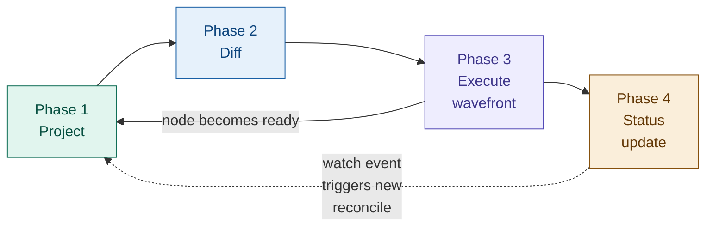
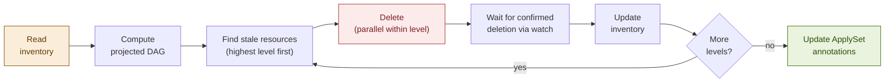
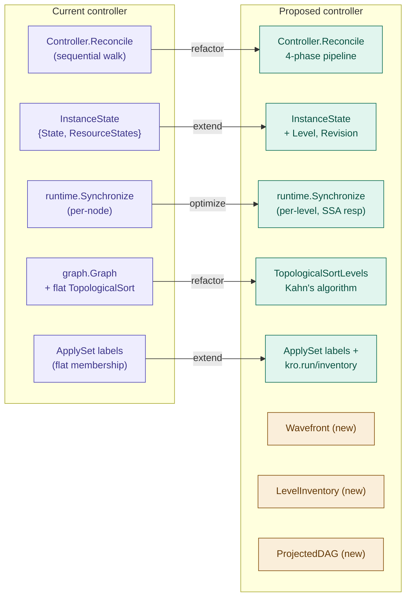

# KREP: Level-Aware Graph Synchronization for the Instance Controller

**Authors:** Jakob Moller
**Status:** Draft

## Related Proposals and References

| Reference | Title | Relationship |
|-----------|-------|--------------|
| [KREP-003] | Level-based topological sorting | Foundation: provides Kahn's algorithm and level grouping |
| [KREP-006] | Propagation control | Extension: `propagateWhen` gates integrated into wavefront |
| [KREP-014] | Resource lifecycles | Extension: Adopt/Orphan policies affect diff and prune phases |
| [KREP-022] | `managedResources` in instance status | Consumer: wavefront produces data for managedResources |
| [KEP-3659] | ApplySet: kubectl apply --prune | Specification: inventory design extends ApplySet |
| [GraphRevision CRD](https://kro.run/api/crds/graphrevision) | GraphRevision API | Data source: structural DAG snapshot |
| [SimpleSchema](https://kro.run/api/specifications/simple-schema) | SimpleSchema specification | Data source: RGD schema definition |
| [pkg/controller/instance](https://pkg.go.dev/github.com/kro-run/kro/pkg/controller/instance) | Instance controller (current) | Refactor target: existing code to be evolved |

---

## Summary

KRO lets users define a **ResourceGraphDefinition (RGD)** — a template that
describes a set of Kubernetes resources and how they depend on each other.
When a user creates an **instance** of that RGD, KRO's **instance controller**
creates and manages all the resources on their behalf.

Today the instance controller applies resources **one at a time**, in order.
This is simple but slow. It also has no way to delete resources in the right
order, and no way to efficiently update resources when the RGD changes.

This proposal replaces the sequential model with a **level-aware wavefront
synchronizer**. The core idea:

1. Group resources into **dependency levels** using topological sorting.
   Level 0 has no dependencies, level 1 depends on level 0, and so on.
2. Apply all resources within a level **in parallel**. Wait for the level
   to finish. Then move to the next level.
3. When deleting, go in **reverse order** — remove level 2 before level 1
   before level 0. This prevents dangling references.
4. Track which **GraphRevision** each resource was last applied at, so the
   controller knows exactly what to update when the RGD changes.

### Example: what changes

Consider a simple web app RGD with three resources:

```
ConfigMap ──► Deployment ──► Service
```

The Deployment depends on the ConfigMap (it mounts it). The Service depends
on the Deployment (it routes to its pods).

**Today (sequential):**
```
Step 1: Apply ConfigMap     wait for ready
Step 2: Apply Deployment    wait for ready (pods start)
Step 3: Apply Service       wait for ready
Total: 3 sequential steps

Delete: Service, Deployment, ConfigMap  (no ordering guarantee!)
```

**With this proposal (level-based wavefront):**
```
Level 0: Apply ConfigMap                 wait for ready
Level 1: Apply Deployment               wait for ready (pods start)
Level 2: Apply Service                  wait for ready
Total: 3 steps (same for a linear chain, but parallel for wider graphs)

Delete: Level 2 (Service) → Level 1 (Deployment) → Level 0 (ConfigMap)
        Always in reverse order. Dependents removed first.
```

For a wider graph with independent branches, the benefit is larger:

```
ConfigMap ──► Deployment-A ──► Service-A
Secret    ──► Deployment-B ──► Service-B

Today: 6 sequential steps
With wavefront: 3 level steps (each level runs in parallel)
  Level 0: ConfigMap + Secret          (parallel)
  Level 1: Deployment-A + Deployment-B (parallel)
  Level 2: Service-A + Service-B       (parallel)
```

### Key decisions

| Decision | Choice | Why |
|----------|--------|-----|
| Parallelism model | Within-level parallelism, strict ordering between levels | Simple to reason about. No need to track per-node dependency readiness at runtime. |
| Error handling | Failed node blocks only its dependents, not the whole graph | Independent branches should keep working. |
| Deletion order | Reverse topological (highest level first) | Prevents dangling references (Service deleted before Deployment). |
| Revision tracking | Per-node `kro.run/revision` label | Allows partial migration. Controller knows exactly where it left off after a crash. |
| New revision during migration | Skip to latest (default) | Each GraphRevision is a complete snapshot. No need to apply intermediate revisions. |
| Inventory storage | Annotation on instance (can migrate to other backends) | Fits in standard Kubernetes objects. No external storage needed. |

**How to read the rest of this proposal:** The [Design](#design) section
is the core — it describes the four-phase reconcile loop in detail. The
other sections cover specific aspects: [Inventory](#level-aware-inventory-management),
[Revision Migration](#revision-migration-n-1-to-n),
[Observability](#observability), and [Implementation Plan](#implementation-plan).

---

## Motivation

### Current state

The instance controller (`pkg/controller/instance`) processes resources one
at a time in topological order. For each node it resolves CEL variables,
applies via SSA, and checks `readyWhen` before moving to the next node.

Per-node state is tracked in a flat `map[string]*ResourceState`. The
possible states (defined in `api/v1alpha1/instance_state.go`, refactored
in [PR #970](https://github.com/kubernetes-sigs/kro/pull/970)) are:
`Synced`, `InProgress`, `Error`, `WaitingForReadiness`, `Skipped`,
`Deleting`, and `Deleted`.

This works but has known limitations:

- **No parallelism.** Independent branches run one at a time. A graph with
  two independent subtrees of depth 5 takes 10 steps instead of 5.
- **No propagation control.** Every reconcile applies all changes at once.
  There's no way to gate rollouts, enforce maintenance windows, or do
  incremental rollouts across `forEach` collections.
- **No ordered deletion.** The current ApplySet tracks resources as a flat
  set. When pruning, a Service might be deleted before its Deployment, or a
  Namespace before the resources inside it.
- **No revision tracking.** When the RGD changes and a new
  [GraphRevision](https://kro.run/api/crds/graphrevision) is issued, the
  controller has no way to tell which resources need updating and which are
  already current.

### Design goals

1. **Ordered creation and deletion.** Create in forward topological order.
   Delete in reverse. Even across reconcile interruptions.
2. **Safe parallelism.** Independent resources within a level run
   concurrently, bounded by configurable limits.
3. **Propagation control.** [KREP-006] `propagateWhen` gates when a
   mutation can *start*. `readyWhen` gates when it is *complete*.
4. **Revision-aware updates.** Track which GraphRevision each resource was
   last applied at. Only update what changed.
5. **ApplySet compatibility.** Standard ApplySet tooling ([KEP-3659])
   still works. KRO adds level ordering on top.

---

## Design

### Architecture overview

The synchronizer operates in four phases per reconcile cycle:



Each phase may short-circuit or loop based on watch events. The arrow
from the wavefront back to projection shows what happens when a node
reaches `Ready` and that changes an `includeWhen` predicate — the
controller re-evaluates the DAG.

### Phase 1: Project

Projection takes the structural DAG from the current
[GraphRevision](https://kro.run/api/crds/graphrevision) and the instance's
input values, and produces a **runtime DAG**: which resources to create, at
which dependency levels, with fully-rendered templates. Dynamic elements --
`includeWhen`, `forEach`, CEL expressions -- are all resolved here.

```go
type ProjectedDAG struct {
    // Levels is the output of Kahn's algorithm: nodes grouped by dependency
    // depth. Level 0 has no dependencies; level N depends only on levels 0..N-1.
    Levels [][]NodeID

    // Nodes maps each node ID to its projected state.
    Nodes map[NodeID]*ProjectedNode

    // Revision is the target GraphRevision.spec.revision for this reconcile.
    Revision int64
}

type NodeID struct {
    // ResourceID is the logical ID from the RGD (e.g., "deployment").
    ResourceID string

    // ForEachBindings holds the forEach variable bindings for expanded nodes.
    // nil for non-forEach nodes. Sorted so the same bindings always produce
    // the same ID.
    ForEachBindings map[string]string
}

type ProjectedNode struct {
    Included       bool                          // Result of evaluating all includeWhen predicates
    Template       *unstructured.Unstructured    // Fully-rendered Kubernetes resource manifest
    IsExternal     bool                          // externalRef node (read-only)
    Level          int                           // Topological level from Kahn's algorithm
    Dependencies   []NodeID                      // Nodes this node depends on
    ReadyWhen      []string                      // CEL predicates for readiness
    PropagateWhen  []string                      // CEL predicates for mutation gating (KREP-006)
    ResourcePolicy ResourcePolicies              // Adopt/Orphan policies (KREP-014)
}
```

**Node identity:**

Every resource has two identities: one in the graph, one in the cluster.

| Layer | Identifier | Scope | Example |
|-------|-----------|-------|---------|
| **Graph node** (logical) | `NodeID` = `ResourceID` + `ForEachBindings` | Unique within the projected DAG of one instance | `NodeID{ResourceID: "deployment"}` or `NodeID{ResourceID: "deployment", ForEachBindings: {"region": "eu-west-1"}}` |
| **Kubernetes resource** (physical) | GKNN (Group, Kind, Namespace, Name) | Unique within the cluster | `apps/Deployment/default/my-app-eu-west-1` |

The graph node ID is **stable across revisions**. It comes from the RGD's
resource block name and forEach bindings, not from the rendered Kubernetes
name. So "the `deployment` node" is the same logical entity in revision 2
and revision 3, even if the template changes.

The GKNN is **not necessarily stable across revisions**. A new revision
could change the resource name. When that happens, the diff sees it as a
delete of the old name + create of the new name.

Each managed resource carries `kro.run/resource-id` and
`kro.run/foreach-bindings` labels. These let the controller map a live
Kubernetes resource back to its logical NodeID.

The inventory stores GKNNs (what exists in the cluster). The projected
DAG stores NodeIDs (what should exist). The diff phase joins them.

**Projection rules:**

- `externalRef` nodes are resolved first (level -1, conceptually). They
  populate the CEL evaluation context but produce no create/update/delete
  actions. Since they are watched, changes trigger re-projection automatically.
- `includeWhen` predicates are evaluated against the current CEL context. Nodes
  with `Included == false` are excluded from the projected DAG entirely.
- `forEach` expressions are evaluated to produce the expansion set. Each
  combination of bindings produces a distinct `NodeID`.
- After projection, Kahn's algorithm ([KREP-003]) groups included nodes into
  levels.

**Re-projection:** The projected DAG can change while we're reconciling.
For example, when a node becomes Ready, its status fields become
available, which may flip another node's `includeWhen` from false to
true. The controller handles this by re-running projection up to 5
times per reconcile. Cycle detection on `includeWhen`/`readyWhen` edges
prevents infinite loops. The iteration cap is a safety net.

### Phase 2: Diff

The diff phase compares the projected DAG against the materialized cluster state
to produce a per-node action plan:

```go
type NodeAction int

const (
    // Forward actions (applied in level order 0, 1, 2, ...)
    ActionCreate    NodeAction = iota // In projected DAG, not in cluster
    ActionUpdate                      // In both, template differs from applied
    ActionAdopt                       // Exists, needs ApplySet labels (KREP-014)
    ActionNone                        // In both, matches, readyWhen not satisfied
    ActionReady                       // In both, matches, readyWhen satisfied

    // Reverse actions (applied in reverse level order ..., 2, 1, 0)
    ActionDelete                      // In cluster, not in projected DAG
    ActionOrphan                      // KREP-014: remove labels, keep resource

    // Gating states
    ActionBlocked                     // Dependencies not ready
    ActionGated                       // Dependencies ready, propagateWhen false (KREP-006)
)
```

**Node classification logic:**

For each node, the diff reads the live resource from the cluster and
classifies it. A stale `kro.run/revision` label forces an update even
if the template hasn't changed:

```
  Resource not in cluster?              --> ActionCreate
  kro.run/revision < target revision?   --> ActionUpdate (force)
  Template differs from live?           --> ActionUpdate
  readyWhen satisfied?                  --> ActionReady
  Otherwise                             --> ActionNone

  In inventory but not in projection?   --> ActionDelete
  includeWhen became false?             --> ActionDelete (if resource exists)
  KREP-014 adopt policy?               --> ActionAdopt
  KREP-014 orphan policy?              --> ActionOrphan
```

**Note:** An `includeWhen` exclusion caused by stale CEL context (e.g., a
dependency is in Error and its status is missing) must **not** trigger a
delete. See [Invariant 4](#consistency-invariants-and-recovery).

### Phase 3: Execute wavefront

The wavefront processes levels in order. Within each level, nodes run in
parallel. A level must finish before the next one starts. If a node fails,
only its dependents are blocked — independent branches continue (see
[Error isolation](#error-isolation)).

#### Forward wavefront (create/update)

Levels are processed in ascending order (0, 1, 2, ...). Within each level,
all non-gated nodes are applied concurrently up to `maxConcurrency`:

```
DAG:  ConfigMap ──► Deployment ──► Service
      Secret    ──┘              ─► Ingress

Levels after Kahn's algorithm:
  Level 0: [ConfigMap, Secret]       (no dependencies)
  Level 1: [Deployment]              (depends on ConfigMap, Secret)
  Level 2: [Service, Ingress]        (depend on Deployment)

Forward wavefront execution:

  ┌─────────────────────────────────────────────────────────────────┐
  │ Level 0                                                         │
  │                                                                 │
  │   ConfigMap ─── SSA apply ──► exists ──► readyWhen? ──► Ready   │
  │                                          (parallel)             │
  │   Secret ────── SSA apply ──► exists ──► readyWhen? ──► Ready   │
  │                                                                 │
  │   All Ready? ── yes ──► runtime.Synchronize() ──► advance       │
  └─────────────────────────────────────────────────────────────────┘
                                    │
                                    ▼
  ┌─────────────────────────────────────────────────────────────────┐
  │ Level 1                                                         │
  │                                                                 │
  │   Deployment ── SSA apply ──► exists ──► readyWhen? ── no       │
  │                                                                 │
  │   Requeue. Wait for watch event (e.g. replicas become ready).   │
  │   Next reconcile re-enters here:                                │
  │                                                                 │
  │   Deployment ── skip apply (unchanged) ─► readyWhen? ── Ready   │
  │                                                                 │
  │   All Ready? ── yes ──► runtime.Synchronize() ──► advance       │
  └─────────────────────────────────────────────────────────────────┘
                                    │
                                    ▼
  ┌─────────────────────────────────────────────────────────────────┐
  │ Level 2                                                         │
  │                                                                 │
  │   Service ──── SSA apply ──► exists ──► readyWhen? ──► Ready    │
  │                                         (parallel)              │
  │   Ingress ──── SSA apply ──► exists ──► readyWhen? ──► Ready    │
  │                                                                 │
  │   All Ready? ── yes ──► instance ACTIVE                         │
  └─────────────────────────────────────────────────────────────────┘
```

Key behaviors:

- **Parallelism within a level.** ConfigMap and Secret are applied
  concurrently. Service and Ingress are applied concurrently. But
  Deployment never starts before both ConfigMap and Secret are `Ready`.
- **Level completion.** A level is done when every node in it reaches a
  terminal state: Ready, Error, or Gated. If a node's `readyWhen` is not
  yet true, the reconcile returns and waits for a watch event.
- **Next-level dependency check.** When a level completes, each node at
  the next level checks its own dependencies. If all are Ready, the node
  proceeds. If any dependency is in Error, the node is Blocked and skipped
  (see [Error isolation](#error-isolation)).
- **runtime.Synchronize() between levels.** After a level completes, the
  CEL evaluation context is refreshed with the latest status fields from
  the just-completed resources. This ensures that level 1 templates can
  reference level 0 status values (e.g., a Deployment referencing a
  ConfigMap's resourceVersion).
- **Concurrency bound.** A semaphore limits parallel SSA applies to
  `maxConcurrency` (default: 10) to avoid overwhelming the API server.

#### Reverse wavefront (delete/prune)

When resources need to be removed (instance deletion or nodes removed by a
new GraphRevision), levels are processed in descending order (2, 1, 0).
This ensures dependents are cleaned up before their dependencies:

```
Reverse wavefront execution (instance deletion):

  Level 2: DELETE Service      (parallel)
           DELETE Ingress
           Wait for confirmed deletion via watch.

  Level 1: DELETE Deployment
           Wait for confirmed deletion via watch.

  Level 0: DELETE ConfigMap    (parallel)
           DELETE Secret
           Wait for confirmed deletion via watch.

  Remove finalizer. Instance deleted.
```

This ordering prevents dangling references: the Service is deleted before
the Deployment it routes to, and the Deployment is deleted before the
ConfigMap it mounts.

#### Propagation gating within a level ([KREP-006])

When `propagateWhen` is configured, some nodes within a level may be
gated even though their dependencies are ready. The wavefront applies
non-gated nodes and skips gated ones -- it does not block waiting:

```
Level 1: [deploy-us, deploy-eu, deploy-ap]
         propagateWhen: canary.status.healthy == true

  deploy-us ── propagateWhen? ── true  ──► SSA apply ──► WaitReady
  deploy-eu ── propagateWhen? ── false ──► GATED (skip)
  deploy-ap ── propagateWhen? ── false ──► GATED (skip)

  Level result: 1 applied, 2 gated.
  Reconcile completes with status: GATED.
  Next watch event (canary becomes healthy) triggers new reconcile.
  deploy-eu and deploy-ap re-evaluated.
```

**Why gated nodes don't block the wavefront:**
`propagateWhen` prevents mutation — it does not delay the reconcile loop.
If the wavefront blocked waiting for the predicate (which might depend on
maintenance windows or external systems), the controller goroutine would
be stuck. Instead, the reconcile finishes with a "gated" status. The next
watch event or resync triggers re-evaluation.

**Deletion does not respect `propagateWhen`:** When a user deletes an instance,
all resources should be cleaned up promptly. Propagation control is a
deployment-time safety mechanism, not a deletion-time one.

#### Mixed forward and reverse in the same reconcile

When a new GraphRevision adds some nodes and removes others, both
wavefronts run in the same reconcile cycle. The forward wavefront runs
first (create/update), then the reverse wavefront prunes stale resources:

```
Revision 2: [ConfigMap] -> [Deployment, OldSidecar] -> [Service]
Revision 3: [ConfigMap] -> [Deployment, NewSidecar] -> [Service]

Same reconcile:
  Forward (levels 0, 1, 2):
    Level 0: Update ConfigMap
    Level 1: Update Deployment, Create NewSidecar
    Level 2: Update Service

  Reverse (levels 1):
    Level 1: Delete OldSidecar

Result: OldSidecar removed only after NewSidecar is Ready.
```

#### Error isolation

When a node fails, only its dependents are blocked -- independent branches
at the same or deeper levels continue unaffected. A level is considered
complete when all its nodes reach a terminal state (Ready, Error, or
Gated), not only when all are Ready.

```
DAG:  ConfigMap ──► Deployment-A ──► Service-A
      Secret    ──► Deployment-B ──► Service-B

Level 0: [ConfigMap, Secret]
Level 1: [Deployment-A, Deployment-B]
Level 2: [Service-A, Service-B]

Deployment-A fails (SSA conflict). Deployment-B is Ready.

  Level 1 terminal states: [Error, Ready] -- level complete, advance.

  Level 2 dependency check:
    Service-A depends on Deployment-A (Error) --> Blocked (skip)
    Service-B depends on Deployment-B (Ready) --> SSA apply --> Ready

  Result:
    Deployment-A: Error     Service-A: Blocked
    Deployment-B: Ready     Service-B: Ready
```

The instance is not `ACTIVE` (not all nodes Ready), but the healthy branch
is fully reconciled. On the next reconcile, Deployment-A is retried. If it
succeeds, Service-A unblocks and proceeds.

**Dependency check rule:** A node can proceed if and only if *every* node
in its `Dependencies` list is in `Ready` state. If any dependency is
`Error`, the node is `Blocked`. If any dependency is `Gated`, the node
remains `Blocked` (it cannot proceed until the gate opens and the
dependency reaches `Ready`).

**CEL context with partial errors:** When a level has errors, the CEL
context only gets fresh status from Ready nodes. This is safe because
nodes that depend on the Error node are Blocked and won't be applied.

**Status rollup:** The instance condition reflects the partial state:

```
Ready = False
  ResourcesReady = False
    Message: "6/8 nodes Ready. 1 Error: [deployment-a].
             1 Blocked: [service-a] (depends on deployment-a).
             deployment-a: SSA conflict (field manager 'helm'
             owns .spec.replicas)."
```

#### Node state machine

```
                          includeWhen = false
               [*] ──────────────────────────────────► Excluded ◄──┐
                │                                        │  ▲       │
                │ includeWhen = true,                    │  │       │ includeWhen
                │ deps not ready                         │  │       │ becomes false
                │ OR any dep in Error                    │  │       │
                ▼                          includeWhen   │  │       │
  Ready ──► Blocked ◄──── becomes true ─────────────────┘  │       │
  │  dep      │                                             │       │
  │  regress  ├── deps ready, propagateWhen = false ──► Gated      │
  │           │                                          │         │
  │           │   deps ready, propagateWhen = true       │ propagate
  │           │   (or not set)                           │ becomes
  │           ▼                                          │ true
  │       Applying ◄─────────────────────────────────────┘
  │           │  ▲
  │  template │  │ retry on
  │  changed  │  │ next reconcile
  │           │  │
  │    SSA    ▼  │
  │    fail  Error
  │           │
  │           │ SSA success,
  │           │ readyWhen = false
  │           ▼
  └──────► WaitReady ─── readyWhen = true ──► Ready ───► Deleting ───► Deleted
                                                │                        ▲
                                                │  node removed or       │
                                                │  instance deleted      │
                                                └────────────────────────┘

  Excluded (previously applied) ───► Deleting ───► Deleted
           resource exists,
           includeWhen = false
```

Key properties:
- A node enters `Blocked` if *any* dependency is not `Ready` — including dependencies in `Error`. This means errors only block dependents, not unrelated branches.
- `propagateWhen` gates mutation *start*; `readyWhen` gates mutation *end* ([KREP-006]).
- `Error -> Applying` happens on the next reconcile cycle, not immediately.
- A `Ready` node can regress to `Blocked` (dependency regresses or new revision) or to `Applying` (template changed, re-apply needed).
- A `Ready` node transitions to `Deleting` when the instance is deleted or the node is removed by a new revision. Deletion is confirmed via watch before reaching `Deleted`.
- An `Excluded` node that was previously applied (resource exists in cluster) transitions to `Deleting` to clean up the resource. An Excluded node that was never applied has no resource to delete.

**State mapping to [KREP-022] managedResources:**

| Synchronizer state | [KREP-022] `managedResources.state` | Current `instance_state.go` |
|---|---|---|
| `Ready` | `READY` | `NodeStateSynced` |
| `Applying` | `IN_PROGRESS` | `NodeStateInProgress` |
| `WaitReady` | `WAITING_FOR_READINESS` | `NodeStateWaitingForReadiness` |
| `Blocked` | `BLOCKED` | *(new -- dependency in Error or Gated)* |
| `Gated` | `GATED` | *(new -- [KREP-006])* |
| `Excluded` (no resource) | not in `managedResources` | `NodeStateSkipped` (renamed) |
| `Excluded` (resource exists) | `DELETING` | `NodeStateDeleting` |
| `Deleting` | `DELETING` | `NodeStateDeleting` |
| `Deleted` | not in `managedResources` | `NodeStateDeleted` |
| `Error` | `ERROR` | `NodeStateError` |
| `ActionAdopt` | `IN_PROGRESS` | *(new -- [KREP-014])* |

### Phase 4: Status update

**Condition hierarchy (extends KREP-001 and [KREP-006]):**

```
Ready
+-- InstanceManaged       - Finalizers and labels set
+-- GraphResolved         - Runtime graph created, resources resolved
+-- ResourcesReady        - All projected resources pass readyWhen
+-- ResourcesPropagated   - All resources at latest GraphRevision (KREP-006)
```

**Instance state mapping:**

| State | Meaning |
|-------|---------|
| `ACTIVE` | All projected resources ready and propagated |
| `IN_PROGRESS` | Forward wavefront executing |
| `GATED` | Wavefront blocked by `propagateWhen` ([KREP-006]) |
| `FAILED` | One or more resources failed after retries |
| `DELETING` | Reverse wavefront executing |
| `ERROR` | Projection failed |

---

## Level-Aware Inventory Management

### The ApplySet limitation

The ApplySet specification ([KEP-3659]) uses a parent object with labels and
annotations to track set membership. This gives us membership tracking, but it
is a flat set with no ordering. When pruning, a Service might be deleted before
its Deployment. Each resource can belong to at most one ApplySet -- you cannot
create one per level.

This proposal adds a **Level Inventory** on top of ApplySet. It groups
resources by dependency level, so they can be created in forward order
and deleted in reverse order.

### Level Inventory design

We extend the ApplySet parent's annotations with level metadata:

```yaml
metadata:
  labels:
    applyset.kubernetes.io/id: "kro-<hash>"
    applyset.kubernetes.io/tooling: "kro/<version>"
  annotations:
    applyset.kubernetes.io/contains-group-kinds: "Deployment.apps,Service.,ConfigMap."
    applyset.kubernetes.io/additional-namespaces: "ns-a,ns-b"
    # KRO extension: level-ordered inventory
    kro.run/inventory: |
      {"revision":3,"levels":[
        ["ConfigMap..default.app-config","Secret..default.app-secret"],
        ["Deployment.apps.default.app","Service..default.app-svc"],
        ["Ingress.networking.k8s.io.default.app-ingress"]
      ]}
```

The `revision` field in the inventory is a "fully converged" marker -- it is
only updated after the entire forward wavefront completes and all nodes reach
the target revision. Per-node revision is the source of truth (via
`kro.run/revision` labels on managed resources). During a partial failure,
individual node labels show exactly which nodes migrated and which did not;
the inventory `revision` stays at the old value, ensuring the next reconcile
correctly re-targets all stale nodes.

**Member labels (on each managed resource):**

```yaml
labels:
  applyset.kubernetes.io/part-of: "kro-<hash>"
  kro.run/instance: "<instance-name>"
  kro.run/resource-id: "deployment"
  kro.run/level: "1"
  kro.run/revision: "3"
annotations:
  kro.run/foreach-bindings: '{"region":"eu-west-1"}'  # forEach nodes only
```

### Ordered prune



### Annotation size analysis

**Size formula:**

```
inventory_bytes ~ 30 + sum(entries_per_level * (avg_gknn_length + 3) + 4)
```

A typical GKNN entry like `"Deployment.apps.my-namespace.my-app-eu-west-1"` is
~50 characters.

**Concrete estimates:**

| Scenario | Total entries | Size | % of 256KB |
|----------|-------------|------|------------|
| Simple web app (5 nodes, 3 levels) | 5 | ~430B | 0.2% |
| Microservice mesh (20 nodes, 5 levels) | 20 | ~1.5KB | 0.6% |
| Multi-region (3 forEach x 10 regions) | 30 | ~2.3KB | 0.9% |
| Large platform (10 + 5 forEach x 50) | 260 | ~18KB | 7% |
| Extreme (5 + 10 forEach x 200) | 2005 | ~140KB | 55% |
| Pathological (20 forEach x 500) | 10000 | ~700KB | **EXCEEDS** |

**Mitigation:**

The inventory format is a simple JSON blob. If the annotation budget
becomes a concern, the same data can be stored elsewhere (a dedicated
ConfigMap, the instance's `.status.inventory` field, etc.) without
changing the synchronizer logic. Only the read/write layer needs to
swap out.

---

## Revision Migration: n-1 to n

This section consolidates the revision-specific behaviors described in
[Phase 2 (Diff)](#phase-2-diff) and [Phase 3 (Execute wavefront)](#phase-3-execute-wavefront)
into a complete picture of how an instance transitions from one GraphRevision to
the next.

### Trigger

A new GraphRevision is created by the RGD controller whenever
`ResourceGraphDefinition.spec` changes. The GraphRevision object is
immutable (`spec` carries an XValidation rule: `self == oldSelf`) and
contains a full snapshot of the RGD spec:

```yaml
apiVersion: internal.kro.run/v1alpha1
kind: GraphRevision
metadata:
  name: webapp-r00003
  labels:
    kro.run/graph-revision-hash: "sha256-abc123"
    internal.kro.run/resource-graph-definition-name: webapp
spec:
  revision: 3
  snapshot:
    name: webapp
    generation: 7
    spec: { ... }   # full copy of the RGD spec at generation 7
```

The in-memory revision registry (`pkg/graph/revisions/registry.go`)
tracks this object through states `Pending -> Active` (or `Failed`). The
instance controller's `GraphRevisionResolver.GetLatestRevision()` returns
the highest-numbered active entry.

### Detection

At the start of each reconcile, Phase 1 (Project) resolves the latest
active GraphRevision and records it as `ProjectedDAG.Revision` -- the
*target* revision. Each managed resource's *current* revision is read
individually from its `kro.run/revision` label during Phase 2 (Diff).

There is no instance-level "previous revision" field. Each node's
`kro.run/revision` label tracks where that node is. During a partial
migration, different nodes may be at different revisions. The inventory
`revision` is only updated once all nodes reach the target (see
[Level Inventory design](#level-inventory-design)).

### Execution order

The diff and wavefront phases handle revision migration using the same
mechanics described above: nodes with a stale `kro.run/revision` label
are classified as `ActionUpdate` (see [Phase 2](#phase-2-diff)), and the
forward wavefront applies them level-by-level (see [Phase 3](#phase-3-execute-wavefront)).

```
Revision 2 (current):  [ConfigMap] -> [Deployment] -> [Service]
Revision 3 (target):   [ConfigMap] -> [Deployment] -> [Service, Ingress]
                                                        ^^^^^^^ new node

Forward wavefront:
  Level 0: Update ConfigMap (kro.run/revision: 2 -> 3)
           Wait readyWhen -> Ready
  Level 1: Update Deployment (kro.run/revision: 2 -> 3)
           Wait readyWhen -> Ready
  Level 2: Update Service (kro.run/revision: 2 -> 3)
           Create Ingress (kro.run/revision: 3)
           Wait readyWhen -> Ready

Inventory updated: {"revision": 3, ...}
```

If a node fails at level 1, its dependents are blocked but independent
branches continue (see [Error isolation](#error-isolation)). For example,
if Deployment fails but an independent Service at level 2 has all its
dependencies Ready, that Service is still updated to revision 3. The
inventory `revision` stays at `2` because not all nodes reached the
target. On the next reconcile, the diff sees nodes already at revision 3
(skip or readyWhen-check only) and retries only the failed node and its
blocked dependents.

### Topology changes between revisions

When the new GraphRevision changes the dependency structure:

| Change | Handling |
|--------|----------|
| **Node added** | `ActionCreate` at its computed level. |
| **Node removed** | `ActionDelete` in reverse order, after forward wavefront completes. |
| **Node moves level** | `kro.run/level` label updated during SSA. Processed at new level. |
| **Edge added** | Node waits for the new dependency. Cycles are caught at compile time (`GraphVerified = False`). |
| **Edge removed** | Node may move to a lower level. Processed there. |

**Example -- node changes level:**

```
Revision 2:  L0:[ConfigMap, Secret]  L1:[Deployment]  L2:[Service]
Revision 3:  L0:[ConfigMap]          L1:[Secret, Deployment]  L2:[Service]
             (Secret now depends on ConfigMap)

Forward wavefront for revision 3:
  Level 0: Update ConfigMap (revision 2->3)
  Level 1: Update Secret (revision 2->3, kro.run/level: 0->1)
           Update Deployment (revision 2->3)
  Level 2: Update Service (revision 2->3)
```

### The kro.run/revision label

Each managed resource carries `kro.run/revision` set during SSA apply.
It serves three purposes:

1. **Diff optimization.** Skip re-applying resources already at the
   target revision when templates have not changed.
2. **Progress visibility.** `kubectl get <resource> -L kro.run/revision`
   shows at a glance which resources have migrated and which have not.
3. **Debugging.** After a partial failure, the label reveals the exact
   frontier of the migration across all managed resources.

The label is written atomically as part of the SSA apply -- it is never
updated separately from the resource template.

### Edge cases

**Revision issued mid-reconcile:**

If a new GraphRevision becomes active while the wavefront is executing
revision *n*, the current reconcile finishes against *n*. The controller
picks up *n+1* on the next cycle. `resolveCompiledGraph()` runs once at
the start of each reconcile and the result is held for the duration.
Labels and inventory are updated to *n*, so the next reconcile correctly
diffs *n* against *n+1*.

**Failed revision:**

If the latest GraphRevision fails to compile, `resolveCompiledGraph()`
returns an error and the reconcile stops. The instance keeps its current
per-node revision labels. The controller does not fall back to the
previous revision — a failed compile means the RGD spec is invalid, and
hiding that would be worse than blocking. The `GraphVerified` condition
on the GraphRevision shows the error. The instance's `GraphResolved`
condition goes to `False` with the failed revision number. The operator
must fix the RGD to unblock.

**Partial migration + topology reorder:**

If revision *n* completes levels 0 and 1 but fails at level 2, and the
operator issues revision *n+1* which reorders levels, the next reconcile
starts fresh against *n+1*. The diff reads each node's `kro.run/revision`
label individually: all are < *n+1*, so all are marked `ActionUpdate` and
processed in the new level order. Partially-applied level-2 resources
from revision *n* are either updated (if still in the projected DAG) or
pruned (if removed).

**New revision arrives during incomplete migration:**

If a new GraphRevision *n+1* arrives while the controller is still
migrating from *n-1* to *n*, the **default behavior is to skip to the
latest revision.** The current reconcile finishes its in-progress level,
then the next reconcile targets *n+1* directly. Nodes still at *n-1*
jump straight to *n+1*, skipping *n*.

This works because each GraphRevision is a complete snapshot, not an
incremental diff. There's nothing in revision *n* that must be applied
before *n+1*. This matches Kubernetes conventions: controllers always
reconcile toward the latest desired state.

```
Before:  L0:[rev 3]  L1:[rev 2]  L2:[rev 2]    (migrating 2->3, L0 done)
Rev 4 arrives.
Next reconcile targets rev 4:
  L0: rev 3 < 4 --> ActionUpdate (3->4)
  L1: rev 2 < 4 --> ActionUpdate (2->4, skips 3)
  L2: rev 2 < 4 --> ActionUpdate (2->4, skips 3)
```

**Alternative: Serialized migration.** An opt-in `revisionPolicy:
Serialized` could finish the full *n-1* to *n* migration before starting
*n* to *n+1*. This ensures every revision is fully applied and passes
`readyWhen` before moving on. The tradeoff is added latency when
revisions arrive in rapid succession.

```
Before:  L0:[rev 3]  L1:[rev 2]  L2:[rev 2]    (migrating 2->3, L0 done)
Rev 4 arrives, but wavefront continues targeting rev 3:
  L1: rev 2 < 3 --> ActionUpdate (2->3)
  L2: rev 2 < 3 --> ActionUpdate (2->3)
  All at rev 3. Inventory updated to rev 3.
Next reconcile targets rev 4:
  L0-L2: all updated (3->4)
```

Serialized mode requires persisting the in-progress target revision in
the inventory or instance status so it survives controller restarts.
Skip-to-latest needs no additional state.

### Consistency invariants and recovery

State is stored in three places: resource labels, the inventory
annotation, and the in-memory projected DAG. These can diverge after
crashes. The following invariants define what's authoritative and how
the controller recovers.

**Invariant 1: Labels are the source of truth.**

- *Rule:* The `kro.run/revision` and `kro.run/level` labels on each
  managed resource are the authoritative per-node state.
- *What can go wrong:* Controller crashes after applying some nodes but
  before updating the inventory. Labels and inventory diverge.
- *Recovery:* Next reconcile reads labels from live resources. Nodes at
  the target revision are skipped. Stale nodes are re-applied. The
  inventory is rebuilt at the end. If the inventory is lost entirely,
  the controller scans for `applyset.kubernetes.io/part-of` labels.

**Invariant 2: Inventory revision <= minimum per-node revision.**

- *Rule:* The inventory `revision` field is only bumped after all nodes
  reach the target.
- *What can go wrong:* Controller crashes mid-migration. Some nodes have
  the new revision label, others don't.
- *Recovery:* The inventory `revision` stays at the old value. Next
  reconcile re-reads each node's label and only re-applies stale nodes.
  SSA is idempotent, so re-applying an already-current node is a no-op.

**Invariant 3: Phase 1 recomputes levels from the GraphRevision.**

- *Rule:* Level assignments come from the current GraphRevision, not
  from the inventory.
- *What can go wrong:* Controller crashes between updating a node's
  `kro.run/level` label and rewriting the inventory. The inventory has
  stale level data.
- *Recovery:* Next reconcile computes fresh levels from the GraphRevision
  in Phase 1 and ignores the inventory's level data. The inventory is
  rewritten at the end.

**Invariant 4: Don't delete resources based on stale CEL context.**

- *Rule:* If a node's `includeWhen` depends on an Error node's status,
  the `includeWhen` result is frozen at its last known value.
- *What can go wrong:* An Error node's status is stale or absent. Another
  node's `includeWhen` evaluates to false because of missing data,
  excluding the node from the DAG and triggering a delete.
- *Recovery:* The controller skips `includeWhen` re-evaluation for nodes
  whose dependencies include an Error node. The node stays included until
  all its dependencies are Ready and the CEL context is fresh.

**Invariant 5: Create before delete within the same level.**

- *Rule:* During revision transitions, the forward wavefront creates new
  nodes before the reverse wavefront deletes old ones at the same level.
- *What can go wrong:* Deleting the old resource before the new one is
  ready leaves a gap.
- *Recovery:* If the new and old resource share the same name, SSA
  updates in-place (no delete needed). If they have different names, the
  forward creates first, then the reverse deletes. If the create fails,
  the delete is skipped — the old resource is kept.

---

## Edge Cases and Risks

1. **Inventory annotation race with spec updates** (HIGH)
   - *Cause:* Inventory PATCH on main resource conflicts with user spec edits.
     Today's controller only writes `/status`.
   - *Mitigation:* Use SSA with dedicated field manager `kro-inventory`. Or
     store inventory in a separate ConfigMap.

2. **Stale informer cache during re-projection** (MEDIUM)
   - *Cause:* `runtime.Synchronize()` reads from cache that hasn't received the
     watch event yet.
   - *Mitigation:* Use SSA response objects directly to update the runtime
     context, bypassing informer cache.

3. **Finalizer-blocked reverse prune** (MEDIUM)
   - *Cause:* DELETE sets `deletionTimestamp` but resource lingers until an
     external finalizer completes.
   - *Mitigation:* Multi-reconcile deletion: issue DELETE, mark DELETING,
     return. Next reconcile confirms deletion via watch.

4. **forEach identity collision** (MEDIUM)
   - *Cause:* Two forEach bindings produce the same Kubernetes resource name.
   - *Mitigation:* Validate expanded names for uniqueness during the projection
     phase before SSA applies.

5. **Revision transition with immutable field changes** (LOW severity / HIGH blast)
   - *Cause:* RGD changes an immutable field (e.g., Deployment selector) and SSA
     fails permanently.
   - *Mitigation:* Diff structural DAGs at revision creation. Flag known
     immutable field changes as warnings.

6. **Controller crash mid-inventory-write** (LOW)
   - *Cause:* Stale inventory listing deleted resources or wrong level
     assignments.
   - *Mitigation:* Labels are the source of truth, not the inventory (see
     [Invariants 1-3](#consistency-invariants-and-recovery)). On recovery,
     rebuild from `applyset.kubernetes.io/part-of` labels via cluster scan.
     SSA applies are idempotent.

7. **Re-projection deleting resources due to stale Error node status** (MEDIUM)
   - *Cause:* An Error node's status is stale/absent in the CEL context. Another
     node's `includeWhen` references it, evaluates to false, and the node is
     excluded from the projected DAG — triggering an unintended delete.
   - *Mitigation:* Freeze `includeWhen` evaluation for nodes with Error
     dependencies (see [Invariant 4](#consistency-invariants-and-recovery)).

8. **propagateWhen never becoming true** (LOW severity / MEDIUM impact)
   - *Cause:* External resource stuck, producing permanent GATED state
     ([KREP-006]).
   - *Mitigation:* Optional `propagationTimeout`. Condition message:
     "propagateWhen false for 4h on node X".

---

## Observability

### Debugging guide: common failure patterns

| Symptom | What to check | Likely cause | Remediation |
|---------|---------------|--------------|-------------|
| Instance stuck `IN_PROGRESS` | `nodes_error` gauge, `NodeError` events | SSA apply failing repeatedly | Check instance events. Common causes: field manager conflict, webhook rejection, RBAC missing. Fix the conflict or update the RGD template. |
| Instance stuck `GATED` | `nodes_gated` gauge, `NodeGatedTimeout` event | `propagateWhen` predicate never becomes true | Inspect the predicate in the event message. Check the upstream resource it references. Update the RGD to adjust `propagateWhen`. |
| Reconcile latency spike | `reconcile_duration_seconds` by `phase`, `level_duration_seconds` | Slow API server, expensive CEL, or large forEach | If `project` phase is slow: check `reprojection_iterations`. If `execute` is slow: check `node_duration_seconds` for outliers. |
| Resources deleted out of order | `level_duration_seconds` with `direction=reverse` | Stale or missing inventory | If inventory was lost (crash), the controller rebuilds from `part-of` labels on next reconcile. Verify labels are present. |
| forEach creates too many resources | `inventory_entries` gauge | forEach evaluates to unexpectedly large set | Check forEach source data. Add `maxItems` validation on the forEach input in the RGD schema. |
| `ReprojectionCapReached` warning | Structured logs with `reprojection cap` | Circular `includeWhen` predicates | Restructure the RGD. Two nodes should not conditionally include each other based on the other's readiness. |
| Inventory annotation too large | `inventory_size_bytes` gauge | Large forEach expansion | Migrate inventory to a different storage backend (ConfigMap, status field). The format is portable. |
| Revision rollout not progressing | `nodes_at_revision` gauge, `nodes_gated` | `propagateWhen` gating rollout (by design) | Check if canary/first-batch resources are healthy. If so, the `propagateWhen` predicate may reference the wrong field. |

### Conditions

The condition hierarchy (Phase 4) surfaces failure information directly in
`kubectl get` output:

```
Ready = False
  ResourcesReady = False
    Message: "2/8 nodes in ERROR state: [deployment, service].
             deployment: SSA conflict on apps/v1 Deployment default/app
             (field manager 'helm' owns .spec.replicas).
             service: connection refused to API server (retries: 3)."
```

```
Ready = False
  ResourcesPropagated = False
    Message: "3 nodes GATED for 4h12m: [deploy-eu, deploy-ap, deploy-us].
             propagateWhen: status.canary.healthy == true
             (canary deploy-us-canary: status.canary.healthy = false)"
```

Each condition message includes:
- **Which nodes** are in a non-terminal state
- **Why** they are stuck (the specific error or unsatisfied predicate)
- **How long** they have been in that state

### Kubernetes Events

| Event | Type | Reason | When |
|-------|------|--------|------|
| Normal | `LevelComplete` | A level finishes execution. Message includes level number, node count, and duration. |
| Normal | `ReconcileComplete` | Full reconcile cycle completes. Message includes total duration and node counts by final state. |
| Normal | `RevisionTransition` | Instance begins reconciling against a new GraphRevision (see [Revision Migration](#revision-migration-n-1-to-n)). Message includes old and new revision numbers and topology change summary (nodes added/removed/moved). |
| Warning | `NodeError` | A node's SSA apply fails. Message includes resource ID, error, and retry count. |
| Warning | `NodeGatedTimeout` | Node in GATED state longer than `propagationTimeout`. Message includes node ID and unsatisfied `propagateWhen` expression. |
| Warning | `ReprojectionCapReached` | Phase 1 hit fixed-point iteration cap. Message includes oscillating `includeWhen` predicates. |
| Warning | `InventoryOverflow` | Inventory exceeded annotation budget. Message includes entry count and byte size. |
| Warning | `ImmutableFieldConflict` | Diff detected change to a known immutable field. Message includes field path and resource. |

### Metrics

The existing instance controller already exposes reconcile-level metrics
(`instance_reconcile_duration_seconds`, `instance_reconcile_total`,
`instance_reconcile_errors_total`, `instance_state_transitions_total`,
`instance_graph_resolution_*`). This proposal changes one existing metric
and adds new ones for the wavefront, inventory, and revision subsystems.

**Changed metric:**

| Metric | Change | Reason |
|--------|--------|--------|
| `instance_reconcile_duration_seconds` | Add `phase` label (`project`, `diff`, `execute`, `status`) | Current metric only records total duration. Per-phase breakdown identifies whether slowness is in CEL evaluation, API server calls, or status writes. |

**New metrics** (all use the `kro_instance_` prefix):

| Metric | Type | Labels | Purpose |
|--------|------|--------|---------|
| `level_duration_seconds` | Histogram | `gvr`, `level`, `direction` | Per-level execution time. Outlier levels reveal bottleneck resources. |
| `level_concurrency` | Histogram | `gvr`, `level` | Actual parallelism achieved per level. Consistently 1 means the DAG has no parallelism at that level. |
| `node_action_total` | Counter | `gvr`, `action` | Action distribution (create, update, delete, adopt, orphan, gate). |
| `node_duration_seconds` | Histogram | `gvr`, `resource_id`, `action` | Per-node SSA apply duration. Identifies slow resources. |
| `nodes_gated` | Gauge | `gvr`, `instance` | Nodes currently in GATED state. Non-zero for hours signals a stuck gate. |
| `nodes_error` | Gauge | `gvr`, `instance` | Nodes currently in ERROR state. |
| `reprojection_iterations` | Histogram | `gvr` | Fixed-point iterations in Phase 1. Near-cap values indicate complex conditional chains. |
| `inventory_size_bytes` | Gauge | `gvr`, `instance`, `storage` | Annotation budget consumption. Alert when approaching 50% of 256KB. |
| `inventory_entries` | Gauge | `gvr`, `instance` | Total entries in inventory. |
| `revision_current` | Gauge | `gvr`, `instance` | GraphRevision being reconciled. Track rollout progress across a fleet. |
| `revision_transition_duration_seconds` | Histogram | `gvr` | End-to-end migration time (first reconcile to all nodes Ready at new revision). |
| `nodes_at_revision` | Gauge | `gvr`, `instance`, `revision` | Resources per revision. Two non-zero values during migration; converges to one when complete. |

### Structured Logging

```
level=info  msg="level complete"      instance=my-app rgd=webapp level=1 direction=forward nodes=3 duration=2.4s
level=info  msg="node applied"        instance=my-app rgd=webapp node=deployment action=update level=1 duration=0.8s revision=3
level=warn  msg="node error"          instance=my-app rgd=webapp node=service action=create level=1 error="conflict" retries=2
level=warn  msg="node gated"          instance=my-app rgd=webapp node=deploy-eu level=1 gated_since=2026-03-27T16:00:00Z predicate="status.canary.healthy == true"
level=info  msg="reprojection"        instance=my-app rgd=webapp iteration=2 changed_nodes=[servicemonitor] trigger="includeWhen became true"
level=error msg="reprojection cap"    instance=my-app rgd=webapp iterations=5 oscillating=[node-a,node-b]
```

---

## Relationship to Other Proposals

### KREP-022: managedResources

[KREP-022] introduces `managedResources` in instance status. The wavefront
synchronizer produces all the data it needs. Key design decisions from
[PR #1161](https://github.com/kubernetes-sigs/kro/pull/1161) review:

- **`graphRevision` must be per-node**, not per-instance. During revision
  transitions, different nodes are at different revisions.
- **External nodes excluded** from managedResources.
- **Add `level` field** to each entry (new -- this proposal recommends it).
- **State naming**: map internal `NodeStateSynced` -> `READY` in status.

### KREP-014: Resource Lifecycles

[KREP-014] introduces resource policies for adoption and orphaning. The
[PR #1091](https://github.com/kubernetes-sigs/kro/pull/1091) review converges
toward separating creation and deletion policies:

```go
type ResourcePolicies struct {
    OnCreate string // "Create" (default) | "Adopt" | "Error"
    OnDelete string // "Delete" (default) | "Orphan" | "Error"
}
```

This fits the synchronizer naturally: forward wavefront reads `OnCreate`,
reverse wavefront reads `OnDelete`. They never interfere.

---

## Implementation Plan

### Mapping current -> proposed



### What stays

- `Controller.Reconcile(ctx, req) error` -- same entry point.
- `graph.Graph` -- compiled RGD with CEL programs
  ([PR #1014](https://github.com/kubernetes-sigs/kro/pull/1014)). Proposal adds
  levels but doesn't change the type.
- `runtime.Synchronize()` -- called per-level instead of per-node. Should use
  SSA response objects to avoid stale cache risk.
- All ApplySet labels -- strictly additive.
- Node state constants from `api/v1alpha1/instance_state.go` -- kept, with new
  states: `GATED` ([KREP-006]), `EXCLUDED`/`INCLUDED` ([KREP-022]).

### What changes

- `ResourceState` gains `Level int`, `Revision int64`, `Action NodeAction`.
  Backward compatible (zero values = current behavior).
- `ReconcileConfig` gains `MaxConcurrency int` (default: 10).
- Status update gains `managedResources` builder ([KREP-022]) and inventory
  annotation writer.

### New components

| Component | Purpose |
|-----------|---------|
| `Wavefront` | Level-aware parallel executor with [KREP-006] + [KREP-014] gates |
| `LevelInventory` | Serializer for `kro.run/inventory` with pluggable storage backend |
| `ProjectedDAG` | Explicit runtime DAG with `includeWhen`/`forEach` evaluated |
| `ReconcilePlan` | Typed diff output grouping actions by level |

### Migration path

| Phase | Scope |
|-------|-------|
| 1 | Add `TopologicalSortLevels()` ([KREP-003]). Sequential execution. Add `kro.run/level` labels. |
| 2 | Add `LevelInventory` writer. Write `kro.run/inventory`. Add `kro.run/revision` labels. |
| 3 | Replace sequential walk with wavefront. Add `managedResources` ([KREP-022]). |
| 4 | Add `propagateWhen` ([KREP-006]) and `onCreate`/`onDelete` ([KREP-014]). |

---

## Open Questions

1. **Serialized vs skip-to-latest revision policy** -- The proposal recommends
   skip-to-latest as the default (see [Revision Migration, "New revision arrives
   during incomplete migration"](#edge-cases-1)). Should `revisionPolicy:
   Serialized` be available from the start, or deferred? Serialized requires
   persisting the in-progress target revision.
2. **Debounce on external watches** -- Configurable 1-2s window. Relevant to
   [Phase 1 (Project)](#phase-1-project) re-projection triggered by external
   resource changes. Without debounce, rapid external changes cause unnecessary
   re-projections.
3. **forEach rollout** -- Subsumed by [KREP-006] `propagateWhen` primitives.
   The [propagation gating example](#propagation-gating-within-a-level-krep-006)
   shows how this works in practice.
4. **Inventory storage backend** -- Start with annotations. Migrate to
   ConfigMap or status field if annotation budget becomes a problem. See
   [Annotation size analysis](#annotation-size-analysis) for estimates.
5. **Revision fallback policy** -- A `Failed` latest revision blocks all
   instances with no automatic fallback (see [Revision Migration, "Failed
   revision"](#edge-cases-1)). Should we support opt-in
   `revisionPolicy: FallbackToPrevious`? This trades "fail loudly" for
   availability. Defer.

---

## Testing Strategy

### Unit tests

- Kahn's algorithm level computation
- Diff algorithm (create, update, delete, adopt, orphan)
- Inventory serialization and storage backend migration
- Propagation gate evaluation ([KREP-006])
- forEach set reconciliation and identity collision detection
- Annotation size estimation

### Integration tests

- Multi-level wavefront execution
- Partial failure and recovery
- Revision migration: full n-1 to n transition with level-by-level label bumping
- Revision migration: topology change (node added, node removed, node moves level)
- Revision migration: partial failure at level K, recovery on next reconcile
- Revision migration: new revision issued mid-reconcile (ignored until next cycle)
- Revision migration: failed revision blocks instances, fixed RGD unblocks
- forEach expansion/contraction with ordered pruning
- `includeWhen` re-projection
- `propagateWhen` gating ([KREP-006])
- `onCreate`/`onDelete` flows ([KREP-014])
- `managedResources` population ([KREP-022])
- Controller restart with partial inventory

### Edge cases

- Single-level graphs (all independent)
- Linear chains (no parallelism)
- 50+ resources across 10+ levels
- forEach producing 0 elements
- All nodes gated
- Revision reordering levels
- Revision n-1 partially applied, revision n+1 issued (skip n)
- Revision changes immutable field on a node (cross-ref risk #6)
- Inventory exceeding 50% budget
- Resource lifecycle policy transitions mid-reconcile ([KREP-014])

<!-- Reference-style links -->
[KREP-003]: https://github.com/bschaatsbergen/kro/blob/1260308a4475ea622f774e3d3ff0f4ee13bca0b5/docs/design/proposals/krep-003-level-based-topological-sorting.md
[KREP-006]: https://github.com/ellistarn/kro/blob/ba49042d4054b58ca44796fe36f247ca4e92d681/docs/design/proposals/propagation-control.md
[KREP-014]: https://github.com/kubernetes-sigs/kro/pull/1091
[KREP-022]: https://github.com/kubernetes-sigs/kro/pull/1161
[KEP-3659]: https://github.com/kubernetes/enhancements/blob/master/keps/sig-cli/3659-kubectl-apply-prune/README.md
