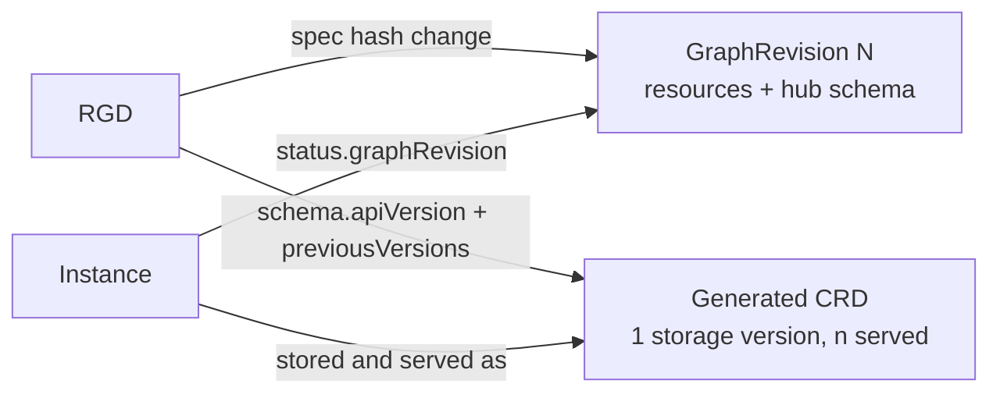

# KREP-009: Versioning and Rollouts for ResourceGraphDefinitions

Authors: @barney-s (original), @jakobmoellerdev

## Summary

kro separates two kinds of versions, both owned by a single
ResourceGraphDefinition (RGD): **graph versions** (which immutable
`GraphRevision` an instance is reconciled with, and how new revisions roll out)
and **API versions** (the served/stored versions of the generated CRD,
including conversion and storage version migration between them).

## Problem statement

Platform teams (RGD authors) need to evolve their RGDs over time. Today any
change to an RGD is propagated to every instance on its next reconcile. This is
fast, but lacks the control production environments need:

- **No controlled rollouts.** All instances pick up a change at once.
- **No version pinning.** Instance authors cannot stay on a known-good graph
  while a new one is validated.
- **No path for breaking schema changes.** `spec.schema.apiVersion` is
  immutable, so the only way to introduce a breaking schema change is a new
  kind (a new RGD), which forces delete/recreate of instances.
- **GitOps friction.** The effective state of an instance changes without any
  change to its own manifest, and migrating to a new kind cannot be expressed
  as an in-place, declarative change.

A concrete example from production users: a platform team manages ~80 clusters
through a cluster-provisioning RGD composing ACK resources. They need to ship a
breaking schema change (e.g. a new required field) and migrate the existing
cluster CRs progressively (dev → staging → prod) via GitOps, serving the old
and new API version side by side, and retiring the old version once every CR
has moved. Creating a parallel kind (`EKSClusterV2`) and re-creating 80 CRs is
not acceptable at that scale.

### What can change in an RGD

1. **Resources** (`spec.resources`): resources added, removed or modified.
   These change *behavior* but not the API.
2. **Schema** (`spec.schema`): changes to the generated CRD. These are either
   compatible (a new optional field, a relaxed constraint) or breaking (a
   removed field, a newly required field, a tightened constraint).
3. **CEL environment**: the kro version determines the available CEL
   functions and their semantics, so upgrading kro can change the output of an
   unchanged graph.

Class 1 and class 3 are about *which graph* evaluates an instance. Class 2 is
about *which API* the instance is expressed in. This proposal handles them with
separate mechanisms.

## Current state

Since this KREP was first drafted, a large part of the foundation has landed.

| Area | State on `main` | Where |
| --- | --- | --- |
| Graph history | Every accepted RGD spec change issues an immutable, cluster-scoped `GraphRevision` (KREP-013), keyed by a hash of the full RGD spec. | `api/internal.kro.run/v1alpha1/graphrevision_types.go`, `pkg/graph/revisions/registry.go` |
| Revision selection | Instances always resolve the latest revision. A point lookup `GetGraphRevision(revision)` exists but is unused. | `pkg/controller/instance/controller_graph_engine.go`, `pkg/graph/revisions/resolver.go` |
| Revision retention | `--rgd-max-graph-revisions` (default 5) keeps the N newest revisions. | `pkg/controller/resourcegraphdefinition/controller_reconcile.go` |
| Schema compatibility | Every CRD update is diffed; breaking changes set `KindReady=False` unless the RGD carries `kro.run/allow-breaking-changes: "true"`. The `ConservativeCRDComparison` feature gate adds stricter checks. | `pkg/graph/crd/compat`, `pkg/client/crd.go` |
| Generated CRD | Exactly one version, served and storage, no conversion. `status.storedVersions` is never touched by kro. | `pkg/graph/crd/crd.go` |
| Schema identity | `apiVersion`, `kind`, `group`, `plural` and `scope` are immutable via CEL validation rules. | `api/v1alpha1/resourcegraphdefinition_types.go` |
| Instance watches | The dynamic controller registers one handler per parent GVR; it is only deregistered when the RGD is deleted. | `pkg/dynamiccontroller/dynamic_controller.go` |

On the Kubernetes side:

- **Storage version migration is built in.** KEP-4192 moved the Storage
  Version Migrator into kube-controller-manager: alpha in 1.30, beta in 1.35
  (disabled by default), GA in 1.37 with `storagemigration.k8s.io/v1` enabled
  by default ([KEP-4192](https://www.kubernetes.dev/resources/keps/4192/),
  [docs](https://kubernetes.io/docs/tasks/manage-kubernetes-objects/storage-version-migration/)).
- It is **not triggered automatically**: someone must create a
  `StorageVersionMigration` object for a group/resource.
- It only **rewrites stored objects into the current storage version**; it does
  not convert fields itself. Conversion is still either `None` (only
  `apiVersion` is rewritten) or `Webhook`.
- On success it trims the CRD's `status.storedVersions` to the storage version,
  which is the precondition for removing an old version from a CRD without
  data loss.

## Proposal

### Overview



- **Phase 1 – graph versions.** Instances are pinned to a `GraphRevision`, and
  the RGD declares a rollout strategy that decides when instances move to a
  newer revision. This covers resource changes, compatible schema changes and
  CEL environment changes.
- **Phase 2 – API versions.** The RGD can serve several API versions of the
  same kind. `spec.schema` is always the hub (storage) version; older versions
  are kept as served spokes until all stored objects have been migrated. This
  covers breaking schema changes without a new kind.

A single RGD stays the only owner of its group/kind in both phases.

### Phase 1: revision pinning and rollout strategy

#### API

```yaml
apiVersion: kro.run/v1alpha1
kind: ResourceGraphDefinition
metadata:
  name: webapp
spec:
  rollout:
    strategy: Manual   # Latest (default) | Manual
  schema: ...
  resources: ...
```

- `spec.rollout.strategy`:
  - `Latest` (default): today's behavior. Every instance is reconciled with
    the latest active revision.
  - `Manual`: a new instance is pinned to the latest active revision when it is
    first reconciled. An existing instance stays on its revision until it is
    explicitly moved.
  - `External`: reserved for a later extension where an external controller
    (or KREP-006 propagation control) moves instances.
- Instance annotation `kro.run/graph-revision`:
  - `"<n>"`: pins the instance to revision `n`, regardless of strategy.
  - `"latest"`: makes the instance follow the latest revision, regardless of
    strategy.
  - Absent: the RGD's strategy decides.
- Instance status:
  - `status.graphRevision`: the revision the instance was last reconciled
    with.
  - `status.targetGraphRevision`: the revision the instance should be on,
    derived from the annotation and strategy. A difference between the two
    means a rollout is in progress for this instance.

The pin is expressed in an annotation owned by the instance author (or by a
rollout tool acting on their behalf), while the observed state lives in
status. kro never writes the annotation, so there is a single writer.

#### Behavior

- The instance controller resolves its graph with
  `GetGraphRevision(targetGraphRevision)` instead of `GetLatestRevision()`.
- A target revision that does not exist or failed compilation sets the
  instance's `Ready` condition to `False` with reason
  `GraphRevisionUnavailable`; the instance is not reconciled against another
  revision implicitly.
- **Retention.** Revision garbage collection never deletes a revision that is
  the `status.graphRevision` or `status.targetGraphRevision` of any instance.
  `--rgd-max-graph-revisions` becomes the minimum number of retained
  revisions rather than a hard cap.
- **Schema defaults.** CRD defaults are applied by the API server to every
  object of the kind, so pinning cannot hide a default change within one API
  version. Under `Manual`, a schema change classified as `DEFAULT_CHANGED` is
  rejected with `KindReady=False`; the author has to introduce a new API
  version (Phase 2) instead.
- **CEL environment.** Each `GraphRevision` records the kro CEL environment
  version it was compiled with in its status, so a kro upgrade that changes
  evaluation of an unchanged revision is visible (see #643).

### Phase 2: multiple API versions (hub and spoke)

#### API

```yaml
apiVersion: kro.run/v1alpha1
kind: ResourceGraphDefinition
metadata:
  name: webapp
spec:
  schema:
    apiVersion: v1beta1           # hub: storage version, graph is evaluated here
    kind: WebApp
    spec:
      image: string
      tag: string | default="latest"
    previousVersions:
      - apiVersion: v1alpha1
        served: true
        deprecated: true
        deprecationWarning: "webapps.kro.run/v1alpha1 is deprecated; use v1beta1"
        spec:
          image: string
  resources: ...
```

- `spec.schema` is always the **hub**: the storage version, and the only
  version the resource graph is written and evaluated against. Resources are
  never duplicated per version.
- `spec.schema.apiVersion` may only move **forward** in Kubernetes version
  priority (`v1alpha1` → `v1beta1` → `v1`). The current `self == oldSelf` rule
  is replaced by a rule allowing only higher-priority values; `kind`, `group`,
  `plural` and `scope` stay immutable.
- `spec.schema.previousVersions[]` lists older versions as **spokes**, each with
  only its schema (`spec`, `status` in SimpleSchema), `served`, `deprecated`
  and an optional `deprecationWarning`.
- Spokes are schema-only. A spoke's schema may only be changed in ways the
  compat package classifies as non-breaking; behavior lives exclusively in the
  hub's resources and is fixed forward through new revisions or new versions.
  There is no backporting of behavior to a spoke.
- When the hub moves forward, the previous hub must be added to
  `previousVersions` in the same update; otherwise the update is rejected,
  because the version may still be stored.
- Spoke schemas are declared in the RGD rather than inferred from the cluster:
  on a fresh cluster there is no existing CRD to infer from, while GitOps may
  still apply manifests written against the old version. To catch copy errors,
  kro validates each spoke against the schema the existing CRD currently
  serves for that version (using `compat.Compare` with the served version as
  the old side). A breaking difference, e.g. a dropped field, sets
  `KindReady=False` with reason `SpokeSchemaMismatch`. If the version is not
  yet served in the cluster, there is nothing to validate against and the
  declared schema is accepted.

#### Conversion

- **Phase 2a – `None`.** The generated CRD uses conversion strategy `None`.
  This is allowed only if the compat package (`CompareVersions`, extended to
  compare across versions instead of only across edits of one version) reports
  the spoke → hub change as non-breaking. Otherwise the RGD reports
  `KindReady=False` naming the offending fields.
- **Phase 2b – CEL conversion (feature gate `CRDConversion`).** Spokes may
  declare `conversion.toHub` and `conversion.fromHub` field mappings as CEL
  expressions. kro serves a conversion webhook that evaluates them, and sets
  strategy `Webhook` on the generated CRD. This KREP describes the API; the
  webhook serving model (certificates, availability) is detailed in the
  implementation PR.

#### Instance reconciliation

- The instance controller watches the hub GVR only; the API server converts
  objects written in spoke versions.
- When the hub changes, the dynamic controller deregisters the old parent GVR
  and registers the new one.
- A graph revision always carries the hub schema it was issued with. An
  instance pinned to a revision whose hub is now a spoke is fetched in that
  revision's `apiVersion` (the API server converts it), so the pinned graph
  sees the schema shape it was compiled against. This is why a spoke must stay
  served while any pinned revision uses it.

#### Migration lifecycle

The RGD controller drives the migration of stored objects:

1. Apply the CRD with the new hub as storage version; spokes stay served.
2. If `storagemigration.k8s.io/v1` is discoverable, create a
   `StorageVersionMigration` for the instance group/resource and wait for its
   `Succeeded` condition. The API server trims `status.storedVersions`.
3. Otherwise (clusters before 1.37, or with the API disabled), kro performs
   the same migration itself: it issues a no-op update for every instance
   listed at the start of the pass, using its existing informer cache. Any
   write makes the API server re-encode the object in the current storage
   version, which is exactly what the in-tree migrator does. Conflicts are
   ignored, since a conflicting write has already re-encoded the object. Only
   after the pass completes does kro patch `status.storedVersions` to the hub
   version. This requires `customresourcedefinitions/status` RBAC.
4. Once a spoke is no longer in `status.storedVersions`, it may be set to
   `served: false` or removed from `previousVersions`.

Removing a spoke that is still listed in `status.storedVersions` or still
used by a pinned revision is rejected: the RGD reports `KindReady=False` with
reason `VersionRemovalBlocked`, and the CRD keeps the version. The
`storedVersions` check is a single read of the CRD; the pinned-revision check
uses an informer-cache index on instances' `status.graphRevision`, so neither
requires listing instances from the API server.

## Other solutions considered

- **Single canonical RGD (status quo).** One schema, one resource set, every
  change rolled out on the next reconcile. Simple, but offers no pinning, no
  controlled rollout and no path for breaking changes.
- **New RGD per change.** Every breaking change creates a new RGD with a new
  kind (`WebAppV2`). Clear isolation, but multiplies kinds, requires
  delete/recreate of instances plus resource adoption, and cannot be expressed
  as an in-place GitOps change. Rejected.
- **RGD with version sections.** Each version carries its own schema *and*
  resources, and instances opt in by switching `apiVersion`. This conflicts
  with how CRD versions work: versions are views of the same stored object, an
  object does not remember the version it was written in, so `apiVersion`
  cannot be used to select behavior. It also duplicates resources and grows
  the RGD towards object size limits. Rejected; the multi-version idea is kept
  in Phase 2, with schemas only.
- **ReplicaSet pattern.** Automatic immutable snapshots of every RGD change,
  with instances pinned to a snapshot. Adopted: this is `GraphRevision`
  (KREP-013), and Phase 1 adds the pinning on top of it.

## Scoping

#### What is in scope for this proposal?

- Phase 1: rollout strategy, revision pinning, revision-aware status,
  retention of referenced revisions.
- Phase 2a: multi-version CRDs with hub/spoke schemas, conversion `None`,
  storage version migration and safe version removal.
- Phase 2b: API design for CEL-based conversion.

#### What is not in scope?

- Automatic rollback to a previous revision.
- Leveled/percentage rollouts (KREP-005, KREP-006); they build on Phase 1.
- Migrating instances between different RGDs or kinds.

## Testing strategy

#### Requirements

- kind clusters on Kubernetes 1.37 (in-tree storage version migration) and
  1.36 (kro fallback path).
- Chainsaw fixtures with a two-version RGD and pinned/unpinned instances.

#### Test plan

- **Unit tests**
  - Target revision resolution from annotation and strategy.
  - Revision GC keeps referenced revisions.
  - Forward-only `apiVersion` validation rule.
  - Cross-version compat classification for conversion `None`.
  - CRD synthesis with a hub and spokes.
- **Integration (envtest)**
  - Instance controller reconciles pinned instances against older revisions.
  - Hub change re-registers the dynamic controller.
- **E2E (chainsaw)**
  1. `Manual` strategy: change resources, verify existing instances keep
     `status.graphRevision`, new instances get the new revision, and moving the
     annotation rolls one instance forward.
  2. Move the hub from `v1alpha1` to `v1beta1` with conversion `None`; verify
     both versions are served and instances written as `v1alpha1` are
     readable as `v1beta1`.
  3. Verify storage version migration trims `status.storedVersions` (1.37
     via `StorageVersionMigration`, 1.36 via kro).
  4. Attempt to remove a still-stored spoke; verify `VersionRemovalBlocked`.

## Related

- Supersedes #935
- #482 Allow ResourceGraphDefinition authors to maintain several versions
- #188 Track ResourceGroup changes and opt-in updates
- #643 CEL versioning
- #648 `apiVersion` and `group` in `spec.schema`
- #883 Versioning and rollout of changes to ResourceGraphDefinitions
- #1051 Earlier implementation attempt
- [KREP-013 Graph Revisions](graph-revisions.md)
