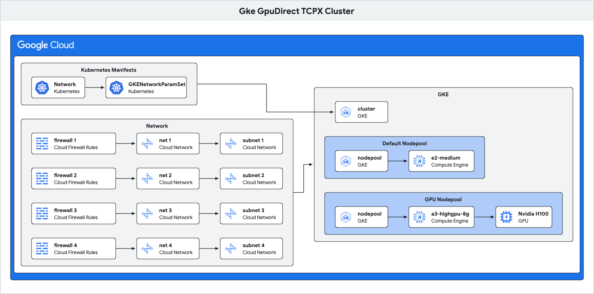

# GkeGpuDirectTCPXCluster

This example deploys [Google Cloud GPU supercomputer](https://cloud.google.com/kubernetes-engine/docs/how-to/gpu-bandwidth-gpudirect-tcpx) which is accelerator-optimized for scalable, massive models. The RGD is installed by platform administrators who facilitate ML infrastructure for self service teams.

The cluster has:
* Eight NVIDIA H100 GPUs per machine.
* Up to 200 Gbps bandwidth on the primary NIC.
* Secondary NICs (up to four on A3 High machine types), each supporting up to 200 Gbps bandwidth for GPU data transfer.

This deployment maximizes network bandwidth and throughput for high-performance GPU workloads in Google Kubernetes Engine (GKE) Standard clusters by using, GPUDirect-TCPX, gVNIC, and multi-networking. 

* GKE cluster
* Container Node Pools
* Network
* Subnetwork
* GKE Network and NetworkParams

Everything related to these resources would be hidden from the end user, simplifying their experience.  



<!--
meta {
  title "Gke GpuDirect TCPX Cluster"
}

elements {
  gcp {
      group k8sconfig {
      name "Kubernetes Manifests"
      card kubernetes as config1 {
         name "Network"
      }
      card kubernetes as config2 {
         name "GKENetworkParamSet "
      }
    } 

    group Network {
      card firewall as fw1 {
         name "firewall 1"
      }
      card firewall as fw2 {
         name "firewall 2"
      }
      card firewall as fw3 {
         name "firewall 3"
      }
      card firewall as fw4 {
         name "firewall 4"
      }
  
      card network as net1 {
         name "net 1"
      }
      card network as net2 {
         name "net 2"
      }
      card network as net3 {
         name "net 3"
      }
      card network as net4 {
         name "net 4"
      }
      card network as snet1 {
         name "subnet 1"
      }
      card network as snet2 {
         name "subnet 2"
      }
      card network as snet3 {
         name "subnet 3"
      }
      card network as snet4 {
         name "subnet 4"
      }
    }
    group GKE {
      card gke as cluster {
         name "cluster"
      }
      
      group default {
        name "Default Nodepool"
        card gke as defaultNodepool {
         name "nodepool"
        }
        card gce as generalVM {
         name "e2-medium"
        }
      }
      
      group gpu {
        name "GPU Nodepool"
        card gke as gpuNodepool {
         name "nodepool "
        }
        card gce as gpuVM {
         name "a3-highgpu-8g"
        }
        card gpu as nvidia {
         name "Nvidia H100"
        }
      }
      
    }
   
 }
}

paths {
  fw1 -\-> net1
  fw2 -\-> net2
  fw3 -\-> net3
  fw4 -\-> net4
  
  net1 -\-> snet1
  net2 -\-> snet2
  net3 -\-> snet3
  net4 -\-> snet4
  
  config1 -\-> config2
  
  defaultNodepool -\-> generalVM
  gpuNodepool -\-> gpuVM
  gpuVM -\-> nvidia

  Network -right-> GKE
  k8sconfig -right-> cluster
}
-->


## End User: GkeGpuDirectTCPXCluster

The administrator needs to install the RGD first.
The end user creates a `GkeGpuDirectTCPXCluster` resource something like this:

```yaml
apiVersion: kro.run/v1alpha1
kind: GkeGpuDirectTCPXCluster
metadata:
  name: gpu-demo
  namespace: config-connector
spec:
  name: gpu-demo        # Name used for all resources created as part of this RGD
  location: us-central1 # Region where the GCP resources are created
```

They can then check the status of the applied resource:

```
kubectl get gkegpudirecttcpxcluster
kubectl get gkegpudirecttcpxcluster gpu-demo -n config-connector -o yaml
```

Navigate to GKE Cluster page in the GCP Console and verify the cluster creation.

Once done, the user can delete the `GkeGpuDirectTCPXCluster` instance:

```
kubectl delete gkegpudirecttcpxcluster gpu-demo -n config-connector
```

## Administrator: ResourceGraphDefinition
The administrator needs to install the RGD in the cluster first before the user can consume it:

```
kubectl apply -f rgd.yaml
```

Validate the RGD is installed correctly:

```
kubectl get rgd gkegpudirecttcpxcluster.kro.run
```

Once all user created instances are deleted, the administrator can choose to deleted the RGD.