# Compilation

Graphs are compiled like source code: parse expressions, check types, resolve dependencies, emit
executable artifacts. Not all type information is available at first compilation. CRDs may not be
installed yet. The compiler uses gradual typing, compiling nodes without schemas permissively, and
narrows types progressively as schemas become available.

For nodes with complete schemas, every type error is caught before a resource is applied. Dynamic
GVK nodes (`kind: ${expr}`) are compiled permissively until their concrete type is known, which
triggers recompilation with the resolved schema (see [Deferred Types](#deferred-types)). The only gap
is [unsafe types](#unsafe-types) -- CRDs with incomplete schemas where the type information doesn't
exist.

The compiler has two objectives:

- **Correctness** -- catch every type error before a resource is applied. Type coverage improves
  with each compilation as schemas arrive. This extends across composition boundaries: when a parent
  Graph stamps child Graphs via forEach, the compiler validates child expressions at the parent's
  compile time.
- **Performance** -- pay the cost of parsing, type-checking, and dependency resolution once. Each
  compiled artifact is immutable and shared across reconciles and structurally identical graphs.
  Compilation fires only when inputs change.

The Watcher runs metadata-only informers against the API server and triggers the reconciler on
resource or schema changes. The reconciler declares interest in new types it discovers during the DAG
walk (fire-and-forget). When triggered, the reconciler requests compilation, which returns a cached
artifact or recompiles if the schema generation has advanced. The compiler is passive -- it resolves
schemas and compiles expressions only when called.

## Type System

To type-check expressions, the compiler needs to know each node's type. Each node type determines
how its type is resolved:

- **`template:`, `patch:`, `ref:`, `watch:`** -- resolve OpenAPI schemas from the API server by
  apiVersion/kind. The resolved schema is baked into the compiled artifact.
- **`def:`** -- infer types from template structure and expression return types. Literal fields are
  typed from their values. Expression fields (`${expr}`) are typed from the return type of the
  compiled expression, resolved during topological compilation (see [Algorithm](#algorithm)). The
  inferred type is recorded in the artifact so downstream nodes see it.

When a node's type cannot be resolved (unresolved CRDs, dynamic GVKs), the compiler declares it
untyped and proceeds permissively. Any field access on an untyped node compiles without error. Types
only get more specific, never less. Unresolved nodes start permissive and narrow as schemas become
available.

The compiler validates assignment compatibility: each expression's return type must match the
destination field's schema. `spec.replicas: ${someString}` is rejected because the schema expects an
integer.

### Deferred Types

Dynamic GVK nodes (`kind: ${expr}`) can't be typed on first compilation because the GVK depends on
a CEL expression evaluated at runtime. The node is declared untyped and compiled permissively.

The compiler is a pure function: spec + types in, artifact out. It has no concept of "dynamic GVK"
or "deferred resolution." It compiles whatever types it's given. The deferred typing lifecycle is
owned entirely by the caller:

1. **First reconcile.** The caller has no type information for dynamic nodes. Type resolution falls
   back to dyn. The compiler produces a permissive artifact. The reconciler evaluates the expression,
   resolves the concrete GVK, and records it per-instance.
2. **Requeue.** The caller detects that a new GVK was resolved and requeues the instance.
3. **Second reconcile.** The caller resolves the schema for the recorded GVK and pre-populates the
   type source before calling the compiler. Type resolution sees "already resolved" and skips those
   nodes. The compiler produces a fully-typed artifact. Downstream expressions are type-checked
   against the resolved schema.
4. **Steady state.** The pre-populated types are the same as last time. The compilation key (which
   includes resolved dynamic GVKs) is unchanged. Cache hit.

The compilation key includes resolved dynamic GVKs as a suffix. Instances with the same structure
AND same resolved GVKs share a typed artifact. Instances that resolve to different GVKs get separate
typed artifacts. All instances share the permissive bootstrap artifact during their first reconcile.

If the resolved GVK changes on a subsequent reconcile (rare -- dynamic GVKs typically stabilize), the
key changes and a new typed artifact is compiled for the new schema.

### Unsafe Types

CRDs with unstructured portions -- `x-kubernetes-preserve-unknown-fields`, or `type: object` with no
properties -- are **unsafe** in those portions. The compiler has no schema for the unstructured
subtree. Expressions accessing it compile permissively and may fail at runtime. Like unsafe memory
access in systems languages, the compiler cannot help -- the type information doesn't exist.

## Algorithm

**Build the DAG.** Scan expressions for node references to build the dependency graph. Edges from
dependency to dependent, both forward and reverse adjacency. Topological order is stable with
respect to `spec.nodes` ordering. Cycles rejected.

Each edge is classified as hard or lazy based on the expression syntax. A dependency accessed only
through optional patterns (`?.`, `[?]`, `.ready().orValue()`, `.updated().orValue()`) is lazy — the
expression handles the absent case. A dependency accessed directly in any expression (including bare
`.ready()` without `.orValue()`) is hard. The classification is per-consumer: the same node can be a
hard dependency of one consumer and a lazy dependency of another. The DAG records both edge types.
Reconciliation uses the classification to determine scope construction (plain value vs optional) and
frontier entry (hard deps only).

**Compile in topological order.** For each node: resolve its type from the API server, compile its
expressions against all upstream types (already resolved), then record the narrowed type in the
artifact so the next node sees it.

During expression compilation, the compiler extracts field paths from the AST and validates
assignment compatibility. Two node types require special handling:

- **forEach nodes** produce two type bindings from a single collection expression. The iterator
  variable is typed as the collection's element type (e.g., `list(Namespace)` yields a `Namespace`
  iterator). The node ID is typed as the list type for downstream references. readyWhen expressions
  compile against the element type; all other expressions compile against the list type.
- **Unresolved types** compile permissively and narrow across compilations. Dynamic GVK nodes
  resolve when the reconciler evaluates the expression (see [Deferred Types](#deferred-types)).
  Nodes referencing CRDs not yet created resolve when the CRD appears
  (see [Compilation Cache](#compilation-cache)).
- **Lazy dependencies** are optional in the evaluation context. `.ready()` and `.updated()` on a
  concrete receiver return `bool`. On an optional receiver (lazy dep) they return `optional(bool)` —
  the author chains `.orValue(false)` to unwrap. Bare `.ready()` without `.orValue()` makes the dep
  hard — the user is not handling absence. Field access uses CEL's native optional types:
  `deployment.?status.?replicas.orValue(0)` for lazy deps.

Field paths are (node, field chain) pairs: `${deploy.status.replicas}` yields
`(deploy, status.replicas)`. When a chain contains a dynamic operation, the path terminates at the
last static select. These paths drive the hash mechanics in
[005-reconciliation](005-reconciliation.md#hash-mechanics).

The result is an immutable artifact: compiled programs, field paths, DAG topology, resolved types, and
the schema generation it was compiled against. If compilation fails, no revision is created and
`Compiled` is set to `False` on the Graph (see [001-graph](001-graph.md#conditions)); reconciliation
continues on the previous revision if one exists.

## Compilation Cache

The compiler does not run on every reconcile. Compiled artifacts are stored and reused until their
inputs change.

Artifacts are content-addressed by their structural inputs: expressions, node IDs, types, conditions.
Concrete values are excluded. N forEach children with different values but identical structure share a
single compiled artifact -- one compilation instead of N.

Two events invalidate a cached artifact:

- **Graph structure change** -- detected when `metadata.generation` changes. The reconciler compiles
  the new spec and produces a new revision (see [002-revisions](002-revisions.md)).
- **API structure change** -- a global generation counter tracks API freshness. Any API change (CRD
  installed, updated, removed) advances it. Staleness is one integer comparison: current generation
  exceeds the artifact's recorded generation. When stale, the next reconcile rebuilds the artifact
  from scratch -- types are resolved fresh from the API server and the topology is reconstructed.

Dynamic GVK resolution does not invalidate existing artifacts. Instead, the resolution changes the
compilation key (which includes resolved GVKs as a suffix), causing a cache miss and producing a new
typed artifact alongside the existing permissive one. Both remain valid for their respective keys.

## Optimizations

### Recursive Compilation

When a Graph stamps child Graphs (via forEach), the child's expressions are invisible to the
parent's compiler -- they arrive as deferred `$${...}` strings or as rendered output. The child
controller discovers errors only when it compiles the child Graph, which may be arbitrarily later.

The compiler closes this gap through two mechanisms.

**Deferred expression analysis.** After compiling `${...}` expressions, the compiler scans for
`$${...}` patterns. For each, it strips one `$`, builds a best-effort type environment from the
child scope (node IDs from the child's node list, typed permissively), and type-checks the inner
expression. Errors are reported on the parent Graph. The compiler handles arbitrary deferral depth
by recursing.

The child scope is extracted from the template when statically knowable: literal node lists are
fully extractable, expression-valued node lists are partially or not at all. The compiler works with
what it has -- partial scopes catch errors in known references, unknown references compile
permissively.

**Pre-compilation.** When a forEach template produces a child Graph CR (literal apiVersion/kind
identifying a Graph), the compiler extracts the child spec, strips one deferral level (`$${...}` to
`${...}`), and runs the full pipeline. This catches expression errors, type errors, and DAG cycles
at the parent's compile time -- before any child Graph CR exists. When the parent later stamps child
Graphs during reconciliation, the child controller computes the same compilation key and gets a
cache hit. On spec mutation, the parent recompiles and pre-compiles the new child spec, catching
errors in the updated template before children are re-created.

Pre-compilation requires literal apiVersion/kind and a literal node list. When conditions aren't
met, the child compiles independently at reconcile time. Missing CRDs in the child scope are handled
the same way as at the parent level -- typed permissively, narrowed when schemas become available.

Pre-compilation also produces the child's topological order, stored on the parent Graph's
`status.topologicalOrder` under the forEach node's ID as key. The child's topology is available
before any child Graph CR exists.

Errors from both mechanisms carry enough context to trace back to the exact location in the parent
spec: parent node, deferral depth, child node, inner expression.
