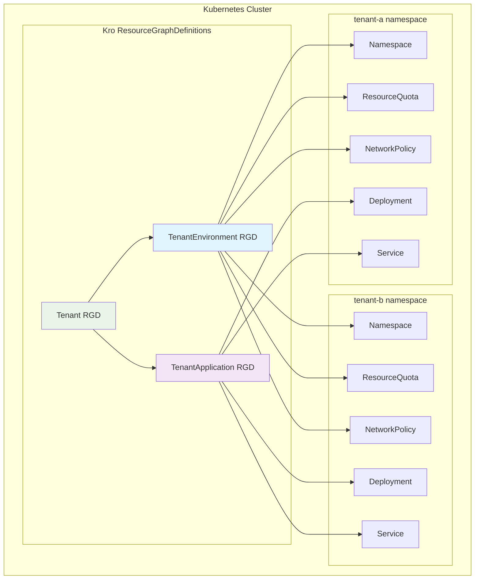

# SaaS Multi-Tenant example

This example demonstrates how to create a multi-tenant SaaS application using Kro ResourceGraphDefinitions. It creates isolated tenant environments with dedicated applications, following a hierarchical structure of ResourceGraphDefinitions.

## Overview

This example creates a multi-tenant architecture with:

1. **TenantEnvironment**: Creates isolated namespaces with resource quotas and NetworkPolicy
2. **TenantApplication**: Deploys applications within tenant environments
3. **Tenant**: Orchestrates tenant environments and applications together

The example uses a hierarchical approach where each ResourceGraphDefinition builds upon standard Kubernetes resources.

## Architecture



## Getting Started

Apply the ResourceGraphDefinitions and instance in the following order:

### Create ResourceGraphDefinition

Apply the tenant environment RGD:

```bash
kubectl apply -f tenant-environment-rgd.yaml
```

Apply the tenant application RGD:

```bash
kubectl apply -f tenant-application-rgd.yaml
```

Apply the main tenant RGD:

```bash
kubectl apply -f tenant-rgd.yaml
```

Check all RGDs are in Active state:

```bash
kubectl get rgd
```

Expected result:

```bash
NAME                               APIVERSION   KIND              STATE    AGE
tenantenvironment.kro.run         v1alpha1     TenantEnvironment Active   2m
tenantapplication.kro.run         v1alpha1     TenantApplication Active   1m
tenant.kro.run                    v1alpha1     Tenant           Active   30s
```

### Create Tenant Instance

Apply the tenant instance:

```bash
kubectl apply -f tenant-instance.yaml
```

Check tenant instance status:

```bash
kubectl get tenant
```

Expected result:

```bash
NAME          STATE    SYNCED   AGE
tenant001   ACTIVE   True     5m
```

## Clean Up

Remove resources in reverse order:

Remove Tenant Instance:

```bash
kubectl delete -f tenant-instance-tmpl.yaml
```

Remove ResourceGraphDefinitions:

```bash
kubectl delete -f tenant-rgd.yaml
kubectl delete -f tenant-application-rgd.yaml
kubectl delete -f tenant-environment-rgd.yaml
```

<details>
  <summary>ResourceGraphDefinition</summary>
  ```yaml title="rgd.yaml"
apiVersion: kro.run/v1alpha1
kind: ResourceGraphDefinition
metadata:
  name: tenantenvironment.kro.run
spec:
  schema:
    apiVersion: v1alpha1
    kind: TenantEnvironment
    spec:
      tenantId: string
  resources:
  - id: tenantNamespace
    template:
      apiVersion: v1
      kind: Namespace
      metadata:
        name: ${schema.spec.tenantId}
        labels:
          name: ${schema.spec.tenantId}
  - id: tenantQuota
    template:
      apiVersion: v1
      kind: ResourceQuota
      metadata:
        name: ${schema.spec.tenantId}-quota
        namespace: ${schema.spec.tenantId}
        labels:
          saas/tenant-id: ${schema.spec.tenantId}
      spec:
        hard:
          requests.cpu: "1"
          requests.memory: "1Gi"
          limits.cpu: "2"
          limits.memory: "2Gi"
  - id: tenantNetworkpolicy
    template:
      apiVersion: networking.k8s.io/v1
      kind: NetworkPolicy
      metadata:
        name: ${schema.spec.tenantId}-isolation
        namespace: ${schema.spec.tenantId}
        labels:
          saas/tenant-id: ${schema.spec.tenantId}
      spec:
        podSelector:
          matchLabels:
        ingress:
        - from:
          - podSelector: {}
  ```
</details>
